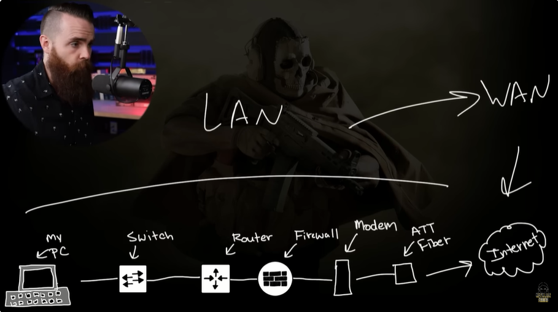
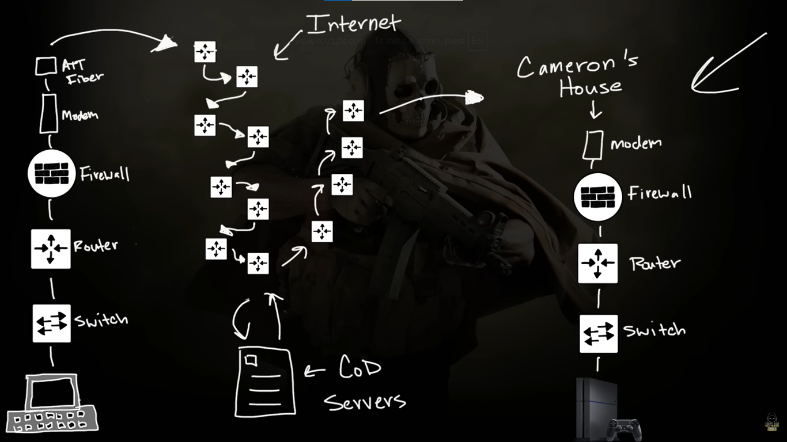
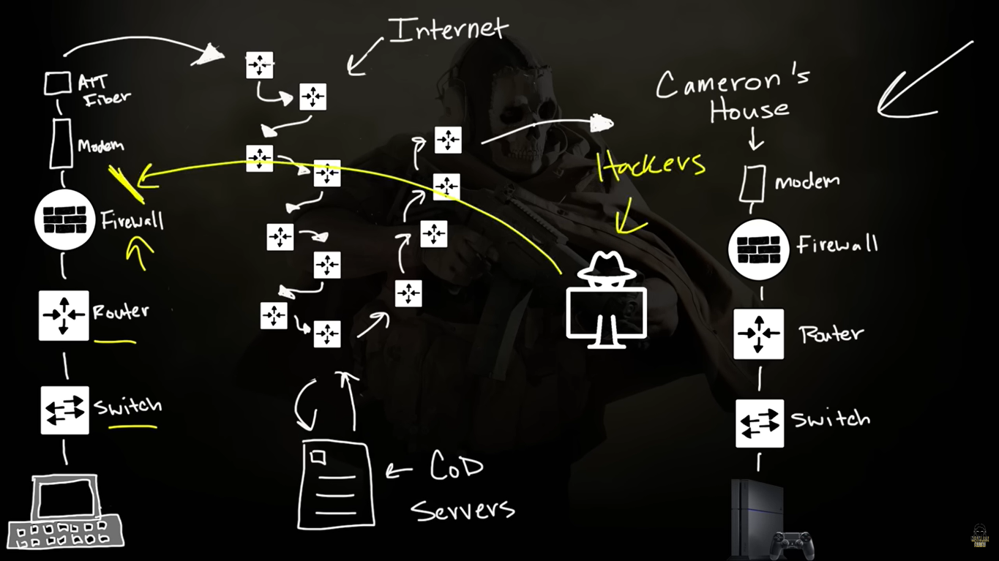

# 📝 Apa itu Jaringan (Network)?  

---

## 🎯 Judul & Tujuan

**Topik**: Jaringan  
**Tahap**: TAHAP-1  
**Kategori**: Networking  
**Tujuan Pembelajaran**:

- [x] Memahami apa itu Jaringan
- [x] Mengenal komponen penyusun Jaringan

---

## 💡 Konsep Utama

Jaringan adalah rangkaian peralatan atau komponen yg saling terhubung untuk memastikan data dapat dikirim, mengalir dan diterima oleh perangkat lain.

Komponen penyusun jaringan biasanya: My PC -> (1)Switch -> Router -> Firewall (opsional) -> Modem -> Kabel Fiber -> Internet (WAN) -> Loop(1) -> Others PC.

**Definisi Singkat**:
> LAN (Local Area Network) adalah Jaringan yg berada di lingkup ruang kecil dan terbatas, sperti di warkop, rental ps, personal komputer, dll.

> WAN (Wide Are Network) adalah Jaringan yg sangat luas, yg hubungkan infastruktur global (internet).

**Visualisasi/Diagram**:

<table style="border: none; width: 100%; text-align: center;">
  <tr>
    <td style="border: none; vertical-align: top;">
      <figure>
        
        <figcaption>LAN (Local Area Network)</figcaption>
      </figure>
    </td>
    <td style="border: none; vertical-align: top;">
      <figure>
        
        <figcaption>WAN (Wide Area Network)</figcaption>
      </figure>
    </td>
  </tr>
  <tr>
    <td style="border: none; vertical-align: top;">
      <figure>
        
        <figcaption>Firewall</figcaption>
      </figure>
    </td>
  </tr>
</table>

---

## 📚 Sumber Belajar

| No | Sumber | Link | Format | Rating | Waktu |
|----|-----|------|--------|--------|-------|
| 1 | NetworkChuck - CCNA Course | <https://www.youtube.com/playlist?list=PLIhvC56v63IJVXv0GJcl9vO5Z6znCVb1P> | Video | ⭐⭐⭐⭐⭐ | 10min |
| 2 | | | | | |
| 3 | | | | | |

**Sumber Rekomendasi**: NetworkChuck

---

## ⚡ Catatan Penting

### Poin Utama

1. **Jenis Jaringan**:
    - **PAN (Personal Area Network)**: sangat kecil (skitar orang), hubungkan perangkat pribadi (hp-pc)
    - **LAN (Local Area Network)**: terbatas (rumah, sekolah), hubungkan pc satu ke pc lain dalam satu gedung
    - **CAN (Campus Area Network)**: area kampus (gedung-gedung di suatu kampus), hubungkan LAN dalam area univ/apatemen kantor (gedung a-gedung b)
    - **MAN (Metropolitan Area Network)**: area yg luas (satu kota), hubungkan LAN dalam area perkotaan (kantor bupati-disnaker-rsud)
    - **WAN (Wide Area Network)**: sangat luas (antar kota, antar negara, global), infrastruktur yg hubungkan jaringan-jaringan di lokasi yg sangat jauh (internet)
2. **Komponen Penyusun Jarigan**:
    - Switch
    - Router
    - Firewall
    - Modem
    - Kabel Fiber
3. **Ethernet**: Standart jaringan kabel yg hubungkan dua perangkat untuk bisa bertukar data
4. **Firewall**: Untuk proteksi lalu lintas jaringan (blokir dan izinkan) dari orang jahat
5. **Wireless Access Point (WAP)**: Perangkat yg dapat hubungkan ke jaringan melalui gelombang sinyal (WiFi), Wireless Router (rumahan) biasanya sudah all in one(Switch, Router, Firewall, etc)
6. **Cisco Certified Network Associate (CCNA)**: Sertif dari Cisco tentang pemahaman dan test jaringan yg diakui secara global

---
