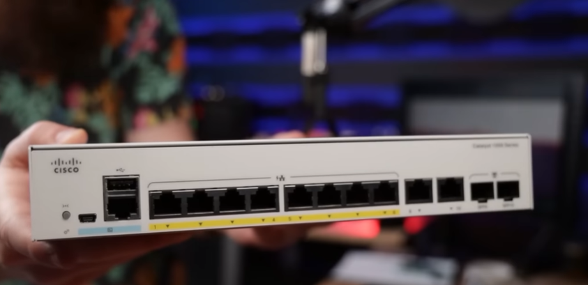
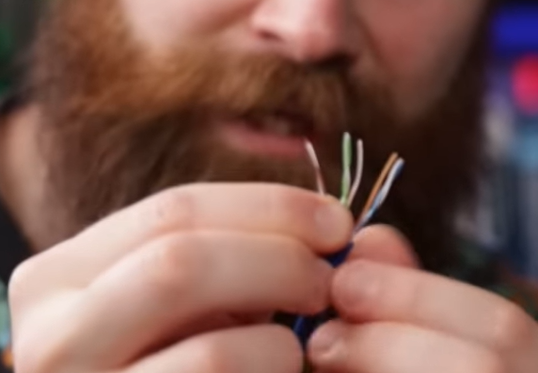
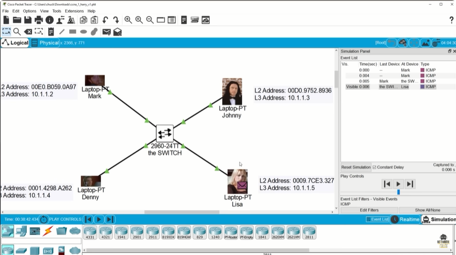
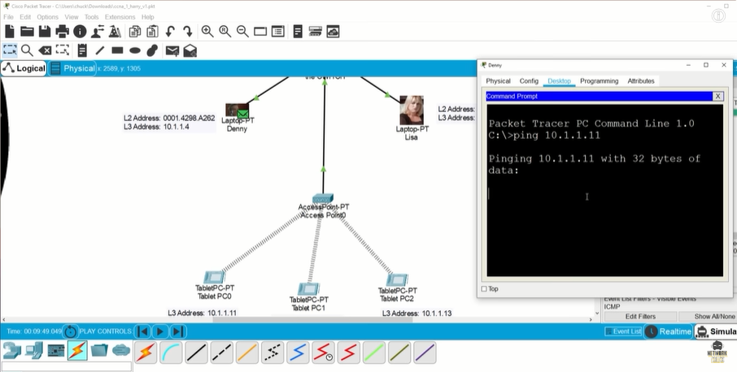
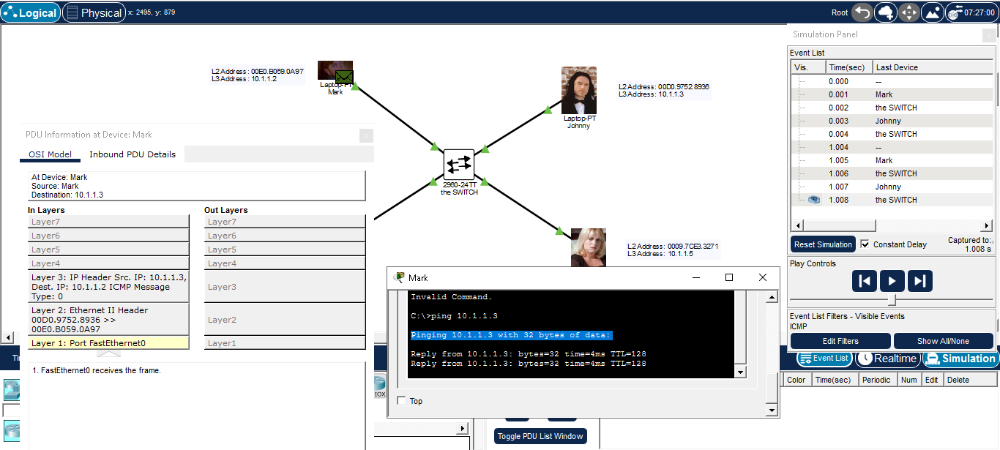
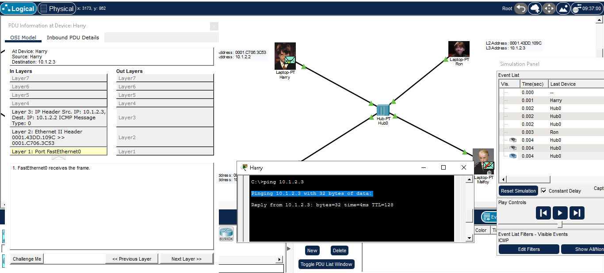
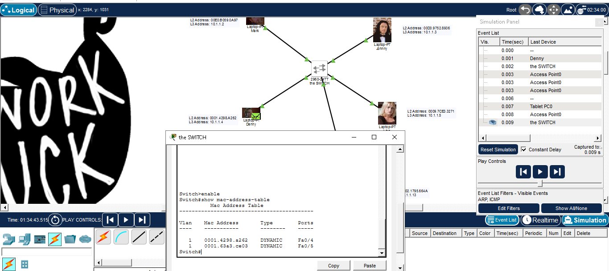
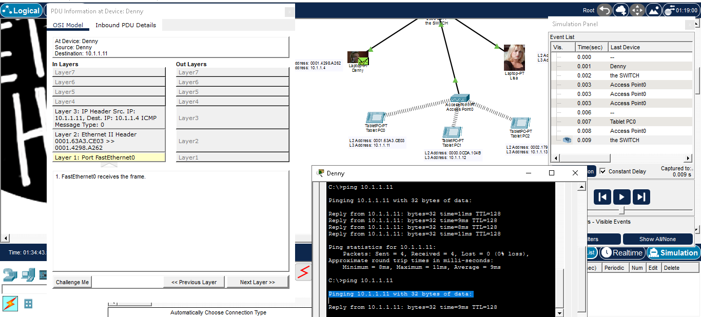

# 📝 Apa itu Switch?

---

## 🎯 Judul & Tujuan

**Topik**: Switch  
**Tahap**: TAHAP-1  
**Kategori**: Networking  
**Tujuan Pembelajaran**:

- [x] Memahami apa itu Switch dan fungsinya
- [x] Mengenal komponen pembantu Switch
- [x] Perbedaan Switch, Hub, dan WAP
- [x] Labbing Switch, Hub, dan WAP

---

## 💡 Konsep Utama

Switch adalah device yg digunakan sebagai jembatan antar device satu dengan device lain supaya dapat berkomunikasi atau mengirim data.

hub dump :v, switch smart :)

switch-> data langsung ke satu tujuan device tertentu (pake L2)
hub-> malah datanya disebar ke smua device yg terhubung (pake L1)
repeat electro signal langsung si hub, bahaya bisa diliat hacker!.

**Definisi Singkat**:

> CAM(Content Addressable Memory) adalah memo pada switch yg digunakan untuk tahu mac address ini berada di port mana.

**Visualisasi/Diagram**:

<table style="border: none; width: 100%; text-align: center;">
  <tr>
    <td style="border: none; vertical-align: top;">
      <figure>
        
        <figcaption>Switch</figcaption>
      </figure>
    </td>
    <td style="border: none; vertical-align: top;">
      <figure>
        
        <figcaption>Ethernet</figcaption>
      </figure>
    </td>
  </tr>
  <tr>
    <td style="border: none; vertical-align: top;">
      <figure>
        
        <figcaption>Switch Simulation</figcaption>
      </figure>
    </td>
    <td style="border: none; vertical-align: top;">
      <figure>
        
        <figcaption>WAP Simulation</figcaption>
      </figure>
    </td>
  </tr>
</table>

---

## 📚 Sumber Belajar

| No  | Sumber                     | Link | Format | Rating     | Waktu |
| --- | -------------------------- | ---- | ------ | ---------- | ----- |
| 1   | NetworkChuck - CCNA Course | <https://www.youtube.com/watch?v=9eH16Fxeb9o&list=PLIhvC56v63IJVXv0GJcl9vO5Z6znCVb1P&index=2&pp=iAQB>   | Video  | ⭐⭐⭐⭐⭐ | 23min |
| 2   |                            |      |        |            |       |
| 3   |                            |      |        |            |       |

**Sumber Rekomendasi**: NetworkChuck

---

## ⚡ Catatan Penting

### Poin Utama

1. **Tentang Switch**:
    - **Jumlah Port pada Switch**: bervariasi biasanya 5, 8, 16, 24, 48 port di suatu Switch
    - semua device yg connect ke internet pasti punya mac address
    - **Source Mac**: MAC address perangkat pengirim frame
    - **Destination Mac**: MAC address perangkat penerima frame
    - **Frames**: Data yg ada di layer 2
    - **Packet**: Data yg ada di layer 3

2. **Layer**
    - **L1**: port ethernet-> Gi0/1, Fa0/1
    - **L2**: mac address-> 00D0.9752:8936
    - **L3**: ip address-> 10.1.1.2

---

## 🔬 Latihan / Praktik

### Lab Setup

```txt
Lokasi Lab: Cisco Packet Tracer
Durasi: 5 menit
Tools: Tools bawaan Cisco Packet
```

### Jenis Praktik

1. Lihat wujud fisik Switch
   hub->physical->home city->coorporate office->main wiring closet(keliatan scaa fisik hub vs switch)

2. Uji coba alur frame di Hub/Switch
   loop(2)
   pojok kanan bawah->simulation
   laptop harry->dekstop->command prompt
   ping ip.address.xxx
   if last event(button skip kanan)
   hub,switch ->smua orang mnerima pesan tpi diverify dg centang jika tujuan benar, jika tdk berwarna silang merah.

3. Uji coba alur frame di WAP
   mirip hub(sebarkan message ke smua device) tpi lebih amazing (satu paket lengkap)
   loop(2)

4. Tampilkan mac address dalam bentuk table
   switch->cli->enable(lalu enter)->show mac-address-table

### Hasil & Pembelajaran

- Hasil:

<table style="border: none; width: 100%; text-align: center;">
  <tr>
    <td style="border: none; vertical-align: top;">
      <figure>
        
        <figcaption>Labbing Switch</figcaption>
      </figure>
    </td>
    <td style="border: none; vertical-align: top;">
      <figure>
        
        <figcaption>Labbing Hub</figcaption>
      </figure>
    </td>
  </tr>
  <tr>
    <td style="border: none; vertical-align: top;">
      <figure>
        
        <figcaption>Switch MAC Address Table</figcaption>
      </figure>
    </td>
    <td style="border: none; vertical-align: top;">
      <figure>
        
        <figcaption>Labbing WAP</figcaption>
      </figure>
    </td>
  </tr>
</table>

- Hambatan: -

---
