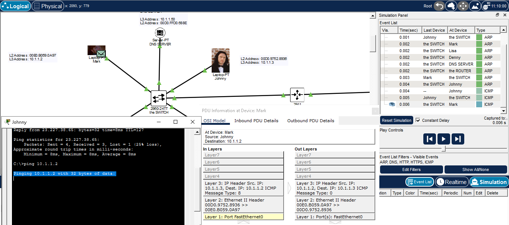
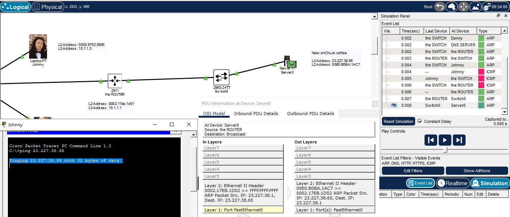
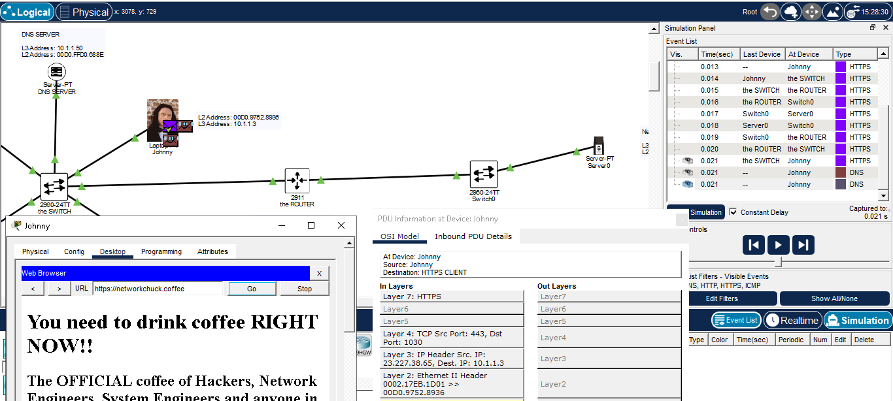

# 📝 Apa itu Router?

---

## 🎯 Judul & Tujuan

**Topik**: Router  
**Tahap**: TAHAP-1  
**Kategori**: Networking  
**Tujuan Pembelajaran**:

- [x] Memahami apa itu Router dan fungsinya
- [x] Mengenal komponen pembantu Router
- [x] Labbing Router

---

## 💡 Konsep Utama

Router adalah perangkat fisik yg menghubungkan switch satu dengan switch lainnya agar bisa berkomunikasi, bisa juga router terhubung ke router lain.

Biasanya dapat terhubung lebih dari satu router maupun switch lain tergantung port yg ada.

Jika tidak memakai Router?
misal tanpa router, cuma switch->ke switch lain, apa bisa?
bisa namun disebut broadcast domain (total port switch1 dan switch2),
yaitu dest mac address klo fff.fff.fff-> broadcast address (gtw menuju kemna maka dikirim ke smua perangkat).

Router biasanya pake angka ip pertama (1) misal (10.16.3.1), router perlu disetting dulu.

**Definisi Singkat**:

> ARP (Address Resolution Protocol) adalah protokol jaringan yang memetakan IP Address ke MAC Address pada jaringan lokal (LAN).

> DNS (Domain Name System) adalah sistem/protokol jaringan yang terjemahkan nama domain menjadi IP Address.

**Visualisasi/Diagram**:

<table style="border: none; width: 100%; text-align: center;">
  <tr>
    <td style="border: none; vertical-align: top;">
      <figure>
        
        <figcaption>Router</figcaption>
      </figure>
    </td>
  </tr>
</table>

---

## 📚 Sumber Belajar

| No  | Sumber                     | Link | Format | Rating     | Waktu |
| --- | -------------------------- | ---- | ------ | ---------- | ----- |
| 1   | NetworkChuck - CCNA Course | <https://www.youtube.com/watch?v=CRdL1PcherM&list=PLIhvC56v63IJVXv0GJcl9vO5Z6znCVb1P&index=4>   | Video  | ⭐⭐⭐⭐⭐ | 21min |
| 2   |                            |      |        |            |       |
| 3   |                            |      |        |            |       |

**Sumber Rekomendasi**: NetworkChuck

---

## ⚡ Catatan Penting

### Poin Utama

1. **Tentang ARP**:
    - **Apa itu ARP**: protocol untuk terjemahkan identitas mac address dari ip address yg dicari.
    - **Apa itu ARP Packet**: tdk slalu dibuat hanya jika diperlukan saja, untuk cari tahu atau memberitahu mac address berdasarkan ip addrress yg diberikan.
    - **ARP Request**: untuk bertanya (ip siapa ini?)
    - **ARP Replay**: untuk menjawab (itu ip saya, mac addressnya ini)
    - **Broadcast**: pesan dikirim ke smua alamat (255.255.255.255) atau artinya dikirim ke smua device yg terhubung ke satu jaringan

2. **Layer**
    - Switch cuma tahu bahasa L2 (Mac Addreess)
    - Router cuma tahu bahasa L3 (Ip Address)

---

## 🔬 Latihan / Praktik

### Lab Setup

```txt
Lokasi Lab: Cisco Packet Tracer
Durasi: 5 menit
Tools: Tools bawaan Cisco Packet
```

### Jenis Praktik

1. Kirim data di jaringan yg sama
    pc1->ping ke pc2 di (switch yg sama)

2. Kirim data di jaringan yg berbeda
    pc1->ping ke server networkchuck.coffee (switch yg beda dan dibantu router)

3. Akses web lewat DNS Server
   pc->web browser->config, set dns(10.1.1.50)->type di url networkchuck.coffee->
   buka packet yg dikim dns server->inbound pdu details->dns answer(bwah sendiri)->web terbuka

4. cari tahu otak router
   router->cli->
   ketik enable->show ip route

5. Cari tahu router yg terhubung di internet
cli->show bgp ipv4 unicast(spertinya di cisco packet tracer biasa tdk bisa)

### Hasil & Pembelajaran

- Hasil:

<table style="border: none; width: 100%; text-align: center;">
  <tr>
    <td style="border: none; vertical-align: top;">
      <figure>
        
        <figcaption>Labbing Same Network</figcaption>
      </figure>
    </td>
    <td style="border: none; vertical-align: top;">
      <figure>
        
        <figcaption>Labbing Different Network</figcaption>
      </figure>
    </td>
  </tr>
  <tr>
    <td style="border: none; vertical-align: top;">
      <figure>
        
        <figcaption>Labbing DNS Server</figcaption>
      </figure>
    </td>
  </tr>
</table>

- Hambatan: Cari tau router yg terhubung di internet itu memerlukan tools khusus jdi tidak bisa dicoba

---
