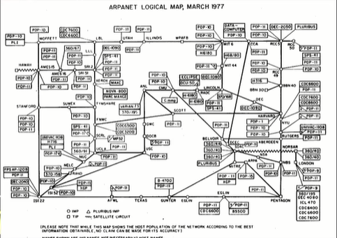
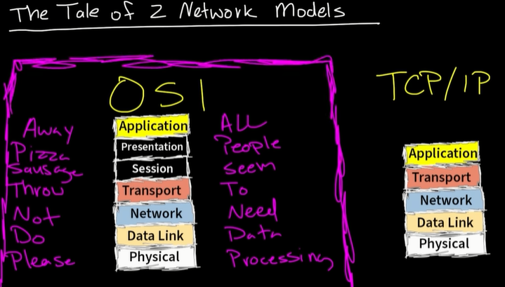
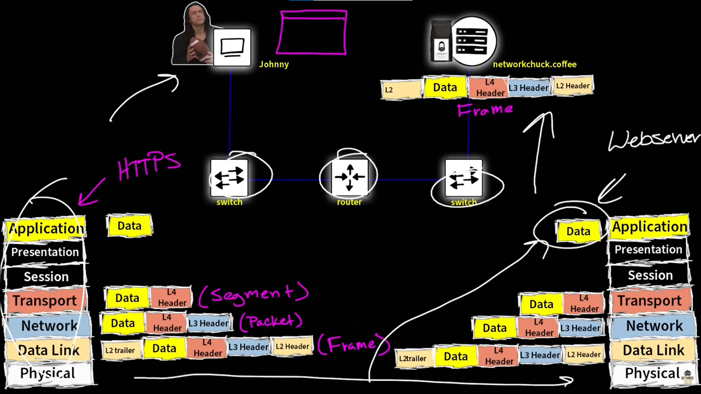

# 📝 Apa itu TCP/IP & OSI?

---

## 🎯 Judul & Tujuan

**Topik**: TCP/IP & OSI  
**Tahap**: TAHAP-1  
**Kategori**: Networking  
**Tujuan Pembelajaran**:

- [x] Memahami apa itu TCP/IP & OSI dan fungsinya
- [x] Mengenal komponen pembantu TCP/IP & OSI

---

## 💡 Konsep Utama

Sejarah munculnya TP/IP & OSI?

Pada 1960 orang pikir spertinya enak klo bisa bagi data(file, gambar) dengan komputer lain. Dahulu ketika beda merk/perusahaan maka device tersebut memiliki standart komunikasi yg berbeda, tdk bisa tukar komunikasi/kirim data(file, gambar) ke device perusahaan lain (karna standart, sperti lubang port dan protokol pengiriman yg beda).

pada 1969 kelahiran internet atau yg disebut ARPANET, US Departement of Defense(DOD) yg menemukan. penemuan ini revolusioner, karna komputer bisa kirim data ke komputer lain(jaman dulu itu hal yg baru bnget)

Ide dari ARPANET tersebut menyebar ke perusahaan komputer dan mereka adapatasi ke pc-nya masing-masing. perusahaan sperti IBM, Apple, Microsoft dan perusahaan lain buat ide jaringan sendiri jdi tdk compatible satu sama lain, misal charger lightning ip dimasukkan ke hp android.
makanya perlu standart network untuk komunikasi (kirim data).

Dalam upaya penyatuan standart tersebut terjadi perdebatan, yg pada akhirnya mengerucut ke dua model, yaitu:

Transmission Control Protocol/Internet Protocol (TCP/IP)?  
sekumpulan rule/standart bagaimana cara komputer berkomunikasi yg dipisahkan menjadi Layer.
model jaringan yg benar-benar dipake, disupport smua komputer,
tiap layer mendefinisikan semacam protocol/standart ketika komputer saling terhubung.

Dari bawah ke atas:  
Layer 1 -> Physical (Ethernet Cable)  
Layer 2 -> Data Link (Switch, Mac Address)  
Layer 3 -> Network (Router, IP Address)  
Layer 4 -> Transport (-)  
Layer 5 -> Application (-)

Open Systems Interconnection (OSI)?  
sama aja, tapi ada 2 tmbahan layer (Session & Presentation), biasanya digunakan sebagai model referensi teori.

Dari bawah ke atas:  
Layer 1 -> Physical (Ethernet Cable)  
Layer 2 -> Data Link (Switch, Mac Address)  
Layer 3 -> Network (Router, IP Address)  
Layer 4 -> Transport (-)  
Layer 5 -> Application (-)

**Definisi Singkat**:

> ARPANET (Advanced Research Projects Agency Network) adalah jaringan komputer pertama yg dikembangkan oleh ARPA (Advanced Research Projects Agency) milik Departemen Pertahanan Amerika Serikat pada tahun 1969.

**Visualisasi/Diagram**:

<table style="border: none; width: 100%; text-align: center;">
  <tr>
    <td style="border: none; vertical-align: top;">
      <figure>
        
        <figcaption>Network Diagram</figcaption>
      </figure>
    </td>
    <td style="border: none; vertical-align: top;">
      <figure>
        
        <figcaption>Network Models (TCP/IP & OSI)</figcaption>
      </figure>
    </td>
  </tr>
  <tr>
    <td style="border: none; vertical-align: top;">
      <figure>
        
        <figcaption>How Data Move</figcaption>
      </figure>
    </td>
  </tr>
</table>

---

## 📚 Sumber Belajar

| No | Sumber | Link | Format | Rating | Waktu |
|----|-----|------|--------|--------|-------|
| 1 | NetworkChuck - CCNA Course | <https://www.youtube.com/watch?v=CRdL1PcherM&list=PLIhvC56v63IJVXv0GJcl9vO5Z6znCVb1P&index=4> | Video | ⭐⭐⭐⭐⭐ | 12min |
| 2 | | | | | |
| 3 | | | | | |

**Sumber Rekomendasi**: NetworkChuck

---

## ⚡ Catatan Penting

### Poin Utama

1. **Packet Switching**: Metode pengiriman data dengan cara memecah data menjadi paket-paket kecil (packet),lalu dikirim lewat jaringan dan disusun lagi setelah sampai.

---
