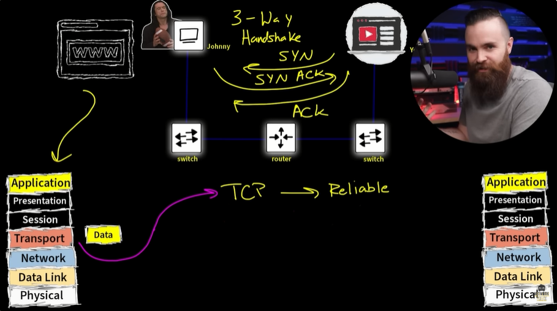
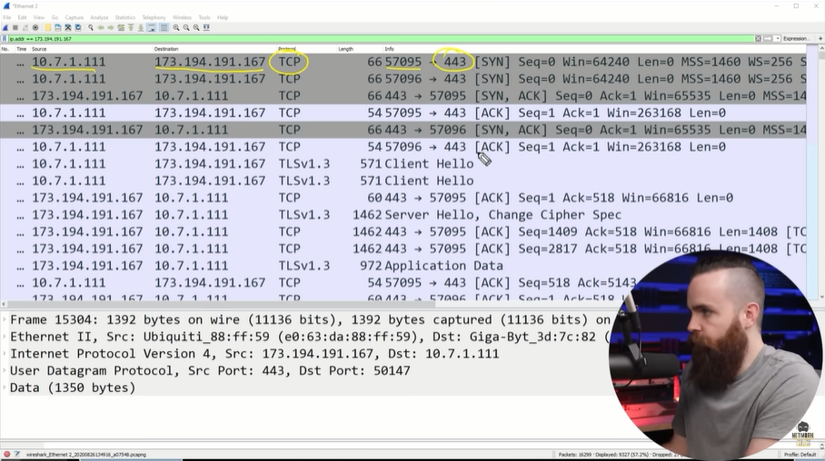

# 📝 Application & Transport Layer

---

## 🎯 Judul & Tujuan

**Topik**: Application & Transport Layer  
**Tahap**: TAHAP-1  
**Kategori**: Networking  
**Tujuan Pembelajaran**:

- [x] Memahami apa itu Application & Transport Layer
- [x] Mengenal komponen pembantu Lapisan Application & Transport Layer

---

## 💡 Konsep Utama

Misal mau beli bubuk kopi di sebuah web, bagaimana alur data supaya bisa akses website tersebut?

Semua dimulai dari:
App layer-> tempat tampilan program (misal website, game)
jika aplikasi perlu tampilan yg collab dengan jaringan

Presentation-> data format, encryption (filetype: png, pdf, html, enkripsi: ssl)
bertugas untuk membuat data dapat ditampilkan dg omat tertentu.

Session-> session protocol (L2TP, RTCP, H.245, SOCKS)
atur komunikasi dengan aplikasi/server lain dan akan ditutup jika sudah selesai, misal komunikasi dengan server web, server spotify dst.

Transport-> transport protocol (TCP/UDP), port(443,20)
untuk memindahkan seluruh protocol dan format sblumnya, anggap aja sperti kurir barang.

lalu di enkapsulasi pada L3-L2, diubah jdi bits dan dikirim secara fisik melalui ethernet cable.

TCP vs UDP
Transmission Control Protocol(TCP)-> reliable (pastikan smua data sampe dan lengkap).

a. TCP pake 3-way handshake-> harus kenalan dulu (jdi teman), untuk persiapan sblum bertukar data,
kenalannya sekali aja ktika baru pertamakali buka web, klo di close/refresh maka kenalan lagi.

misal kenalan dari yt ke pc-ku: (Synchronize & Acknowledgment)

1. hi bro namaku yt (yt, synk)
2. halo nice to meet u (pc-ku, synk ack)
3. cihuy, kita teman sekarang bro (yt, ack)

b. UDP-> FAST!
karna ga perlu kenalan dulu langsung kirim semuanya sekaligus, ga peduli message/packet udah sampe ataupun blum RUDE! tpi cocok bnget untuk realtime data.

Dilayanan stream sperti yt biasanya pake 2 protocol itu sekaligus(tcp & udp)
tcp untuk dpatkan html, img dll. lalu udp untuk kirim video/streaming secara realtime
bisa dicoba di wireshark, di netwokchuck menit ke 10:00

Apa itu port?
untuk identifikasi jenis layanan/ sbgai pintu tempat data masuk-keluar sesuai fungsi.
karna satu pc bisa jalanakn bbrp layanan sekaligus(web server, ssh, mysql) maka data harus dipisah sesuai pintu layanan.

biasanya selain ip address perlu juga spesifik pilih port yg akan dipake,
misal mau nonton video yt selain ip (173.194.191.167) perlu port spesifik(443/https)
untuk akses server maka pake port(20-21/FTP)

Jenis-jenis port umum:  
HTTPS->443, SMTP->23, FTP->20/21  
SSH->22, RDP->3389

**Definisi Singkat**:

>

**Visualisasi/Diagram**:

<table style="border: none; width: 100%; text-align: center;">
  <tr>
    <td style="border: none; vertical-align: top;">
      <figure>
        
        <figcaption>Three-Way Handshake</figcaption>
      </figure>
    </td>
    <td style="border: none; vertical-align: top;">
      <figure>
        
        <figcaption>Wireshark Port</figcaption>
      </figure>
    </td>
  </tr>
</table>

---

## 📚 Sumber Belajar

| No | Sumber | Link | Format | Rating | Waktu |
|----|-----|------|--------|--------|-------|
| 1 | NetworkChuck - CCNA Course | <https://www.youtube.com/watch?v=oIRkXulqJA4&list=PLIhvC56v63IJVXv0GJcl9vO5Z6znCVb1P&index=6> | Video | ⭐⭐⭐⭐⭐ | 21min |
| 2 | Wikipedia - Common Ports | <https://en.wikipedia.org/wiki/List_of_TCP_and_UDP_port_numbers> | Website | ⭐⭐⭐⭐ | - |
| 3 | | | | | |

**Sumber Rekomendasi**: NetworkChuck

---

## ⚡ Catatan Penting

### Poin Utama

1. **Jumlah keseluruhan port**: 0-65.535  
   **Well-known port**: 0-1023 (port standart layanan umum)  
   **Registered port**: 1024-49.151 (untuk app yg terdaftar)  
   **Ephemeral/Dynamic port**: 49.152-65.535 (port smntara yg dipilih otomatis oleh os)  

---
