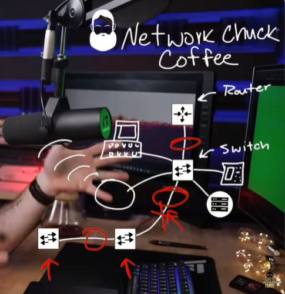
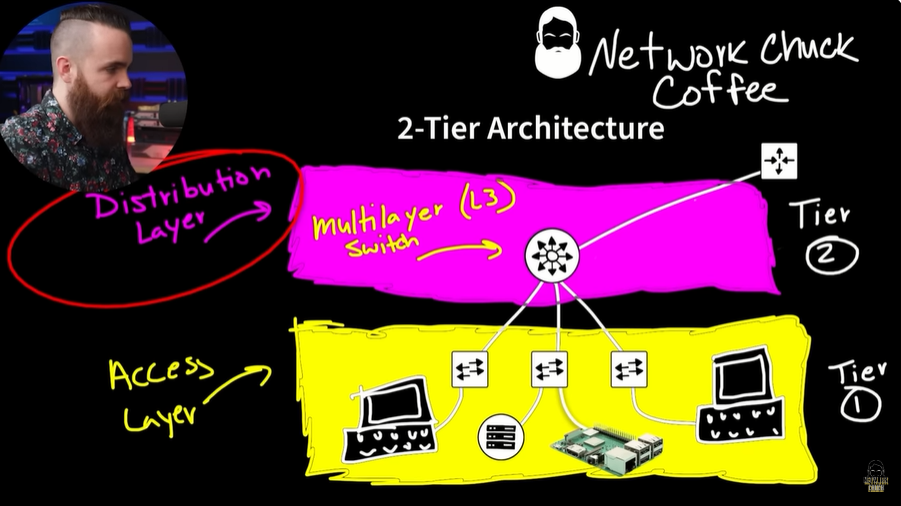
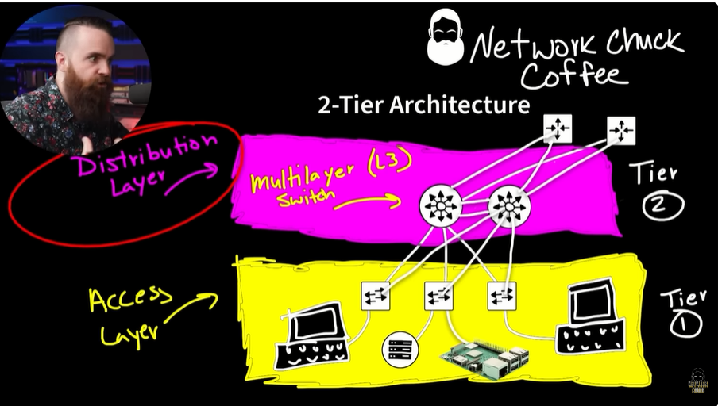
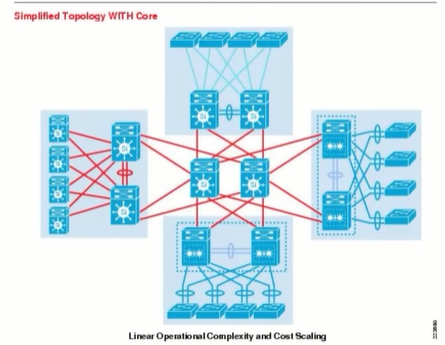
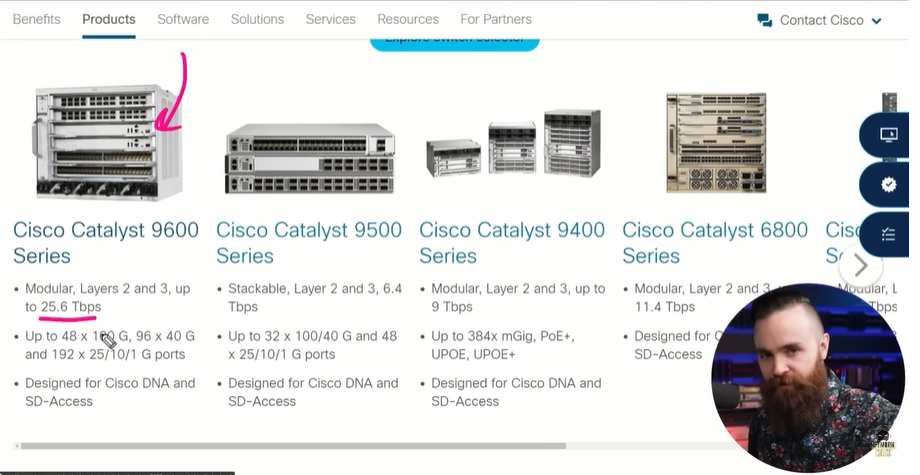

# 📝 Network Design

---

## 🎯 Judul & Tujuan

**Topik**: Network Design  
**Tahap**: TAHAP-1  
**Kategori**: Networking  
**Tujuan Pembelajaran**:

- [x] Memahami apa itu Network Design
- [x] Mengenal macam-macam Network Design

---

## 💡 Konsep Utama

Apakah jaringanmu bisa bertahan terhadap hewan pelihaaan dan bayi?
jika tdak mari jelajahi macam-macam arsitektur jaringan.

Misal ada design jaringan:
router connect ke switch1 ->
dari switch1-> hubungkan ke WAP, pc, telepon, server dst
lalu dari switch1-> hubungkan ke switch2-> lalu ke switch3.

jika di switch2 putus/gangguan maka di switch3 dst akan terputus jaringannya juga,
jika switch1 gangguan dari router juga akan terputus jaringannya,
itu biasa disebut Single Point of Failure (satu titik kesalahan).

untuk batasi titik SPOF maka perlu bnyak device, maka diperlukan smakin banyk device smakin mahal pula pengeluarannya(budget).

**Two-tier Architecture**:
```
Router
  └── Distribution/L3 Switch (Tier 1)
        ├── Switch1 -> PC (Tier 2)
        ├── Switch2 -> Server (Tier 2)
        └── Switch3 -> Raspberry Pi (Tier 2)
```

Multilayer switch disebut Distribution layer,
Switch1-3 disebut access layer.

**Three-tier Architecture**:
```
Router
  └── Core/L3 Switch (Tier 1)
        └── Distribution/L3 Switch (Tier 2)
              ├── Switch1 -> PC (Tier 3)
              ├── Switch2 -> Server (Tier 3)
              └── Switch3 -> Raspberry Pi (Tier 3)
```

Single Point of Failure (SPOF)? cara atasi?
sdiakan jalur/koneks cadangan jika yg lain gagal tujuannya untuk hilangkan/minimalkan SPOF.

Pada real world lebih bnyak pake two tier arch dripda three tier karna lebih mahal, hanya perusahaan besar yg pake three-tier. two tier arch juga sering disebut Collapsed Core design.

**Definisi Singkat**:

> SPOF (Single Point of Failure) adalah Satu titik yg jika mengalami kegagalan, dapat menyebabkan seluruh sistem atau layanan berhenti bekerja.

**Visualisasi/Diagram**:

<table style="border: none; width: 100%; text-align: center;">
  <tr>
    <td style="border: none; vertical-align: top;">
      <figure>
        
        <figcaption>Single Point of Failure</figcaption>
      </figure>
    </td>
    <td style="border: none; vertical-align: top;">
      <figure>
        
        <figcaption>Two-Tier Architecture</figcaption>
      </figure>
    </td>
  </tr>
  <tr>
    <td style="border: none; vertical-align: top;">
      <figure>
        
        <figcaption>Two-Tier Architecture Optimal</figcaption>
      </figure>
    </td>
    <td style="border: none; vertical-align: top;">
      <figure>
        
        <figcaption>Three-Tier Architecture</figcaption>
      </figure>
    </td>
  </tr>
  <tr>
    <td style="border: none; vertical-align: top;">
      <figure>
        
        <figcaption>Core Switch</figcaption>
      </figure>
    </td>
  </tr>
</table>

---

## 📚 Sumber Belajar

| No | Sumber | Link | Format | Rating | Waktu |
|----|-----|------|--------|--------|-------|
| 1 | NetworkChuck - CCNA Course | <https://www.youtube.com/watch?v=wwwAXlE4OtU&list=PLIhvC56v63IJVXv0GJcl9vO5Z6znCVb1P&index=7> | Video | ⭐⭐⭐⭐⭐ | 21min |
| 2 | | | | | |
| 3 | | | | | |

**Sumber Rekomendasi**: NetworkChuck

---

## ⚡ Catatan Penting

### Poin Utama

1. **Access Layer**: Hubungkan end device (PC, laptop), VLAN, PoE.  contoh Cisco Catalyst Catalyst 9200.  
   **Distribution Layer**: Hubungkan beberapa Access Layer, contoh Cisco Catalyst 9200.  
   **Core Layer**: Sebagai tulang punggung (backbone) jaringan yg hubungkan semua bagian jaringan dengan kecepatan tinggi. Contoh Cisco Catalyst 3850-Cisco Catalyst 9600 series dst.  

---
