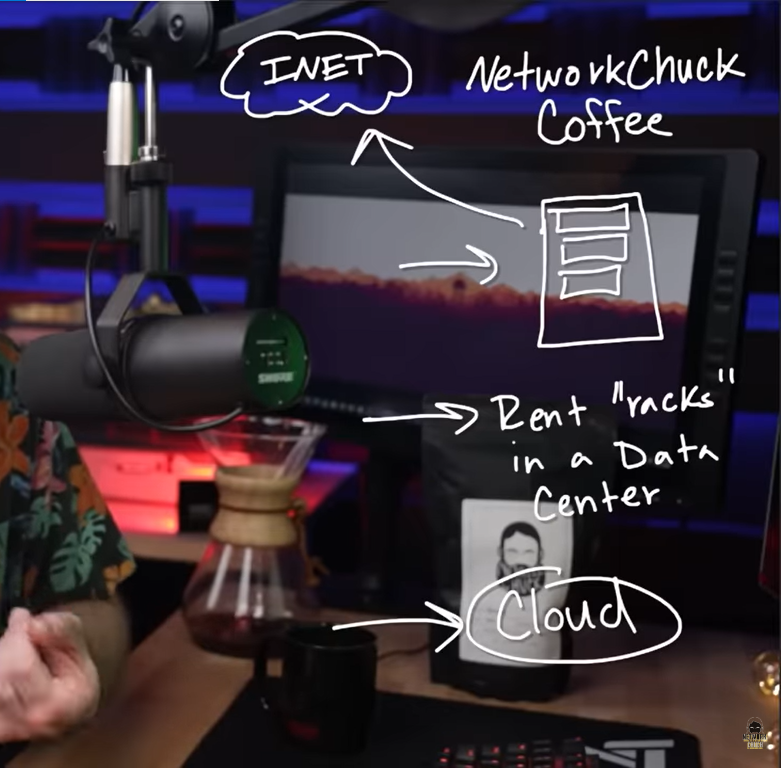
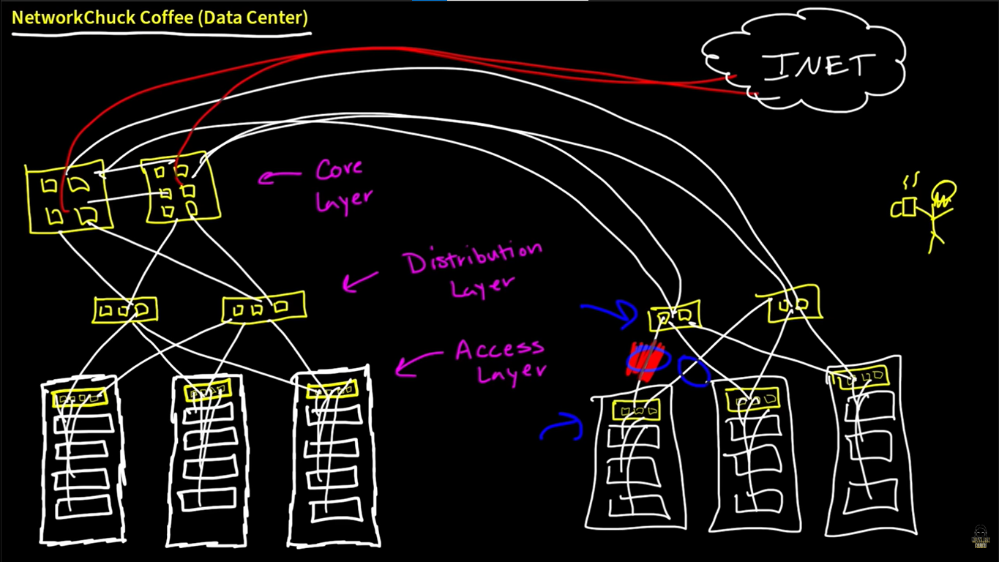
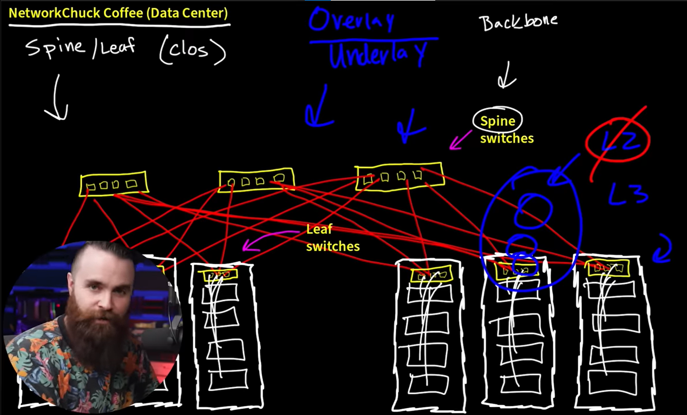
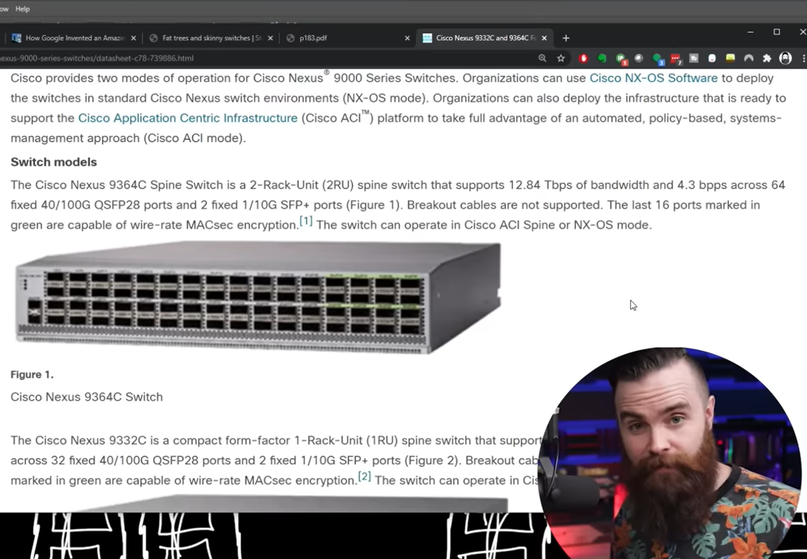

# 📝 Data Center

---

## 🎯 Judul & Tujuan

**Topik**: Data Center  
**Tahap**: TAHAP-1  
**Kategori**: Networking  
**Tujuan Pembelajaran**:

- [x] Memahami apa itu Data Center
- [x] Mengenal macam-macam Data Center
- [x] Memahami desain data center lama vs baru (spine-leaf)
- [x] Mengenal underlay dan overlay

---

## 💡 Konsep Utama

### Apa itu Data Center?

Server yang connect ke jaringan dan internet. Kebanyakan sumber daya (file, gambar, dsb) yang diakses di internet berada di dalam data center.

Isinya? Kumpulan tumpukan **server**, **switch**, **router** dalam rak-rak besar. Perusahaan besar seperti Google, Facebook, dan Amazon punya data center massive.

### Jenis Data Center

1. **On-Premise (Sendiri)** — Buat data center sendiri, bisa cuma 1 ruangan, 1 rack berisi router, switch, server. Tapi biasanya belum standar (AC pendingin, raised floor).
2. **Colocation (Rent Rack)** — Sewa rak server di data center lain. Tiap rack bisa dipinjam oleh perusahaan berbeda (fisik).
3. **Cloud** — Data center dan server milik orang lain (AWS, Azure, Google Cloud). Beli resource virtual (RAM, CPU, storage), bukan sewa device fisik.

**Definisi Singkat**:

> Data Center adalah fasilitas yang digunakan untuk menempatkan sistem komputer dan komponen terkait seperti sistem penyimpanan dan jaringan.

---

## 🏗️ Desain Data Center

### Desain Lama (Traditional)

Desain lama pakai arsitektur **three-tier**: Access → Distribution → Core.

```txt
                    [Core Layer]
                   /             \
           [Dist Layer]     [Dist Layer]
           /       \         /       \
      [TOR]     [TOR]     [TOR]     [TOR]
       |          |         |          |
    [Server]  [Server]  [Server]  [Server]
```

- **TOR (Top of Rack)** = Access layer, switch di atas rack
- **Distribution Layer** = menghubungkan beberapa TOR
- **Core Layer** = tulang punggung kecepatan tinggi

**Kekurangan**: Desain ini hanya optimal untuk **North-South traffic** (trafik dari luar ke server). Saat virtualisasi muncul dan server perlu komunikasi satu sama lain (**East-West traffic**), desain ini jadi bottleneck karena spanning tree mematikan jalur redundant untuk cegah switching loop.

### Desain Baru (Spine-Leaf / Clos)

```
        [Spine 1]     [Spine 2]
        /  |  \       /  |  \
    [L1] [L2] [L3] [L4] [L5] [L6]
     |    |    |    |    |    |
   [S1] [S2] [S3] [S4] [S5] [S6]
```

- **Leaf Switches** = TOR lama, langsung connect ke server
- **Spine Switches** = Distribution lama, menghubungkan semua leaf
- Setiap leaf terhubung ke **semua spine** → path predictabel, max **2 hops** antar leaf
- Pakai **Layer 3** (ECMP) antar spine-leaf, bukan spanning tree
- Biasanya pakai **Cisco Nexus class** untuk spine/leaf

**Kelebihan**: Optimal untuk **East-West traffic** (server ↔ server). Predictable, reliable, scalable.

---

**Visualisasi/Diagram**:

<table style="border: none; width: 100%; text-align: center;">
  <tr>
    <td style="border: none; vertical-align: top;">
      <figure>
        
        <figcaption>Jenis Data Center</figcaption>
      </figure>
    </td>
    <td style="border: none; vertical-align: top;">
      <figure>
        
        <figcaption>Desain Lama (Traditional)</figcaption>
      </figure>
    </td>
  </tr>
  <tr>
    <td style="border: none; vertical-align: top;">
      <figure>
        
        <figcaption>Desain Baru (Spine-Leaf)</figcaption>
      </figure>
    </td>
    <td style="border: none; vertical-align: top;">
      <figure>
        
        <figcaption>Cisco Nexus Class</figcaption>
      </figure>
    </td>
  </tr>
</table>

---

## 📚 Sumber Belajar

| No | Sumber | Link | Format | Rating | Waktu |
|----|-----|------|--------|--------|-------|
| 1 | NetworkChuck - CCNA Course | <https://www.youtube.com/watch?v=6-66D9J5PkY&list=PLIhvC56v63IJVXv0GJcl9vO5Z6znCVb1P&index=8> | Video | ⭐⭐⭐⭐⭐ | 20min |
| 2 | Data Center Tour - Tom Shaw | <https://www.youtube.com/watch?v=UMMfJ4au1o4> | Video | ⭐⭐⭐⭐ | 15min |

**Sumber Rekomendasi**: NetworkChuck

---

## ⚡ Catatan Penting

### Poin Utama

1. **Spine**: backbone yang menghubungkan trafik antar leaf, tidak terhubung ke spine lain.
2. **Leaf**: TOR yang langsung connect ke server, tidak terhubung ke leaf lain.
3. **Underlay**: pondasi arsitektur jaringan (fisik).
4. **Overlay**: jaringan virtual di atas underlay (Cisco ACI, VXLAN, otomatisasi), biasanya di perusahaan besar.
5. **East-West traffic**: trafik antar server dalam data center (80% trafik data center).
6. **North-South traffic**: trafik dari luar (internet/user) ke server.
7. **Hops**: satu lompatan paket dari satu perangkat ke perangkat lain.

---
