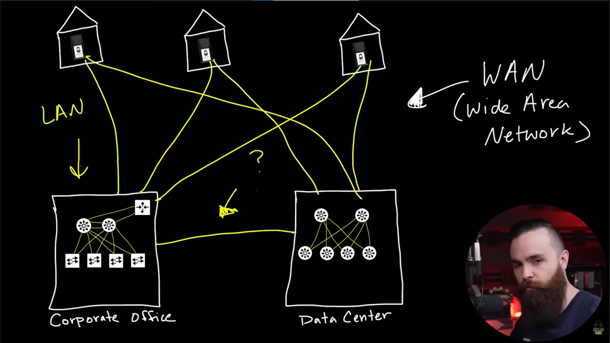
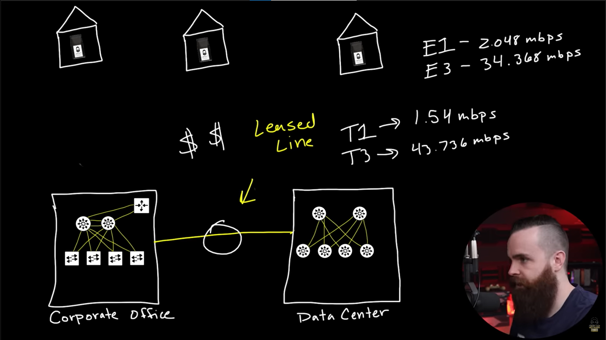
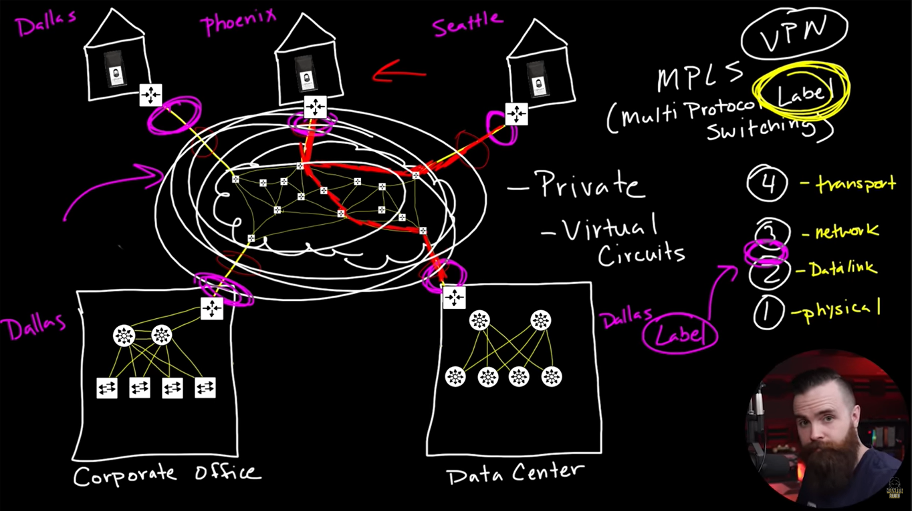
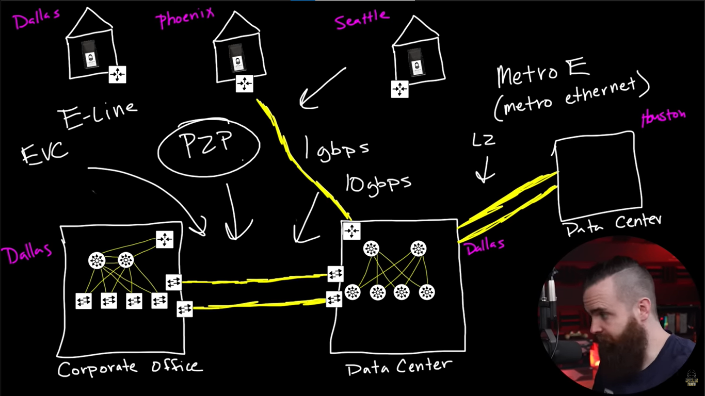

# 📝 Data Center

---

## 🎯 Judul & Tujuan

**Topik**: WAN  
**Tahap**: TAHAP-1  
**Kategori**: Networking  
**Tujuan Pembelajaran**:

- [x] Memahami apa itu WAN
- [x] Mengenal macam-macam WAN

---

## 💡 Konsep Utama

WAN adalah jaringan yg hubungkan beberapa LAN di lokasi yg berjauhan.

Internet merupakan contoh jaringan WAN publik terbesar, yg hubungkan jutaan jaringan di seluruh dunia pakai TCP/IP.

home lab, office, jaringan local etc = LAN
diluar LAN disebut WAN.

bagaimana jaringan sperti LAN bisa connect ke data center?
misal secara geografis terpisah jauh? pake kabel ethernet aja kan?

Cara hubungkan dari office ke Data Center?
(Jaman Dulu 1-4, Jaman Now 5)

1. Leased Line(jenis layanan untuk sambungkan)  
  klo internet biasanya data dibagi-bagi jdinya kecepatan dan latensinya berubah-ubah, klo ini jenis layanan yg stabil dan private tpi mahal.

    contoh:  
    corporate office <--------Leased Line---------> data center

    Jenis leased line(teknologi kabelnya)
    T1 -> kecepatan 1.5 Mbps
    T3-> 43.735 Mbps
    E1-> 2.048 Mbps
    E3-> 34.368 Mbps

    Alternatif selain Leased Line
    Frame Relay
    ATM(Asynchronous Transfer Mode)

2. MPLS(Multi Protocol Label Switching)  
    Ditemukan di thun 90 an, private, virtual circui (jaringan virtual kecil), bekerja di 2.5 layer yg dipakai sbgai label.

    Perlu provider(ISP) untuk hubungkan jaringan ke router lain yg saling terhubung, sampai nantinya ke router customer/tujuan, provider akan route/petakan dan hubungkan ke router yg diperlukan, nah itu akan diberi label dan diarahkan serta orang lain tdk akan bisa liat trafficnya. jdi ditandai pake label supaya router lain tinggal liat labelnya tanpa liat ip address.

    CE(Customer Edge)-> router(milik pelanggan) yg hubungkan ke router provider MPLS network.
    PE(Provider Edge)-> router(milik ISP) yg hubungkan ke MPLS network.

3. Metro Ethernet (mahal, tpi sangat cepat, bekerja di L2)  
    Ada SLA dan private source: spectrum enterprise  
    corporate office <--------Metro E---------> data center  
    atau  
    data center1 <--------Metro E---------> data center2  

    Biasanya hanya dipaki untuk sambungkan tempat-tempat vital/penting.

4. Pake Internet Public  
    Tapi harus disetting biar aman, sperti VPN jaringan tdi di tmbhi header, disembunyiin dan enkripsi, site to site vpn-> hubungkan dua atau lebih jaringan di tempat yg berbeda melalui internet.

    namun terkadang koneksinya lambat, karena packetnya sperti dilempar, prioritasin traffic gmna bisa pake QOS(quality of service) labelin beberapa traffic itu penting.

5. SD-WAN(Software-Devined WAN)  
    MPLS dying(sekarat) karena jaman dan teknoogi baru yg disebut SD-WAN.

    yaitu teknologi yg kelola jalur WAN scara otomatis pake software. karna pake internet koneksi biasanya, bisa optimasi dari cloud(AWS etc) lebih baik sampe ke tujuan data center-corporate office.

**Definisi Singkat**:

> WAN(Wide Area Network) adalah Jaringan yang mencakup area geografis luas (kota, negara, atau bahkan global), contoh paling umum ya internet itu sendiri.

---

**Visualisasi/Diagram**:

<table style="border: none; width: 100%; text-align: center;">
  <tr>
    <td style="border: none; vertical-align: top;">
      <figure>
        
        <figcaption>LAN vs WAN</figcaption>
      </figure>
    </td>
    <td style="border: none; vertical-align: top;">
      <figure>
        
        <figcaption>Leased Line</figcaption>
      </figure>
    </td>
  </tr>
  <tr>
    <td style="border: none; vertical-align: top;">
      <figure>
        
        <figcaption>MPLS (Multi Protocol Label Switching)</figcaption>
      </figure>
    </td>
    <td style="border: none; vertical-align: top;">
      <figure>
        
        <figcaption>Metro Ethernet</figcaption>
      </figure>
    </td>
  </tr>
</table>

---

## 📚 Sumber Belajar

| No | Sumber | Link | Format | Rating | Waktu |
|----|-----|------|--------|--------|-------|
| 1 | NetworkChuck - CCNA Course | <https://www.youtube.com/watch?v=xPi4uZu4uF0&list=PLIhvC56v63IJVXv0GJcl9vO5Z6znCVb1P&index=9> | Video | ⭐⭐⭐⭐⭐ | 26min |
| 2 | | | | | |
| 3 | | | | | |

**Sumber Rekomendasi**: NetworkChuck

---

## ⚡ Catatan Penting

### Poin Utama

1. **Terminologi**:  
    - **P2P**: topologi koneksi yang hubungkan dua lokasi secara langsung(hanya 2 titik).
    - **E-Line**: layanan metro e yg hubungkan dua lokasi aja.
    - **E-LAN**: layanan metro ethernet untuk hubungkan ke bnyak lokasi shingga dapat komunikasi satu sama lain.
    - **E-Tree**: mirip pohon, pusat bisa komunikas dengan cabang, tpi cabang komunikasi dengan cabang ga bisa.
    - **EVC**: jalur virtual yg hubungkan 2 atau lebih endpoint ethernet(dibuat oleh ISP).
    - **VPN**: untuk buat koneksi internet privat dan terenkripsi melalui internet/isp, kyk ada tunnel/terowongan nanti.

---
