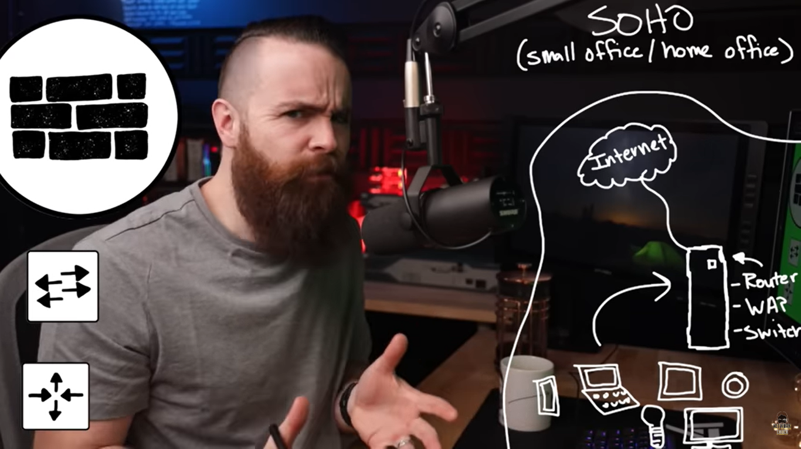
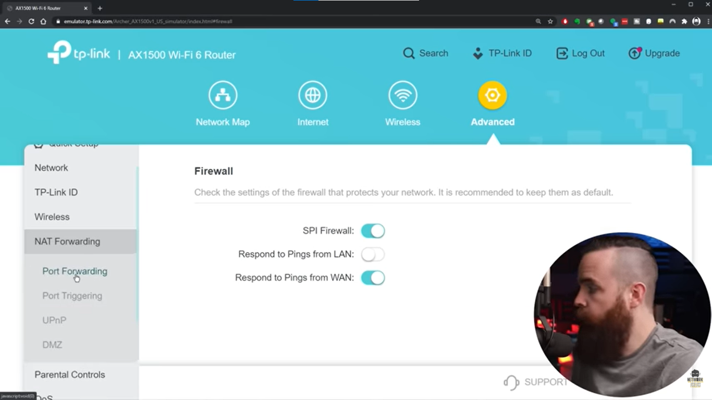
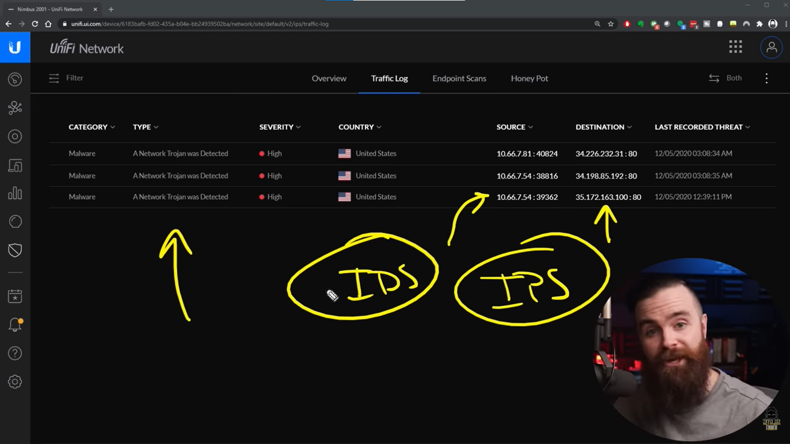

# 📝 SOHO / Home Network

---

## 🎯 Judul & Tujuan

**Topik**: SOHO  
**Tahap**: TAHAP-1  
**Kategori**: Networking  
**Tujuan Pembelajaran**:

- [x] Memahami apa itu SOHO
- [x] Mengetahui cara amankan SOHO

---

## 💡 Konsep Utama

SOHO(Small Office Home Office) adalah kantor kecil atau rumahan yg memiliki jaringan/infrastruktur IT sederhana. biasanya karyawan sdikit, contohnya warung kopi yg punya wifi, orang yg hobi buat home lab.

SOHO(small office/home office)  
internet  
   |  
   |  
   |  
router wifi  
(router, WAP, switch, all in)  
   |  
   |  
device  
(hp, laptop, smart tv, smart bulb, alexa)  

Klo yg enterprise, punya router, switch dan firewall tpi masih ke hack, apa jaringan LAN rumah sudah aman? dalam banyak kasus tdk aman.

Ancaman dari internet (outside)  
serang dan masuk ke dlam internet local(LAN), public ip address rentan & bahaya jika diketahui orang(hacker), karna bisa simpan info-info sensitif tentang network local. ISP berikan ip address ke router LAN.

cara cari tahu public ip sendiri?  
ketik di google-> what is my ip address?  
url-> whatismyipaddress.com, lalu liat isinya.

lalu ada dua cara scanning network vuln:  
a. pentest-tools.com-> untuk scanning network vuln yg terbuka dengan cepat

port-> sperti lubang atau pintu masuk ke jaringan local, firewall cegah dari luar untuk masuk seenaknya(blokir), port yg terbuka sperti port 80 (http) bisa dimasuki lewat website,nanti bisa akses didalam servernya lewati keamanan firewall, idealnya ga ada port yg terbuka.

b. nmap
perlu linux yg scan diluar LAN sendiri, pake linode free tpi card method billing:

dashboard->create->linode->OS(debian)->region terdekat->label-pw->udah jdi server linuxnya  

lauch console->terminal(glish), masukkan username dan pw  
apt install nmap -y(enter)-> nmap -sT ip.address  
akan muncul port open, closed, filtered.  

nmap --script vuln ip.address  
lama, why? karna pake script untuk temukan vulnerabilities di network, misal kerentanan ddos, tls, etc. biasanya hacker pake ini untuk cari jenis vuln di network jika tahu public ip address.

Cara amanin Jaringan SOHO:

1. Amanin dari Internet
    cara cegahnya supaya ga di hack?
    jangan kasih tau public ip, pake vpn recommend(north vpn)
    tpi pake vpn aja ga pasti aman, karna yg pake vpn cuma pc,   tpi device lain sperti tv, hp dll masih pake public ip.

    biasanya hacker scan ranges ip address, bukan cuma satu ip addr aja,
    cara secure? amanin/program config router atau beli router baru yg lebih baik(canggih).

2. Dari Device (IOT)
    misal alexa, light bulb, smart tv itu berbahaya.. why?
    mereka bisa akses apapun yg dimau, bisa masuk dan keluarin data ke internet.
    misal light bulb akses ke firmware perusahannya atau akses web china, kan tdk akan tau juga.

    Keamanan perangkat IOT:  
    |-port_key|-seeker of truth |-horcruxes   |  
    |-phones  |-vlan 6          |-cheap light |  
    |-tablets |-alex            |-cheap iot   |  
    |-laptops |-philips bulb    |-vlan 8      |  
    |-vlan 7  |  
    (vlan6-8 cuma beda no identitas dan lingkup).  

    port_key-> main wireless network (sangat dipercaya)  
    seeker of truth-> tdk bisa akses network lain (di port_key) bisa disebut client/device isolation.  
    horcruxes-> tidak mau sentuh device ini(sngat tidak dipercaya).  

    mau client isolation untuk iot device? router biasa ga bisa, harus sperti ini:  
    1.-DD-WRT custom firmware ke  
    2.cisco equipment(cheap router, switch) bisa tpi custom network dulu  
    3.ubiquiti(unifi)  

    Cisco untuk enterprise skala besar  
    Unifi untuk homelab, bisnis kecil-menengah  
    lebih rekomend ubiquiti murah tpi bisa berasa enterprise.

    unifi controller untuk kontrol network device(switch, wap, router)  
    prosumer-> produk untuk user yg butuh fitur lebih bukan user biasa tpi juga blum level enterprise.  
    dream machine-> perangkat network all-in-one(router, firewall, ids/ips, access point).  

    ids/ips(Intrusion detections system/intrusion protection system)  
    ids-> deteksi serangan, pantau dan beri peringatan (pasif)  
    ips-> deteksi dan langsung cegah serangan/blokir (aktif)  

    nmap -sT -O ip.address/24  
    untuk ketahui smua os yg connect ke network  

3. Amanin dari Wireless Network
    misal config router ada 6 langkah supaya pastikan aman:  
    masuk ke tp-link router  

    1.aktifin firewall  
    advanced->security->firewall->SPI firewall

    2.matikan port forwading  
    nmap -sT -p port_brp ip.address-> untuk scan port tertentu di LAN  
    NAT forwading->port forwading->lalu statusnya matiin smua di stiap service

    klo mau akses sesuatu dari luar gmna?  
    pake vpn yg bisa disambungin ke router wifi, di tp-link spertinya udah ada vpn bawaan

    3.disabled remote management  
    system->administration->remote management->disabled aja

    4.ubah default password wifi  
    misal username:admin pw:admin, mudah ketebak ganti ke kombinasi yg sulit aja

    5.upgrade firmware scara berkala  
    biasanya diupdate karna fitur baru atau ada kerentanan

    6.ubah config default router wifi  
    wireless->  
    ssid-> jangan pake nama default mudah ketebak pake random aja (harry poter, coffe, wifi-rumah etc)
    security-> pilih yg WPA2-PSK
    password-> jangan default dan mudah ketebak

    klo tamu mau connect ke wifi gmna? buat sendiri password untuk tamu (guest), jangan kasih mereka akses ke main network, buat network guest sendiri.  
    wireless->guest network

    7.(bonus) matiin reply ping  
    untuk keamanan lebih baik ga usah reply ping.  
    security->firewall-> respond to pings fom LAN/WAN matiin aja supaya hacker ga di reply ping.

4. Koneksi jaringan ke Company
    Ada 2 opsi:  
    vpn-> sperti buat terowongan yg aman, untuk cegah hacker liat traffic ke company.

    remote-access vpn  
    hubungkan perangkat(user) dengan jaringan, misal openvpn, cisco anyconnect yg buat koneksi vpn ialah router user.

    firewall  
    perusahaan berikan firewall kecil untuk ditaruh di jaringan rumah cisco Adaptive Security Appliance(ASA) 5506, jdi nanti ga connect ke router tpi connect langsung ke firewall(cisco ASA), jdi nanti perusahaan control apa yg masuk ke jaringan mereka lewat firewall kecil tdi, ini disebut site-to-site vpn.

    site-to-site vpn
    hubungkan jaringan dengan jaringan, yg buat koneksi vpn ialah device masing-masing user.

**Definisi Singkat**:

> VPN(Virtual Private Network) adalah teknologi yg bikin koneksi internet jadi privat dan terenkripsi lewat "tunnel" virtual.

---

**Visualisasi/Diagram**:

<table style="border: none; width: 100%; text-align: center;">
  <tr>
    <td style="border: none; vertical-align: top;">
      <figure>
        
        <figcaption>Topologi SOHO</figcaption>
      </figure>
    </td>
    <td style="border: none; vertical-align: top;">
      <figure>
        
        <figcaption>Point-to-Secure / VPN</figcaption>
      </figure>
    </td>
  </tr>
  <tr>
    <td style="border: none; vertical-align: top;">
      <figure>
        
        <figcaption>TP-Link Router Config</figcaption>
      </figure>
    </td>
    <td style="border: none; vertical-align: top;">
      <figure>
        
        <figcaption>UniFi Controller</figcaption>
      </figure>
    </td>
  </tr>
</table>

---

## 📚 Sumber Belajar

| No | Sumber | Link | Format | Rating | Waktu |
|----|-----|------|--------|--------|-------|
| 1 | NetworkChuck - CCNA Course | <https://www.youtube.com/watch?v=80vIin4xGp8&list=PLIhvC56v63IJVXv0GJcl9vO5Z6znCVb1P&index=10> | Video | ⭐⭐⭐⭐⭐ | 30min |
| 2 | | | | | |
| 3 | | | | | |

**Sumber Rekomendasi**: NetworkChuck

---

## ⚡ Catatan Penting

### Poin Utama

1. **Terminologi**:  
    - **Firewall**:  sistem keamanan jaringan yg memantau dan memfilter lalu lintas data masuk/keluar berdasarkan aturan (rules) yg ditentukan.

---
