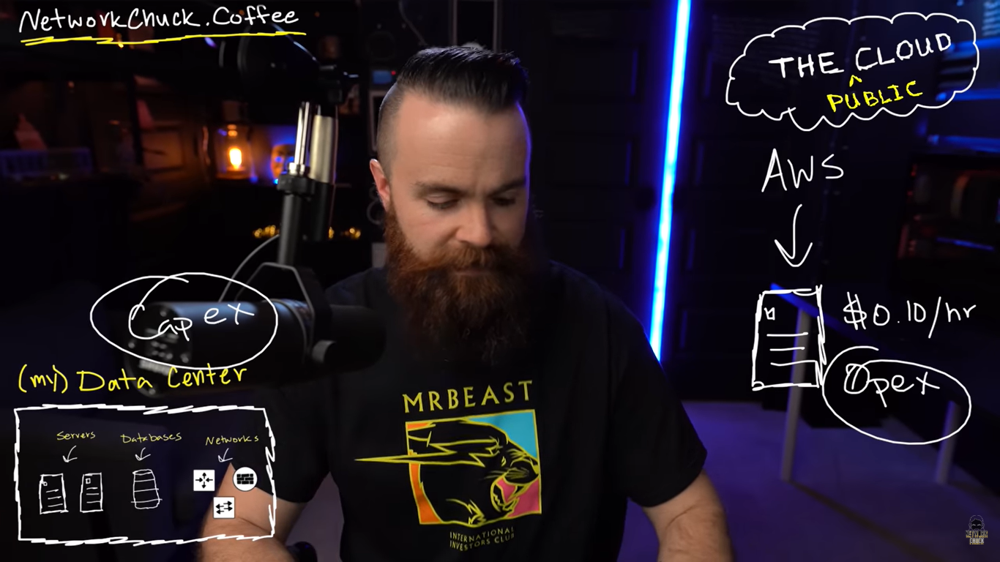
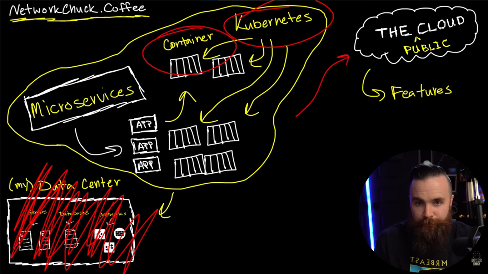
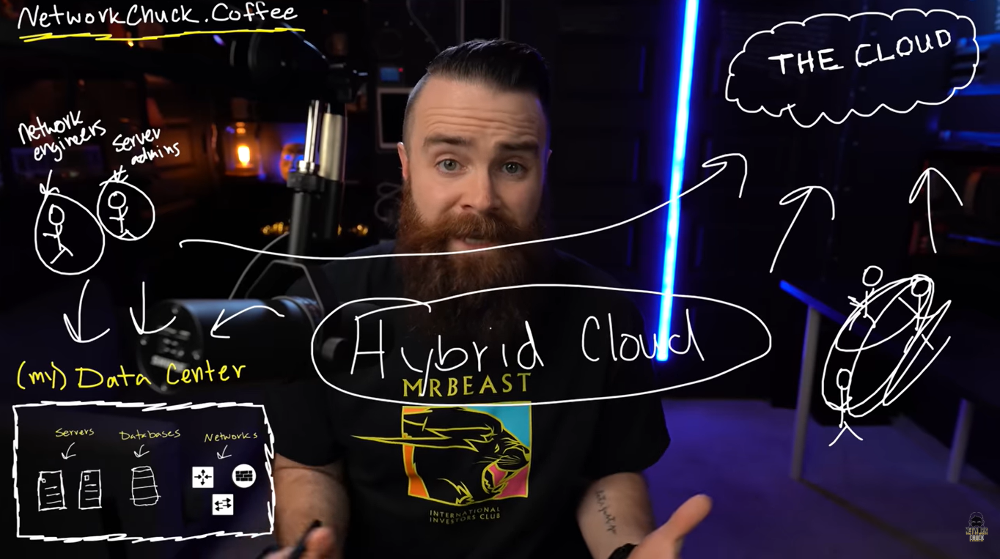
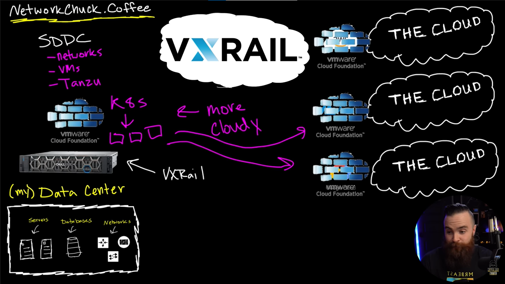

# 📝 HYBRID CLOUD

---

## 🎯 Judul & Tujuan

**Topik**: Hybrid Cloud  
**Tahap**: TAHAP-1  
**Kategori**: Networking  
**Tujuan Pembelajaran**:

- [x] Memahami apa itu Hybrid Cloud
- [x] Mengetahui cara kombinasikan On-Prem dan Hybrid Cloud

---

## 💡 Konsep Utama

Spertinya smua orang pake cloud kan?  
Cloud dimna-mana misal AWS, Google Cloud, Ms Azure etc.

namun tidak smua harus di cloud dan itu ide dari hybrid cloud...

On-Premises Infra  
smua app, smua layanan dan smua web mreka punya infrastruktur
sperti switch, router, firewall, db umumnya diperlukan di company

networkchuck.coffe misal yg buat infra di rumah (homelab) itu disebut on-prem. misal pake dari peralatan dell dan dell tech cloud, tpi biaya beli infra(router, switch) mahal bisa sampai 50.000-120.000 dollar, makanya orang2 lebih prefer ke cloud, karna bisa sewa server/layanan AWS bayarnya $0.10/hour, cuma klik klik langsung jdi dan bisa dipake(amazing).

misal traffic pengunjung naik gmna?  
homelab nambah server, peralatan dan itu mahal!
cloud tinggal klik klik dan hapus jika tidak dipake.

on-prem  
-> kdang kala cuma satu app yg besaaar, pake VM.

microserrvices  
-> dipecah-pecah jdi bagian/service yg kecil-kecil, pake container dan kubernetes
biasanya fitur-fitur itu hanya ada di cloud, namun tidak smua harus ditaruh di cloud

Misal di order coffe oleh CIA untuk supply maka kita perlu jdi security, compliance(regulasi yg ketat) supaya bisa tetap supply, nah karna ga mmungkin di cloud smua terkait keamanan dan kerahasiaan maka peru ditaruh di on-prem

lalu masalah storage dan latency, klo kemahalan dan lambat taruh di on-prem aja jngan di cloud. bnyak company pake hybrid cloud, ketika masuk akal taruh di cloud, ketika tdk masuk akal tetap di on-prem aja.

Ada dua masalah pake hybrid cloud  

1. Cara supaya punya fitur mirip cloud di on-prem
cloud punya bnyak fitur dan kereen bet, why on-prem infraku ga mirip cloud aja? dan ketika operasikan mirip cloud juga

2. Cloud punya Masalah Manajemen
klo di on-prem udah ada network engi, server admin mereka udah terlatih.
nah di cloud malah nambah orang(network engi, server admin) yg harus mengerti dan bisa manage cloud tersebut. itu pain point/kesulitannya dan terkadang company pake bermacam cloud.

sbuah perusahaan biasanya pake banyak cloud(multi-cloud)-> AWS, GCP, Azure, Digital Ocean
why? karna mengejar lower cost dan fitur terbaik.

lalu masalah multi-cloud/banyak provider layanan,
maka perlu orang yg beda, set up berbeda, sertif cloud berbeda, perlu login dan manage provider berbeda. maka perlu bnyak staff atau paksa staff sblumnya tpi buat capek dan ingin resign.

namun Dell punya solusi untuk dua masalah tersbut!  
Pada infra on-prem pake server dell dan install VMware ESXI.

1.cara manage on-prem
dell tech cloud partner dengan vxrail, vmware cloud foundation
vcenter, vrealize bisa dipake di banyak provider(AWS, GCP, Azure)

2.supaya punya fitur mirip cloud
vmware cloud foundation(vxrail) itu diinstall/ditanam ke provider(AWS, GCP, Azure)
cara supaya bisa pake microservices?
SDDC yaitu bisa otomasi.

- vms
- tanzu (alat untuk kubernetes & container)
- k8s (namalain dari kubernetes)

intinya on-prem bisa jdi "more cloudy".

**Definisi Singkat**:

> CAPEX (Capital Expenditure): Biaya modal di awal untuk membeli aset fisik (server, router, switch) — sekali bayar besar, lalu disusutkan. Cocok untuk on-prem.  

> OPEX (Operational Expense): Biaya operasional berulang (sewa cloud, listrik, langganan) — bayar per bulan/jam sesuai pemakaian. Cocok untuk cloud.

---

**Visualisasi/Diagram**:

<table style="border: none; width: 100%; text-align: center;">
  <tr>
    <td style="border: none; vertical-align: top;">
      <figure>
        
        <figcaption>On-Prem vs Cloud</figcaption>
      </figure>
    </td>
    <td style="border: none; vertical-align: top;">
      <figure>
        
        <figcaption>Cloud Features</figcaption>
      </figure>
    </td>
  </tr>
  <tr>
    <td style="border: none; vertical-align: top;">
      <figure>
        
        <figcaption>Hybrid Cloud</figcaption>
      </figure>
    </td>
    <td style="border: none; vertical-align: top;">
      <figure>
        
        <figcaption>VxRail / VMware Cloud Foundation</figcaption>
      </figure>
    </td>
  </tr>
</table>

---

## 📚 Sumber Belajar

| No | Sumber | Link | Format | Rating | Waktu |
|----|-----|------|--------|--------|-------|
| 1 | NetworkChuck - CCNA Course | <https://www.youtube.com/watch?v=37tyxaQbtN4&list=PLIhvC56v63IJVXv0GJcl9vO5Z6znCVb1P&index=11> | Video | ⭐⭐⭐⭐⭐ | 16min |
| 2 | | | | | |
| 3 | | | | | |

**Sumber Rekomendasi**: NetworkChuck

---

## ⚡ Catatan Penting

### Poin Utama

1. **Terminologi**:  
    - **SDDC(Sofware-Defined Data Center)**: sluruh komponen data center dikelola dan dikonfig melalui software, bukan scara manual lewat masing-masing device.
    - **VMWare EXSI**: hypervisor type 1untuk buat dan manage virtual machine.
    - **On-Prem**: Infrastruktur IT (server, storage, network) dimiliki dan dikelola sendiri di lokasi fisik perusahaan. Akses penuh, biaya awal tinggi.
    - **Cloud**: Infrastruktur disewa dari penyedia (AWS, Azure, GCP) via internet. Bayar sesuai pemakaian, skalabel, tanpa urus hardware fisik.
    - **Multi-Cloud**:  Menggunakan lebih dari satu penyedia cloud (AWS, Azure, GCP) secara bersamaan untuk menghindari vendor lock-in, optimasi biaya, dan memanfaatkan fitur terbaik dari masing-masing provider.

---
