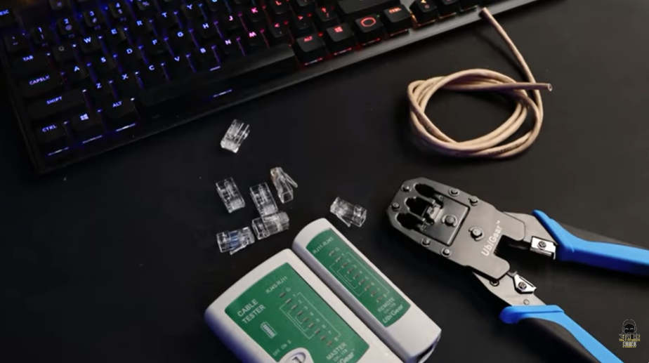
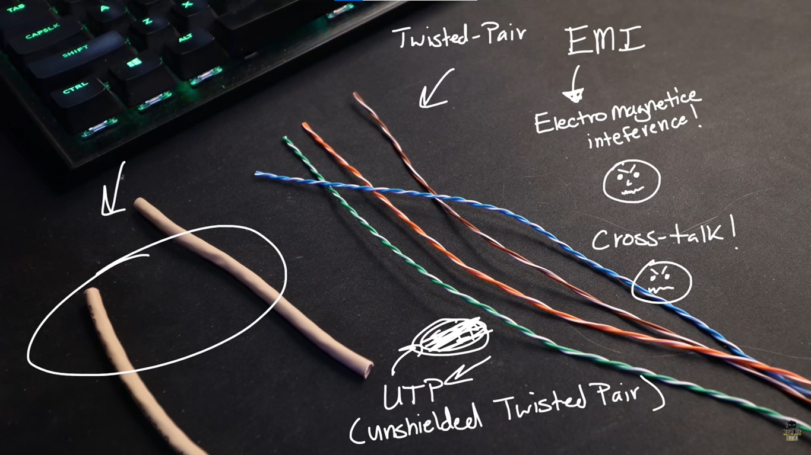
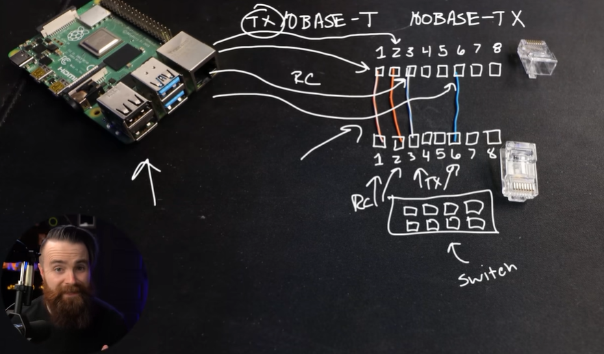
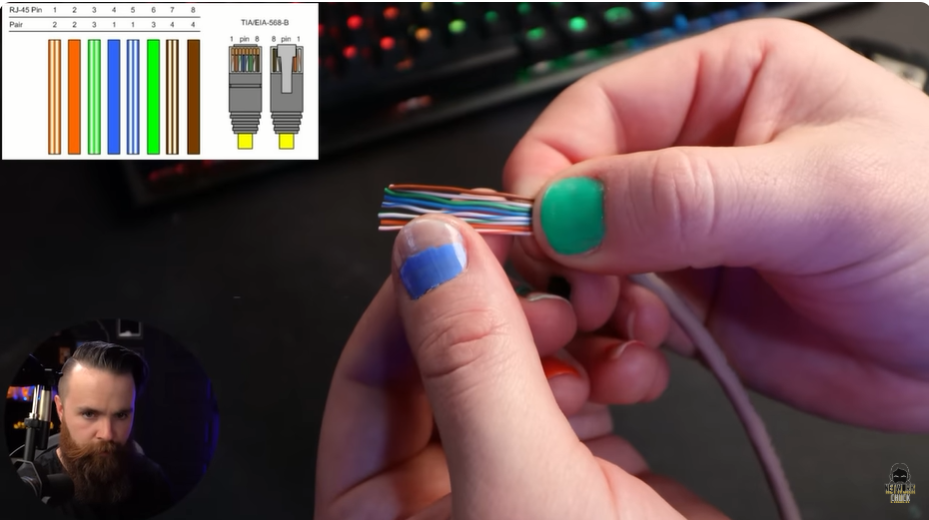
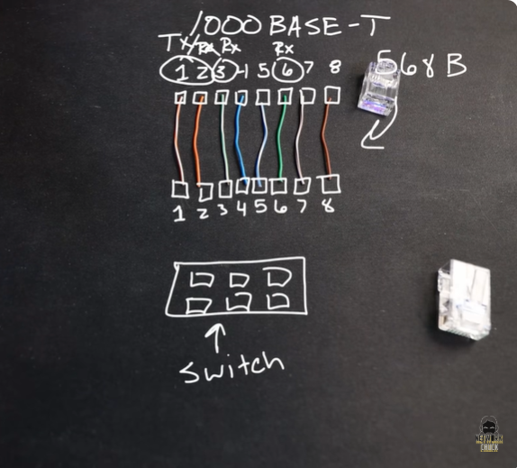
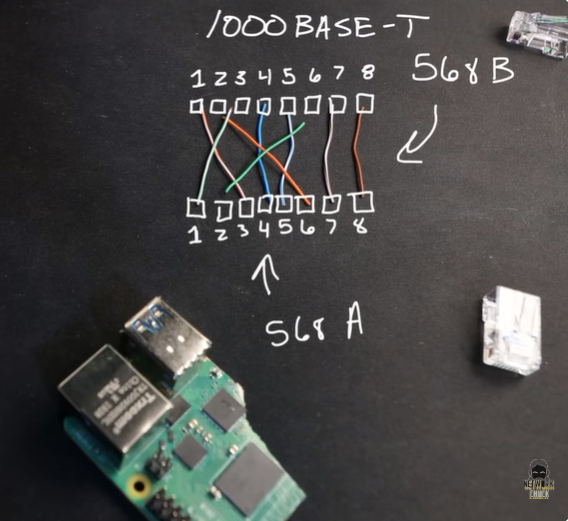
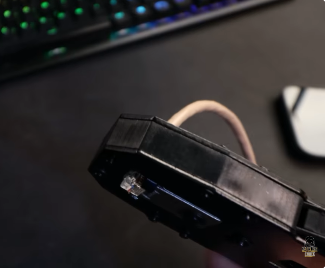
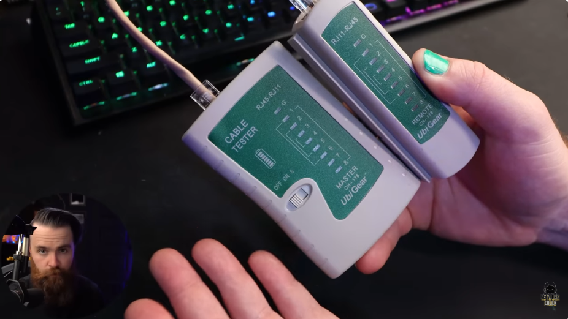

# 📝 Ethernet Cable

---

## 🎯 Judul & Tujuan

**Topik**: Ethernet Cable  
**Tahap**: TAHAP-1  
**Kategori**: Networking  
**Tujuan Pembelajaran**:

- [x] Memahami apa itu Ethernet Cable
- [x] Mengetahui cara membuat Ethernet Cable

---

## 💡 Konsep Utama

Ethernet Cable adalah kabel yg digunakan untuk hubungkan ke perangkat dalam jaringan(LAN).

misal:
PC─────────Switch
Switch─────────Switch
Access Point─────────Switch

Mengapa perlu buat ethernet kabel? bukankah sudah ada langsung di toko tinggal beli? misal ada yg potong kabelnya maybe? :v  
sbgai network engineer yg bekerja di sebuah data center atau bahkan homelab yg perlu modif panjang kabel di rumah.

Apa yg diperlukan untuk buat ethernet cable?

- Cable ethernet Cat5e
- Konektor RJ45
- Crimping tool (Crimper)
- Network Cable Tester (opt)

Deep dive:  
pelindung konektor (si jacket) tentu untuk melindungi kabelkonektor (warna warni) dari bahaya luar. masing2 kabel kecil warna warni itu disebut copper wires, karna itu merupakan bahan konduktor.

Misalkan untuk hindari gangguan sperti:  

- EMI-> gangguan elektromagnetik yang dapat mengganggu sinyal pada kabel.  

- crosstalk-> gangguan sinyal dari satu kabel ke kabel lain di dlm kabel Ethernet.

Jenis pelindung cable ethernet:

- UTP(Unshielded Twisted Pair) biasanya dipasang dirumah-rumah, kurang tahan ke EMI.

- FTP(Foiled Twisted Pair) punya lapisan alumunium foil yg bungkus smua twisted pair, dipasang di gedung.

- STP(Shielded Twisted Pair) pake anyaman logam untuk bungkus, lebih kuat dari FTP hadapi interferensi, dipake di pabrik, ruang mesin.

- S/FTP (Shield + Foil) paling lengkap ada anyaman logam dari luar dan stiap twisted pair dibungkus alumunium foil juga, dipake di data center, RS, industri berat.

Sejarah perubahan versi Cable Ethernet:

Dulu pada tahun 1990 hanya ada 4 copper wired ini (2 twisted pair)  
Cat 3  Ethernet Cable  
Copper wires(4) 10BASE-T  
10BASE= 10 mbps, T= twisted pair  
putih-oranye, oranye, putih-biru, biru.

lalu pada tahun 1995, sudah lebih cepat tpi masih 4 copper wires  
Cat 5  Ethernet Cable  
Copper wires(4) 100 BASE-TX
100mbps  
putih-oranye, oranye, putih-biru, biru.

Cat5e Ethernet Cable(Jaman Now)  
Copper wires(8) 1000 BASE-T:  
putih-oranye, oranye, putih-biru, biru, putih-hijau, hijau, putih-coklat, coklat.

pc komunikasi dalam binary(0 dan 1), lalu bgmna cara sinyal elektro komunikasi pake 0 dan 1
misal +2.5volt itu dianggap 1, -2.5volt?  
itu dianggap 0, itu berlangsung sangat cepat(miliaran kali perdetik) tpi bukan pake pasti angka sperti ini.

satu kabel twisted pair akan digunakan untuk kirim data(TX atau transmit), yg lainnya akan digunakan untuk menerima data(RC atau receive).

Pada RJ45 ada 8 pin yg terbuat dari metal/logam yg nantinya tiap wire akan cocokkan ke dalamnya.

misal di rasberry pi, terdapat NIC yg akan mengirim data pake wire warna putih-oranye, oranye, yg ditempatkan di pin 1 dan 2. lalu akan menerima pake wire warna putih-hijau, hijau, di pin 3 dan 6.

8 pin  di RJ45 (dari rasberry pi)  
 1    2   3    4   5   6   7   8  
[po] [o] [ph] [ ] [ ] [h] [ ] [ ]  
 |    |   |            |  
 |    |   |            |         <====  Straight-throught cable  
 |    |   |            |  
[po] [0] [ph] [ ] [ ] [h] [ ] [ ]  
 1    2   3    4   5   6   7   8  
connect ke switch  

po=putih-oranye | o=oranye  
ph=putih-hijau  | h=hijau  

misal device yg sama? pc dan pc, switch dan switch apa bisa?  
tidak, karena di pin 1 dan 2 akan saling bicara satu sama lain dan akan bertabrakan, itu sebabnya.

solusinya? tinggal pake crossover aja,
dari pin switch1(1 dan 2) putih oranye serta oranye ke pin switch2(3 dan 6),
lalu dari pin switch1(3 dan 6) putih hijau serta hijau ke pin switch2(1 dan 2).

8 pin  di RJ45 (dari rasberry pi)  
 1    2   3    4   5   6   7   8  
[po] [o] [ph] [ ] [ ] [h] [ ] [ ]  
 |    |   |            |  
 |    |   |            |         <==== Crossover cable (COBA UBAH LAGI)  
 |    |   |            |  
[po] [0] [ph] [ ] [ ] [h] [ ] [ ]  
 1    2   3    4   5   6   7   8  
connect ke  

(ini masih yg jadul 10BASE-T dan 100BASE-TX)

1000BASE-TX (versi terbaru)  
Cat 5e  Ethernet Cable  
Copper wires(8) 1000 BASE-TX  
1000mbps  
568A-568B  

TX= transmit | RX= Receive  

TX   TX   RX   TX  TX   RX  RX   RX  
 1    2   3    4   5    6   7    8  
[po] [o] [ph] [b] [pb] [h] [pc] [c]  
 |    |   |    |   |    |   |    |  
 |    |   |    |   |    |   |    | <==== Straight-throught cable  
 |    |   |    |   |    |   |    |  
 |    |   |    |   |    |   |    |  
[po] [0] [ph] [b] [pb] [h] [pc] [c]  
 1    2   3    4   5    6   7    8  

T568A: putih-hijau, hijau, putih-oranye, biru, putih-biru, oranye, putih-coklat, coklat.  
T568B: putih-oranye, oranye, putih-hijau, biru, putih-biru, hijau, putih-coklat, coklat

bisa kirim data simultaneosly(secara bersamaan) pada setiap pasang wires, setiap pasang wires(misal putih hijau dan hijau) bisa mengirim sekaligus menerima di waktu yg sama, putih-hijau mengirim, hijau menerima dst. tpi wires yg berurutan sesuai standart masih diperlukan supaya bisa.

klo yg crossover? sama aja tpi ada tambahan sperti pb,b,pc,c

po=putih-oranye | o=oranye  
ph=putih-hijau  | h=hijau  

Auto-mdix  
bisa di switch connect ke switch atau switch connect ke pc.
teknologi dari switch untuk deteksi mana pin yg sedang mengirim dan mana pin yg sedang menerima listrik,
kelemahan Auto MDI-X yaitu hanya bisa pada jarak 100m maximal, jika lebih dari itu maka tidak akan bisa

Cat 6-> 10GBASE-T (10 Gigabit/second), pin dan urutan wirenya mirip namun di tengah ada benda aneh yg disebut
Cat 8-> 40GBASE-T (40 Gigabit/second)

Langkah-langkah membuat Ethernet Cable:

1. potong dulu kabelnya diawal dan diakhir sesuai ukuran(5-10m)
lalu kupas kedua ujung kabel skitar 3cm(1 inci).
bukanya menggunakan crimper(ada lubang yg cocok untuk kabel ethenet, cari!)

2. nanti akan terlihat warna warni dan warna putih sperti rambut nenek, potong yg warna putih.
yg warna warni(kable konduktor) itu pisahkan dan luruskan dulu,

    lalu urutkan sesuai urutan berikut:  
    a. Straight-through:
    kedua ujung sama (A dan B)
    putih-oranye, oranye, putih-hijau, biru, putih-biru, hijau, putih-coklat, coklat

    b. Crossover:
    kedua ujung beda (T568A <-> T568B)
    T568A: putih-hijau, hijau, putih-oranye, biru, putih-biru, oranye, putih-coklat, coklat
    T568B: putih-oranye, oranye, putih-hijau, biru, putih-biru, hijau, putih-coklat, coklat

3. potong(dengan crimper) dan samakan panjang kabel konduktor tersebut skitar setengah-1 inch(1,27 cm).
pastikan dulu kepala RJ45 taruh yg ada pengaitnya/clip ke arah bwh.

4. masukkan kabel konduktor kedalam kepala RJ45 dan pastikan sudah sesuai urutan kabel konduktornya,

5. masukkan kepala RJ45 ke lubang di crimper, pastikan yg ada gigi besinya ada dibelakang,  setelah itu tekan crimper dan ulangi sampai merasa sudah terkunci dengan kabel. lalu coba tarik apakah sudah melekat sempurna, ulangi langkah awal pada ujung lainnya.

6. ambil cable tester dan kabel yg udah ada RJ45 dan masukkan ke cable tester di kedua lubang, hidupkan tester ke mode lambat atau ke mode cepat. lihat apakah smua lampu nyala sesuai urutan(dari G,1 sampai 8), (khusus Straight-through)
  
cable tester-> untuk pastikan smua pin/kabel warna-warni dapat menyala di lampu cable tester.

late collisions adalah tabrakan data (collision) yang terjadi terlambat, yaitu setelah 64 byte pertama frame Ethernet sudah dikirim.

**Definisi Singkat**:

>

---

**Visualisasi/Diagram**:

<table style="border: none; width: 100%; text-align: center;">
  <tr>
    <td style="border: none; vertical-align: top;">
      <figure>
        
        <figcaption>Tools &amp; Material</figcaption>
      </figure>
    </td>
    <td style="border: none; vertical-align: top;">
      <figure>
        
        <figcaption>Wire Arrangement</figcaption>
      </figure>
    </td>
  </tr>
  <tr>
    <td style="border: none; vertical-align: top;">
      <figure>
        
        <figcaption>NIC</figcaption>
      </figure>
    </td>
    <td style="border: none; vertical-align: top;">
      <figure>
        
        <figcaption>RJ45 Pinout</figcaption>
      </figure>
    </td>
  </tr>
  <tr>
    <td style="border: none; vertical-align: top;">
      <figure>
        
        <figcaption>Straight-through</figcaption>
      </figure>
    </td>
    <td style="border: none; vertical-align: top;">
      <figure>
        
        <figcaption>Crossover</figcaption>
      </figure>
    </td>
  </tr>
  <tr>
    <td style="border: none; vertical-align: top;">
      <figure>
        
        <figcaption>Crimping</figcaption>
      </figure>
    </td>
    <td style="border: none; vertical-align: top;">
      <figure>
        
        <figcaption>Cable Tester</figcaption>
      </figure>
    </td>
  </tr>
</table>

---

## 📚 Sumber Belajar

| No | Sumber | Link | Format | Rating | Waktu |
|----|-----|------|--------|--------|-------|
| 1 | NetworkChuck - CCNA Course | <https://www.youtube.com/watch?v=y8h5qY3zwic&list=PLIhvC56v63IJVXv0GJcl9vO5Z6znCVb1P&index=12> | Video | ⭐⭐⭐⭐⭐ | 43min |
| 2 | | | | | |
| 3 | | | | | |

**Sumber Rekomendasi**: NetworkChuck

---

## ⚡ Catatan Penting

### Poin Utama

1. **Terminologi**:  
    - **Auto MDI-X(Automatic Medium Dependent Interface Crossover)**:  adalah fitur yang membuat port Ethernet otomatis menentukan jalur kirim (TX) dan terima (RX).
    - **NIC (Network Interface Card)**: kartu antarmuka jaringan, hardware yang memungkinkan perangkat (PC, Raspberry Pi, dll) terhubung ke jaringan. Setiap NIC punya alamat MAC unik dan menangani pengiriman/penerimaan data di layer 2

---
