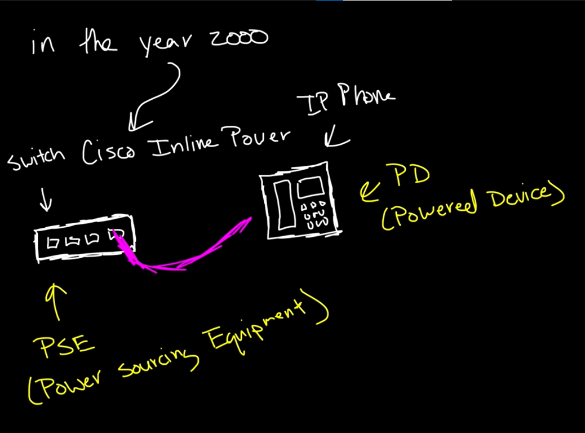
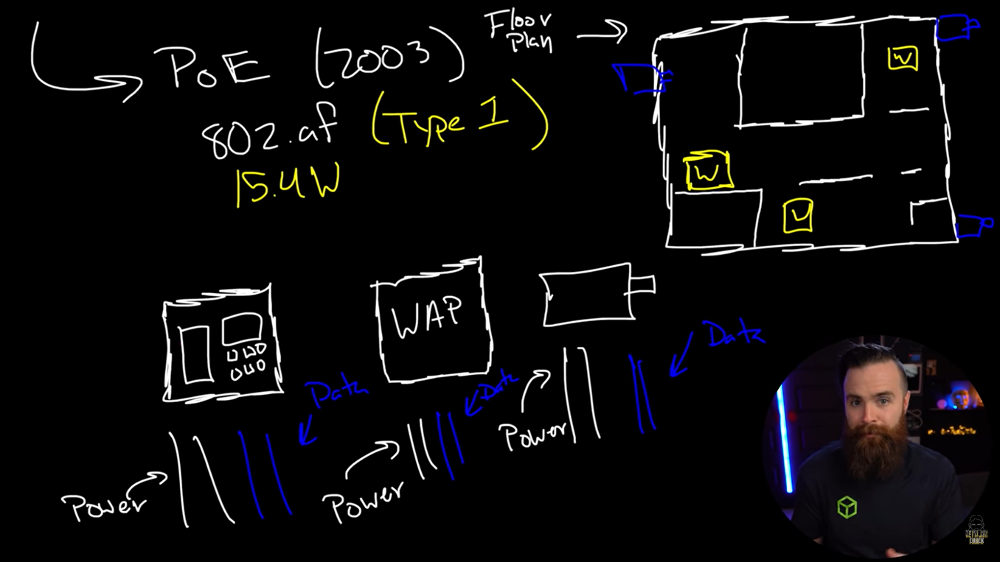
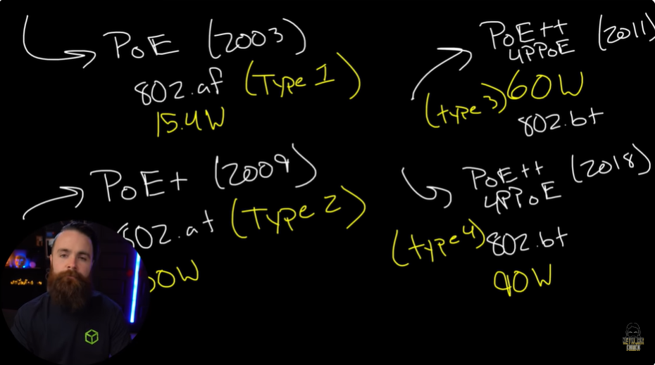
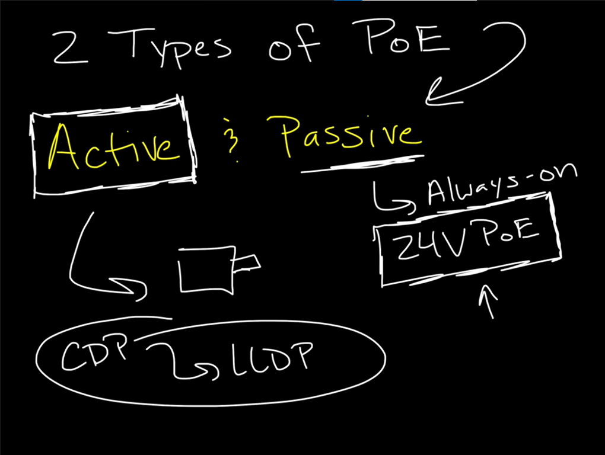
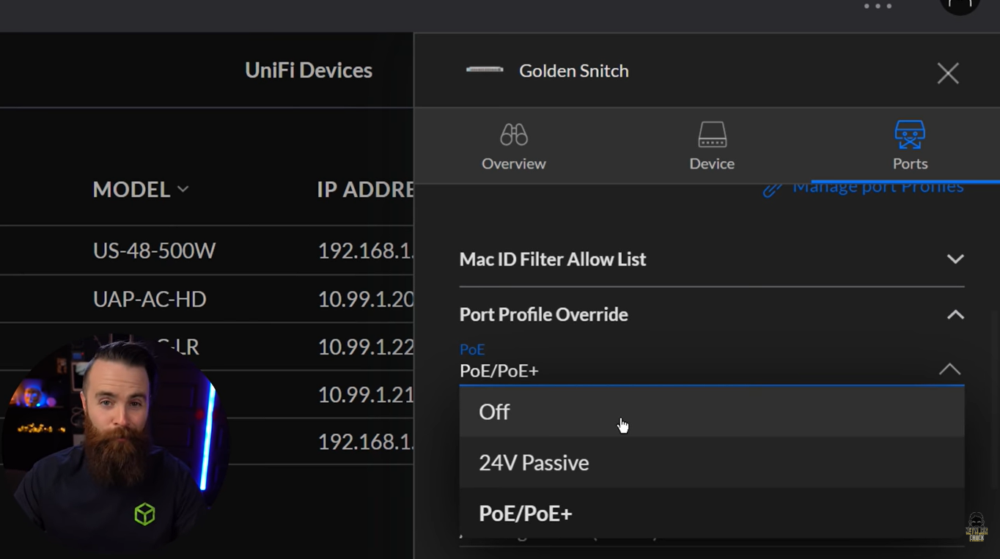

# 📝 PoE

---

## 🎯 Judul & Tujuan

**Topik**: PoE  
**Tahap**: TAHAP-1  
**Kategori**: Networking  
**Tujuan Pembelajaran**:

- [x] Memahami apa itu PoE
- [x] Mengetahui jenis-jenis PoE

---

## 💡 Konsep Utama

PoE(Power Over Ethernet) adalah teknologi yg bisa mengalirkan daya listrik sekaligus data jaringan(internet) pada satu kabel aja.

Asal usul POE:  
Cisco pikir knp ga sekalian power cable(arus daya) dan ethernet cable(network) jdi satu cable aja ya?

Pada tahun 2000 cisco menemukannya dan dinamai dengan nama Cisco Inline Power.

Switch --------------- Ip Phone (Powered Device)

cara supaya bisa kirim 2 sumber daya tersebut(listrik dan network) bagaimna?  
misal sblum Ethernet Cat 5 kan cuma 4 wires yg dipake (1,2,3,6), nah sisanya itu yg dipake buat salurin daya listrik.

Cisco kerjasama dengan IEEE untuk buat standartnya, nah sterusnya perusahaan lain bisa pake standart yg sama (ubiqi,aruba,juniper)
lalu yg unik di commands promptnya mereka masih pake kata inline power itu sbgai pengingat bahwa mereka yg menemukannya.

knp pake POE?  
karena malas, engineer yg baik itu MALAZZ, makanya kita otomatisasikan sesuatu :v  
maksudnya itu gini misal mau pasang perangkat di kantor,
ada ip phone, WAP, camera security maka tiap devce perlu power(listrik) dan internet(data), nah engi biasanya klo mau pasang listrik harus sewa/bayar electrician(kang listrik), daripada sewa mending langsung aja satu cable, sperti itu lazy yg dimaksud.

Rangkaian versi PoE:  
Nama umum:    PoE (2003)  
Standar IEEE: 802.af(Type 1)  
Daya maks:    15.4 W  

Nama umum:    PoE+ (2009)  
Standar IEEE: 802.af(Type 2)  
Daya maks:    30 W  

Nama umum:    PoE++ (2011)  
Standar IEEE: 802.bf(Type 3)  
Teknologi:    4ppoE  
Daya maks:    60 W  

(Type 3)  
UPoE (Universal Power over Ethernet)  
udah pake 4 twisted pair(8 wires) makanya bisa sebesar itu, udah bisa connect switch ke switch lain.

Nama umum:    PoE++ (2018)  
Standar IEEE: 802.bf(Type 4)  
Teknologi:    4ppoE  
Daya maks:    90 W  
(Type 4)  
udah bisa powering laptop, lampu led bahakan AC!(tergantung daya).

Dua type PoE(Actice & Passive):

1. Active
    yg sering dipake di switch brand2, karena bisa atur jumlah power yg mengalir, misal ga diatur powernya? bisa meledak karna kelebihan daya.

    CDP-> cisco discovery protocol.  
    dibuat oleh cisco, supaya perangkat jaringan bisa berkenalan dengan perangkan tetangganya(neighbor discovery) mereka negosiasi berapa power yg akan dikirim.

    LLDP-> Link Layer Discovery Protocol, sama dengan CDP tpi yg buat standart itu IEEE.

2. Passive
    stupid :v, cuma ngirim power trus(always-on), 24VPoE-> ubiquity support/pake ini.

    PoE class:  
    class 0: 0.44-12.94 watss  
    class 1: 0.44-3.84 w  
    class 2: 3.84-6.49 w  
    class 3: 6.49-12.95 w  

    misal di ubiquity(unifi) PoE:  
    golden snitch->ports-> PoE/PoE+-> pilih Off, 24V Passive, PoE/PoE+.

LAB(NetworkChuck):  
multi switch->cli->enable  

lalu sambungkan switch ke device lain, lighning bolt->lighning bolt(lagi)->lalu tekan switch dan tekan ip phone.

cli-> ada tulisan detected, power granted  
cli-> show power inline-> ada info yg dipake, tersedia, tersisa, alokasi power masing-masing device.

umumnya klo switch 24 ports dan masing-masing device cuma ambil 30 watts aja,  
maka 24x30= 720 masih bisa connect rata,  
lalu misal lebih dari 24 port dan daya 30 w gmna,maka ada device yg kurang berfungsi optimal.

**Definisi Singkat**:

>

---

**Visualisasi/Diagram**:

<table style="border: none; width: 100%; text-align: center;">
  <tr>
    <td style="border: none; vertical-align: top;">
      <figure>
        
        <figcaption>PoE Origin (Cisco Inline Power)</figcaption>
      </figure>
    </td>
    <td style="border: none; vertical-align: top;">
      <figure>
        
        <figcaption>Why PoE?</figcaption>
      </figure>
    </td>
  </tr>
  <tr>
    <td style="border: none; vertical-align: top;">
      <figure>
        
        <figcaption>PoE Versions</figcaption>
      </figure>
    </td>
    <td style="border: none; vertical-align: top;">
      <figure>
        
        <figcaption>Active vs Passive PoE</figcaption>
      </figure>
    </td>
  </tr>
  <tr>
    <td style="border: none; vertical-align: top;">
      <figure>
        
        <figcaption>UniFi 24V Passive PoE</figcaption>
      </figure>
    </td>
    <td style="border: none; vertical-align: top;">
    </td>
  </tr>
</table>

---

## 📚 Sumber Belajar

| No | Sumber | Link | Format | Rating | Waktu |
|----|-----|------|--------|--------|-------|
| 1 | NetworkChuck - CCNA Course | <https://www.youtube.com/watch?v=MLxgmkRzgIQ&list=PLIhvC56v63IJVXv0GJcl9vO5Z6znCVb1P&index=13> | Video | ⭐⭐⭐⭐⭐ | 19min |
| 2 | | | | | |
| 3 | | | | | |

**Sumber Rekomendasi**: NetworkChuck

---

## ⚡ Catatan Penting

### Poin Utama

1. **Terminologi**:  
    - **PSE(Power Sourcing Equipment)**: perangkat yg menjadi sumber daya listrik dan network.
    - **Powered Device**: ialah device yg bisa menerima daya listrik dari PSE melalui ethernet.

---
