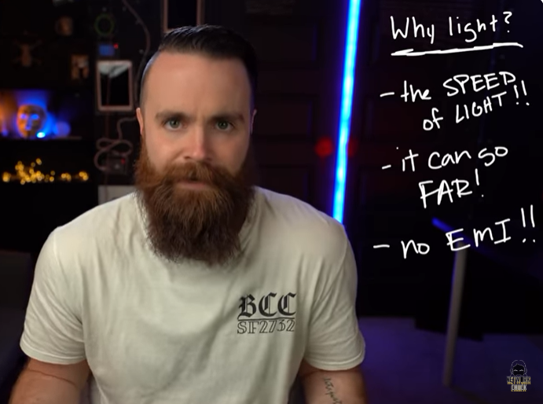
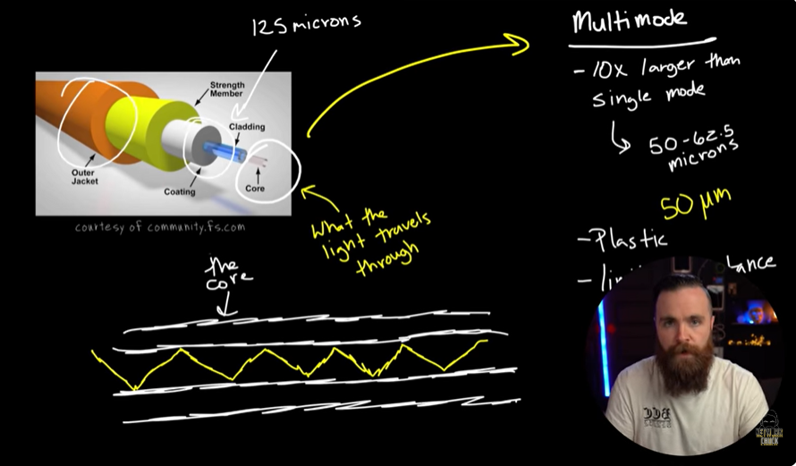
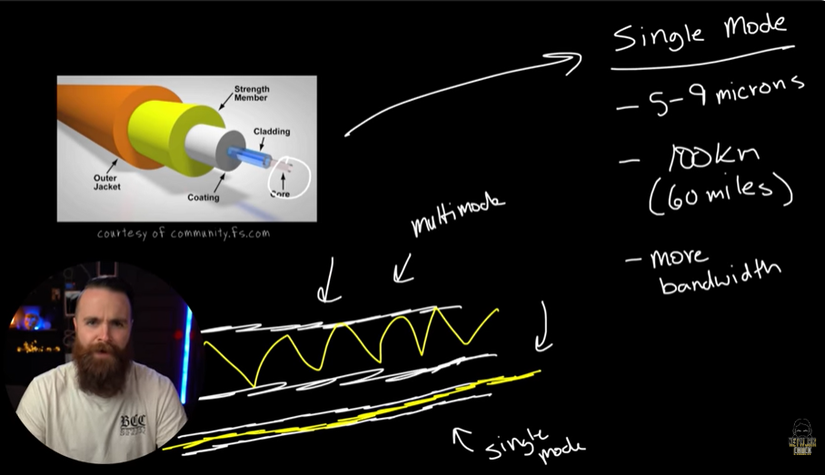
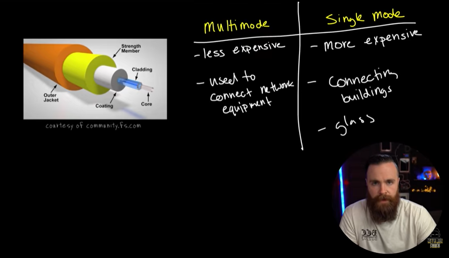
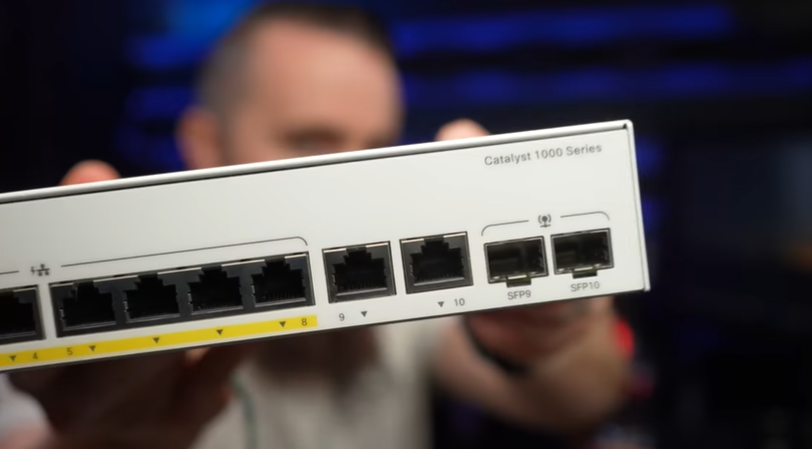

# 📝 Fiber Cable

---

## 🎯 Judul & Tujuan

**Topik**: Fiber Cable  
**Tahap**: TAHAP-1  
**Kategori**: Networking  
**Tujuan Pembelajaran**:

- [x] Memahami apa itu Fiber Cable
- [x] Mengetahui komponen penyusun Fiber Cable

---

## 💡 Konsep Utama

Fiber Optik Cable adalah kabel yg mengirimkan data tidak pake electric signal tpi pake cahaya (light).

Pake fiber optic itu keren,tpi knp pake cahaya untuk untuk kirim sinyal?  
karena sangat cepat yaitu kecepatan cahaya tpi dipangkas 31% karena cahaya berintekraksi dengan atom-atom kaca. bisa bertukar data sampai 100 terabit/second dan bisa sangat panjang sampai 100km, tidak punya attenuation dan EMI !.

Dua mode Fiber Optic:

1. Multi Mode

    cahaya melalui core kabel, cahaya tersebut memantul-mantul di core karena refaction, jangan pernah bengkokkan kabelnya, gulung aja ditangan sperti biasa, karna klo patah maka tidak bisa alirkan cahaya lagi.

    cladding untuk pastikan cahaya(light) tdak meninggalkan core cable
    dan yg laind coating,strength member, outer jacket untuk bungkus kabel lainnya supaya tidak mudah dibengkokkan dan patah.

    - 10x lebih besar daripada single mode (50-62.5 micons)
    - pake plastik sebagai corenya, penjangnya bisa sampe 300m

2. Single Mode

- 5-9 microns
- pake kaca untuk core, panjangnya bisa sampe 100km, bandwith lebih besar.
- tdk memantul di core, langsung melaju lurus sperti peluru, karenanya attenuation lebih sedikit, bisa lebih jauh(panjang).

Multi:  
lebih murah, untuk sambungkan perlengkapan, = core pake plastic(POE).

vs

Single:  
lebih mahal, untuk hubungkan bangunan(gedung-gedung), hubungkan antar negara jaringan (switch, rak server), pake glass(kaca).

knp masih pake ethernet kan ada fiber?  
karena murah dan mudah diatur(manage),karena misal putus/ubah panjang kabel maka lebih mudah dibanding fiber, core nya lebih kecil dan perlu skill dan peralatan khusus.

fiber optic cable connectors:
ST, SC, LC, MT-RJ,  
kebanyakan pake tipe LC dan SC.

klo mau hubungkan fiber ke switch gmna?  
tidak bisa langsung ke pot ethernet (rj45), harus ke port SFP, dan perlu modul SFP sebagai penghubung antara perangkat jaringan(router,switch) dan media transmisi(fiber optik), misal ujung fiber di port switch pake LC (LC)<---->(SC) di patch panel pake SC, dan kombinasi lain.

Duplex Fiber Optics Cable->  
berlaku dua arah,ada 2 individual wires, satunya khusus untuk menerima data, satunya lagi khusus untuk mengirim data
bisa juga untuk singlemode.

Bagian-Bagian Fiber:  

- core (inti)  
terbuat dari kaca/plastik(POF), memantulkan cahaya.

- cladding (selubung)  
mengelilingi core, terbuat dari kaca yg indeks bias lebih rendah drpda core, untuk pantulkan cahaya kembali ke core, diameter standart: 125 µm.

- coating  
lapisan pelndung akrilik, lindungi fiberdari kelembapan, tdk hantarkan cahaya.

Multimode Fiber Types:  
Om1-om5

**Notes:**
Beli aja kabel fiber,susah klo buat sendiri, ga murah tpi juga ga mahal benget, fiber superior dibanding ethernet, tpi ga bisa mirip PoE(Power over Ethernet), sulit diatur(manage).

Kabel Fiber biasanya untuk connectkan core switch ke switch  lain, lantai ke lantai, gedung ke gedung, multimode berwana orang,aqua, hijau, lalu singlemode berwarna kuning.

**Definisi Singkat**:

>

---

**Visualisasi/Diagram**:

<table style="border: none; width: 100%; text-align: center;">
  <tr>
    <td style="border: none; vertical-align: top;">
      <figure>
        
        <figcaption>Why Light?</figcaption>
      </figure>
    </td>
    <td style="border: none; vertical-align: top;">
      <figure>
        
        <figcaption>Multimode Fiber</figcaption>
      </figure>
    </td>
  </tr>
  <tr>
    <td style="border: none; vertical-align: top;">
      <figure>
        
        <figcaption>Singlemode Fiber</figcaption>
      </figure>
    </td>
    <td style="border: none; vertical-align: top;">
      <figure>
        
        <figcaption>Multi vs Single Mode</figcaption>
      </figure>
    </td>
  </tr>
  <tr>
    <td style="border: none; vertical-align: top;">
      <figure>
        
        <figcaption>SFP Port</figcaption>
      </figure>
    </td>
    <td style="border: none; vertical-align: top;">
    </td>
  </tr>
</table>

---

## 📚 Sumber Belajar

| No | Sumber | Link | Format | Rating | Waktu |
|----|-----|------|--------|--------|-------|
| 1 | NetworkChuck - CCNA Course | <https://www.youtube.com/watch?v=E3DEJ7odWq0&list=PLIhvC56v63IJVXv0GJcl9vO5Z6znCVb1P&index=14> | Video | ⭐⭐⭐⭐⭐ | 19min |
| 2 | | | | | |
| 3 | | | | | |

**Sumber Rekomendasi**: NetworkChuck

---

## ⚡ Catatan Penting

### Poin Utama

1. **Terminologi**:  
    - **POF(Plastic Optical Fiber)**: serat optik yg core-snya terbuat dari plastik, bukan kaca.
    - **Refraction**: pembiasan cahaya, yaitu perubahan arah cahaya saat berpindah.
    - **Attenuation**: penurunan kekuatan sinyal karena jarak kabel yg teralu panjang.
    - **Microns**: satuan panjang sperjuta meter, 1 meter = 1.000.000 mikron (µm).
    - **Total Internal Refraction**: pemantulan seluruh cahaya kembali ke dalam core, sehingga cahaya tdk keluar ke cladding.
    - **SFP(Small Form-factor Pluggable)**: modul transceiver yg dipasang pada perangkat jaringan seperti switch, router, media converter, atau server untuk hubungkan perangkat ke kabel fiber optik.

---
