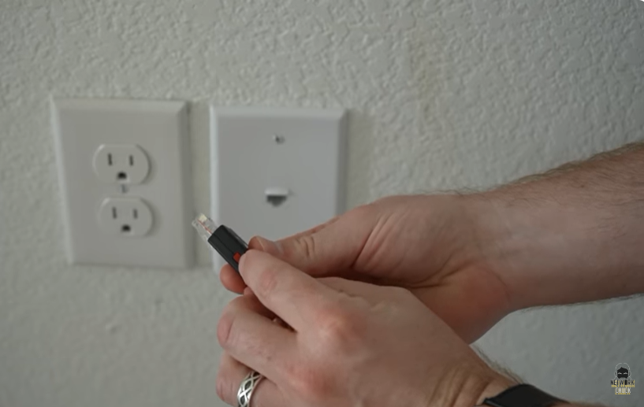
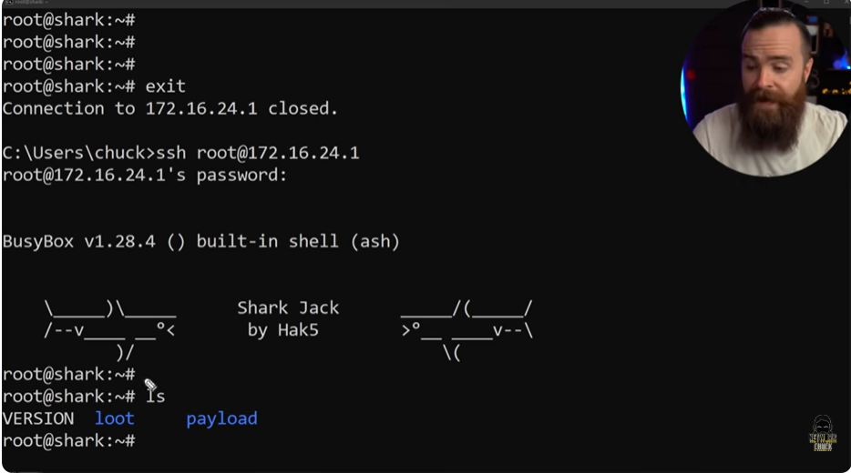
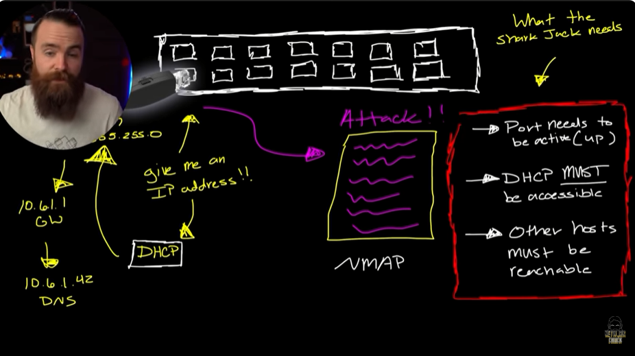
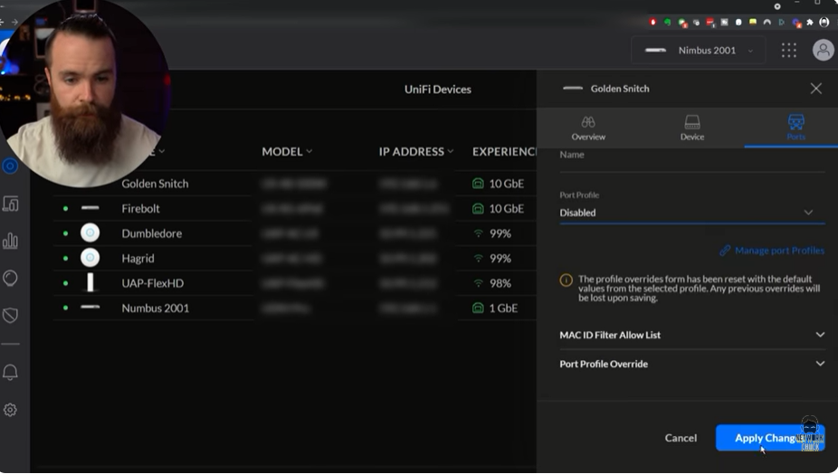
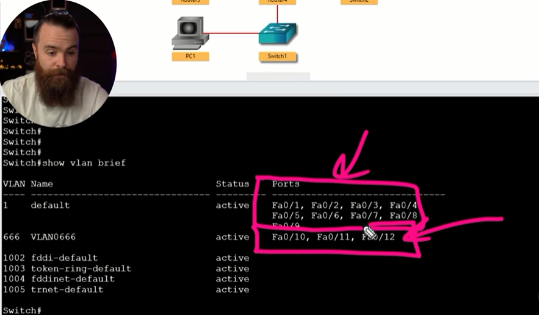
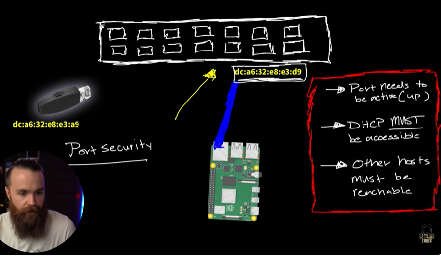
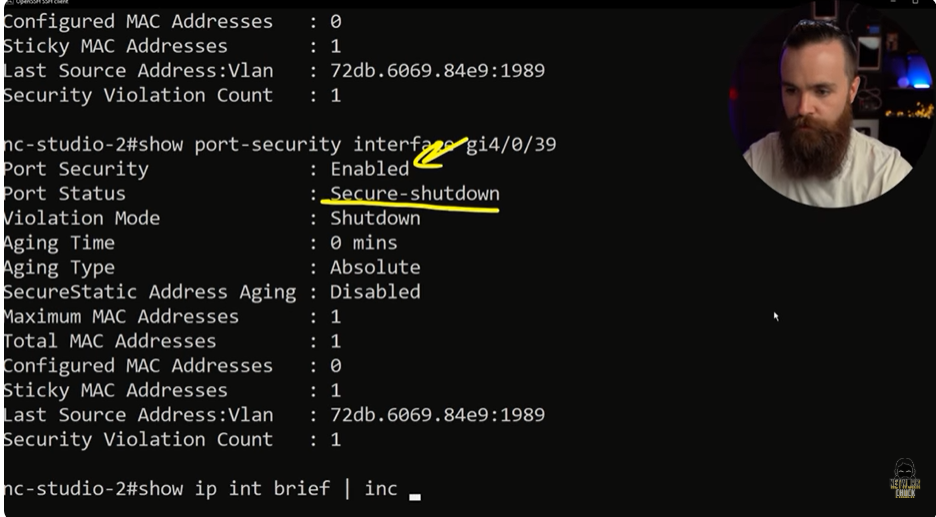

# 📝 Port Security

---

## 🎯 Judul & Tujuan

**Topik**: Port Security  
**Tahap**: TAHAP-1  
**Kategori**: Networking  
**Tujuan Pembelajaran**:

- [x] Memahami apa itu Port Security
- [x] Mengetahui cara amankan Port

---

## 💡 Konsep Utama

Di bisnis, bandara, restoran bahkan di rumah apakah port aman dari serangan hacker?  
misal pakai shark jack dari hack5, buka penutup lalu alihkan ke mode attack dan colokkan (ke RJ45), maka akan bisa dapat info dari network.

Shark jack(USB) hak5  
linux sever jalan didalmnya, ukurannya sbesar kunci motor

Isinya?  
colokkan ke pc->terminal->ssh->muncul tampilan di terminal (Shark Jack).  
loot-> tempat simpan hasil dari attack(payload).  
payload-> jalankan script otomatis untuk attack.  

Customizable jdi bisa utak-atik isi scriptnya, ada scriptnya di github untuk berbagai macam test. misal ping-tester,jac-tester, internet-access-tester.

Urutan warna LED:  
putih-> booting/menyalakan perangkat  
biru-> siap/tunggu koneksi  
ungu-> payload sedang berjalan  
hijau-> payload selesai  
merah> terjadi kesalahan  

Saat di attack mode maka akan berikan ipaddress dari port device yg dicoloknya via DHCP. yg dari DHCP tersebut akan dapat banyak info sperti subnet mask, gateway, bahkan dns server. scanning lewat NMAP untuk beri tahu host yg tersedia dan port mana yg terbuka.

Shark jack bisa sanning dengan syarat:

- port perlu active (up)
- DHCP harus bisa diakses
- host lainnya harus bisa ditemukan

Cara amanakan port?

1. Matikan port(shutdown) yg tidak dipakai  
    terminal-> show ip int brief | inc down (tampilin interface port yg saat ini dimatikan)  
    down down karena memang tidak ada yg dicolokkan ke port trsbt.
    terminal->conf t->interface fa0/1->shut -> maka akan muncul pesan administratively down.  
    artinya sudah dimatikan secara admin dan tidak akan bisa dipakai kecuali diaktifkan lagi.  

    Misal Unifi:  
    golden snitch->port->pilih salah satu port(misal 13)-> port profile->disable.

    terkadang shutdown port satu2 g enak, karena kadang ga dikasi label diportnya.

2. Masukkan ke black hole network(VLAN)  
    misal up maka pastikan tidak bisa akses semua(network), yaitu DHCP server.

    Pisahkan ke VLAN 666

    show vlan brief->akan menunjukkan default vlan yg sudah ada,  
    conf t-> vlan 666->exit-> interface fa0/10-> switchport access vlan666->show vlan brief.

    Misal di Unifi:  
    networks->add new network->misal namanya BLACKHOLE->  
    ->advance->vlan id(666)-> auto scale network(off)->DHCP server(none)->device isolation(on)->  
    ->lalu masukkan pot ke vlan->switch->pilih port->port profile->black hole.

3. port security  
    misal port yg normal(dipake buat ethernet sperti biasa), dicabut dan dicolokin shark jack gmna dong, bukannya nanti bisa akses hackernya. ketika dimasukkan ke port maka akan ambil mac address device, idenya hanya izinkan mac address device yg aman yg boleh akses.

    terminal->ssh->enable->show run interface gi4/0/39(port 39)  
    conf t->int gi4/0/39->switchport mode access->switchport port-security.  
    switchport port-security maximum 1(cuma 1 mac address yg diizinkan)  
    switchport port-security mac-address(nanti muncul bberapa pilihan mode)->  
    switchport port-security mac-address sticky  

    Ada 3 cara set mac address:  
    H.H.H-> harcode mac address yg diizinkan.  
    forbidden->hardcode mac address yg mau diblokir.  
    sticky->untuk ingat mac address yg pertamakali connect ke port.  

    misal ada yg langgar(cabut lalu tancapkan mac yg beda)  
    switchport port-security violation (nanti muncul bberapa pilihan mode)-> switchport port-security violation shutdown

    protect-> tetap up, tidak ada log/notif, packet dari mac tdk dikenal dibuang.  
    restrict-> tetap up, kirim log/SNMP, packet dari mac tdk dikenal dibuang.  
    shutdown-> untuk matikan port sampai diaktifkan kembali.  

Untuk Lacak(simulasi):  
show port-security->show port-security address->misal ada yg colokkan port dengan shark jack.  
->show port-security interface gi4/0/39->muncul port status secure-shutdown karna coba dilanggar.  

cara kembalikannya, karena tidak otomatis up setelah dicabut shark jacknya.  
show interface gi4/0/39 status(err-disabled status)->  
conf t->int gi4/0/39->shut-> no shut  
->do sh interface gi4/0/39->show port-security->show port-security interface gi4/0/39(secure-up).  

klo di unifi?  
ports->pilih port(misal 13)->mac id filter allow list->masukkan mac address scara hard code(manual).

**Definisi Singkat**:

>

---

**Visualisasi/Diagram**:

<table style="border: none; width: 100%; text-align: center;">
  <tr>
    <td style="border: none; vertical-align: top;">
      <figure>
        
        <figcaption>Shark Jack Device</figcaption>
      </figure>
    </td>
    <td style="border: none; vertical-align: top;">
      <figure>
        
        <figcaption>Terminal Shark Jack</figcaption>
      </figure>
    </td>
  </tr>
  <tr>
    <td style="border: none; vertical-align: top;">
      <figure>
        
        <figcaption>Shark Jack Needs</figcaption>
      </figure>
    </td>
    <td style="border: none; vertical-align: top;">
      <figure>
        
        <figcaption>Turn Off Unused Port</figcaption>
      </figure>
    </td>
  </tr>
  <tr>
    <td style="border: none; vertical-align: top;">
      <figure>
        
        <figcaption>Black Hole VLAN</figcaption>
      </figure>
    </td>
    <td style="border: none; vertical-align: top;">
      <figure>
        
        <figcaption>Port Security Config</figcaption>
      </figure>
    </td>
  </tr>
  <tr>
    <td style="border: none; vertical-align: top;">
      <figure>
        
        <figcaption>Port Shutdown Violation</figcaption>
      </figure>
    </td>
    <td style="border: none; vertical-align: top;">
    </td>
  </tr>
</table>

---

## 📚 Sumber Belajar

| No | Sumber | Link | Format | Rating | Waktu |
|----|-----|------|--------|--------|-------|
| 1 | NetworkChuck - CCNA Course | <https://www.youtube.com/watch?v=0W4JZIWtjLQ&list=PLIhvC56v63IJVXv0GJcl9vO5Z6znCVb1P&index=15> | Video | ⭐⭐⭐⭐⭐ | 23min |
| 2 | | | | | |
| 3 | | | | | |

**Sumber Rekomendasi**: NetworkChuck

---

## ⚡ Catatan Penting

### Poin Utama

1. **Terminologi**:  
    - **DHCP(Dynamic Host Configuration Protocol)**: adalah protokol jaringan yang berfungsi memberikan konfigurasi IP secara otomatis kepada perangkat yang baru terhubung ke jaringan.
    - **SNMP**: adalah singkatan dari Simple Network Management Protocol, yaitu protokol yang digunakan untuk memantau (monitor), mengelola, dan menerima notifikasi dari perangkat jaringan seperti router, switch, access point, firewall, hingga server.
    - **Trunk**: mode pada port switch yang memungkinkan satu kabel membawa lalu lintas dari beberapa VLAN sekaligus.

---
