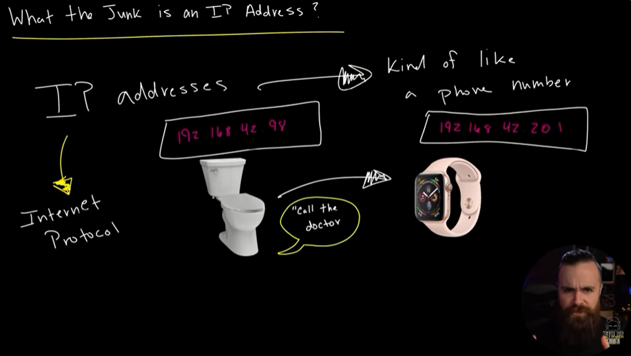
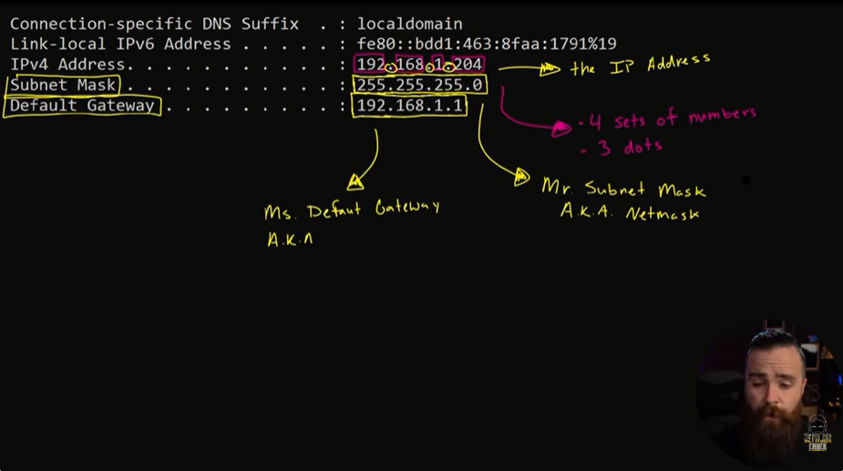
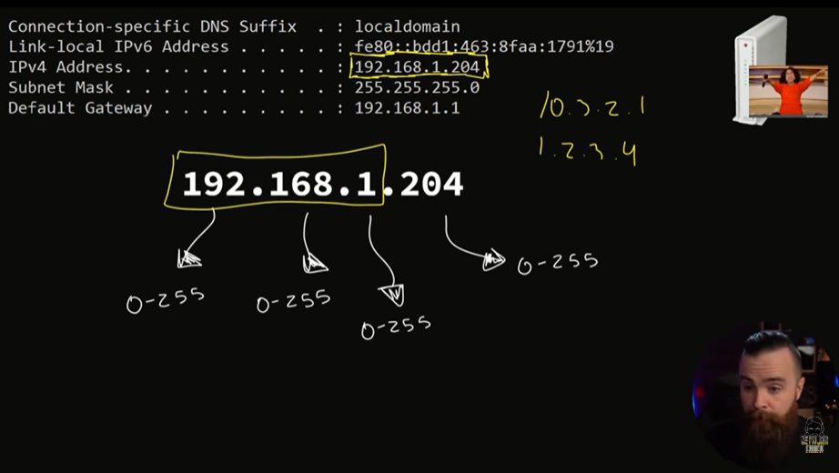
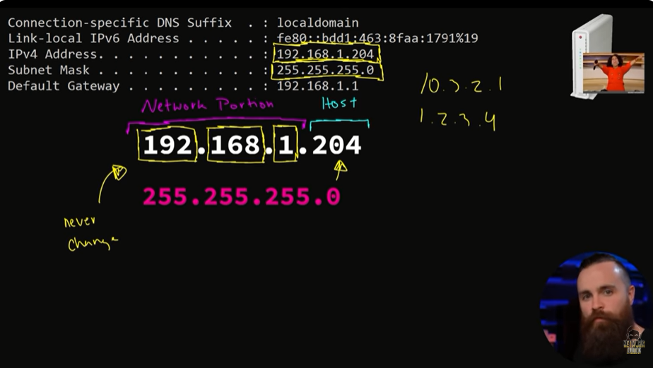
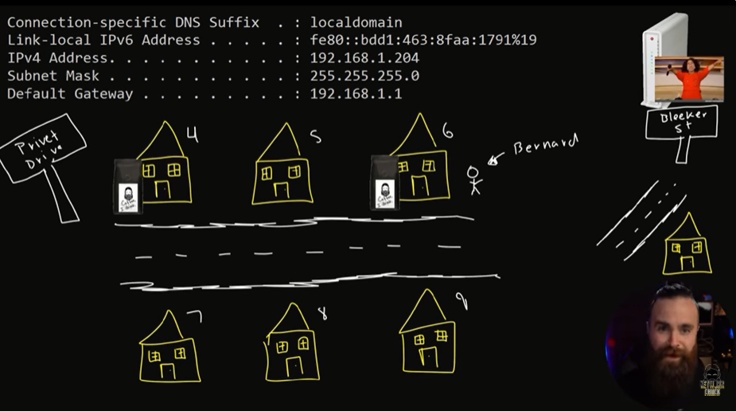
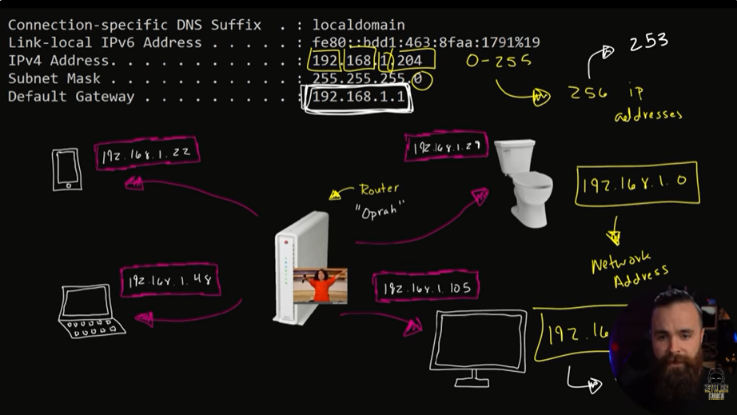

# 📝 IP Address

---

## 🎯 Judul & Tujuan

**Topik**: IP Address  
**Tahap**: TAHAP-1  
**Kategori**: Networking  
**Tujuan Pembelajaran**:

- [x] Memahami apa itu IP Address
- [x] Mengetahui komponen penyusun IP Address

---

## 💡 Konsep Utama

Sperti magic, mereka yg buat internet bisa bekerja, itu sebabnya banyak dipakai. speti di handphone, jam tangan, light bulbs, oven, bahkan toilet!

Mengetahui ip address dan subnetting sangat dibutuhkan di job,
sperti networking, ethical hacking, security, cloud.

IP(Internet Protocol) Addresses  
-> semacam nomor tel yg berada di device(perangkat).
misal saya(555-555-555) dan kamu punya nomor sendiri untuk komunikasi (555-555-555).  
Tpi klo device mereka pake ip address(192.168.42.98), dan bisa untuk connect ke internet dan komunikasi satu sama lain.

Cara temukan ip address?

- windows: cmd->ipconfig

- mac/linux: terminal->ifconfig

- hp->settings->wifi->wifi yg diapakai->ip address

nah sudah ketemu, misal: 192.168.1.204, ip address itu 4 kumpulan angka lalu masing-masing kumpulan dipisahin oleh 3 titik.

lalu muncul juga teman-temannya ip address:  

- mr. subnet mask/netmask(255.255.255.0)  
teman baik ip address.

- ms. default gateway(192.168.1.1)  
nama lain default router/router, anggap aja mirip gojek.
untuk bisa komunikasi dengan jaringan lain maka perlu router(default gateway).

Bgmna device dapat ip address?  
dari router, ketika device connect ke router maka akan langsung diberi ip address.

192.169.1.204  
masing nomor ini(misal 192 atau 204) bisa dari 0-255,  
misal 10.3.2.1 atau 1.2.3.4

192.169.1.204 -> ip address  
255.255.255.0 -> subnet mask/netmask  
192.169.1.204 -> default gateway(router)  

192.169.1.204  
network portion(192.169.1), host(204).

masing kumpulan 4 angka itu disebut octet (192.169.1.204)
klo mau bisa akses sama jaringan maka harus sama 3 angka terdahulunya (192.168.1) tdk boleh berubah. lalu octet yg terakhir(host) boleh apapun dari (0-255).

Analoginya:  
Jalan melati di perumahan1 yg berisi banyak perumahan yg punya alamat masing-masing(R01,R02,R03).  
klo saya(R01) mau anterin bubuk kopi ke alamat R03, maka antarnya tinggal jalan aja.  
klo misal satu perumahan masih enak karena masih satu jalan/perumahan(network portion), jdi tidak perlu pake gojek untuk antar.

lalu ada yg mau nyoba bubuk kopi, rumahnya di surabaya jdi beda jalan, maka perlu gojek/router(default gateway) untuk antarin ke beda jalan(jaringan).

sebenarnya jumlah host yg bisa dipakai bukan full 256(0-255),  
tpi dipotong pajak, jdi total yg bisa dipakai jdi host 253.

192.168.1.0-> network address, pemimpin dan yg lahir pertama.  
192.168.1.255-> broadcast address, menyampaikan ke smua host.  
192.168.1.1-> diambil oleh router (sbgai default gateway).  

**Definisi Singkat**:

>

---

**Visualisasi/Diagram**:

<table style="border: none; width: 100%; text-align: center;">
  <tr>
    <td style="border: none; vertical-align: top;">
      <figure>
        
        <figcaption>What is IP Address?</figcaption>
      </figure>
    </td>
    <td style="border: none; vertical-align: top;">
      <figure>
        
        <figcaption>IP Address &amp; Friends</figcaption>
      </figure>
    </td>
  </tr>
  <tr>
    <td style="border: none; vertical-align: top;">
      <figure>
        
        <figcaption>IP Range (0-255)</figcaption>
      </figure>
    </td>
    <td style="border: none; vertical-align: top;">
      <figure>
        
        <figcaption>Network vs Host Portion</figcaption>
      </figure>
    </td>
  </tr>
  <tr>
    <td style="border: none; vertical-align: top;">
      <figure>
        
        <figcaption>Analogy Perumahan</figcaption>
      </figure>
    </td>
    <td style="border: none; vertical-align: top;">
      <figure>
        
        <figcaption>Network &amp; Broadcast Address</figcaption>
      </figure>
    </td>
  </tr>
</table>

---

## 📚 Sumber Belajar

| No | Sumber | Link | Format | Rating | Waktu |
|----|-----|------|--------|--------|-------|
| 1 | NetworkChuck - CCNA Course | <https://www.youtube.com/watch?v=5WfiTHiU4x8&list=PLIhvC56v63IJVXv0GJcl9vO5Z6znCVb1P&index=16> | Video | ⭐⭐⭐⭐⭐ | 18min |
| 2 | | | | | |
| 3 | | | | | |

**Sumber Rekomendasi**: NetworkChuck

---

## ⚡ Catatan Penting

### Poin Utama

1. **Terminologi**:  
    - **Network Portion**: bagian alamat IP yang identifies jaringan (gedung/kantor/kelompok).
    - **Host portion**: bagian yang identifies perangkat spesifik (komputer, HP, printer) dalam jaringan itu.

---
