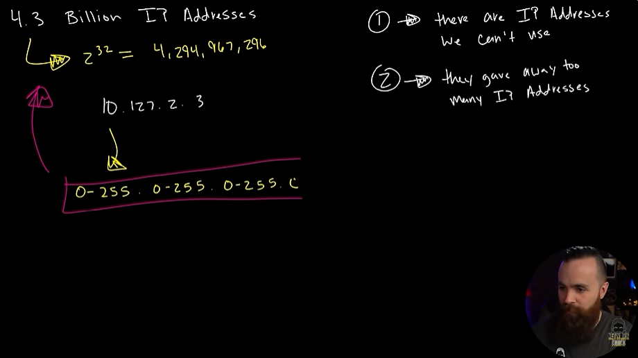
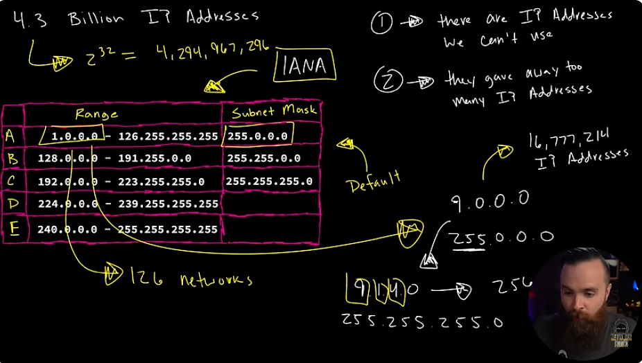
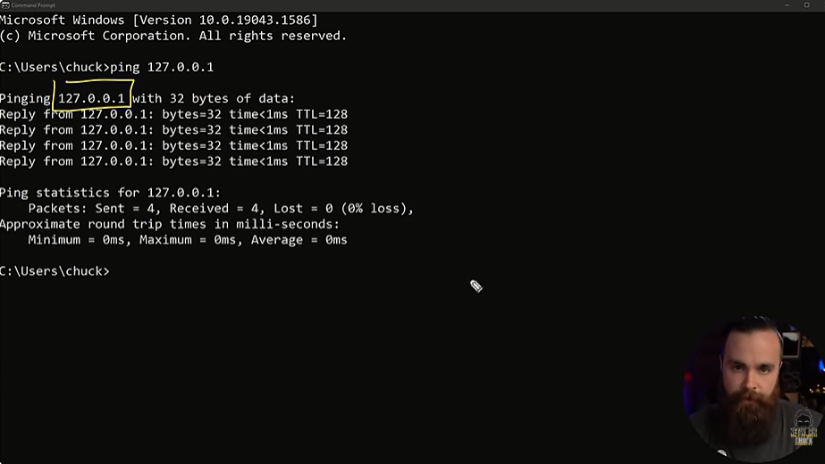

# 📝 Ran Out IP Address

---

## 🎯 Judul & Tujuan

**Topik**: Ran Out IP Address  
**Tahap**: TAHAP-1  
**Kategori**: Networking  
**Tujuan Pembelajaran**:

- [x] Memahami mengapa IP Address habis
- [x] Mengetahui pembagian class IP Address

---

## 💡 Konsep Utama

Ketika device ingin komunikasi dengan device lain maka pelu ip address, tpi spertinya 4.3 miliar ip address tersebut habis.

Pada tanggal 1 Januari 1993, hari kelahiran intenet modern.
4.3 miliar ip address keliatan tidak akan pernah habis, tpi salah kaena 2 hal ini:

1. internet sangat penting.
2. smua device punya ip addess(router, pc, hp, oven).

karena hal yg tak terduga ini,mereka (IANA) melakukan kesalahan manajemen untuk ruang ip address.

4.3 bilion(miliar) ip address 2^32 = (4,294,967,296)

1. ada ip address yg tidakbisa dipakai sembarangan
2. mereka berikan terlalu banyak ip address

10.127.2.3
(0-255).(0-255).(0-255).(0-255) totalnya 2^32 tadi

| Class | Range | Subnet Mask |
|:-----:|-------|-------------|
| A | 1.0.0.0 - 126.255.255.255 | 255.0.0.0 |
| B | 128.0.0.0 - 191.255.255.255 | 255.255.0.0 |
| C | 192.0.0.0 - 223.255.255.255 | 255.255.255.0 |
| D | 224.0.0.0 - 239.255.255.255 | - |
| E | 240.0.0.0 - 255.255.255.255 | - |

Subnet mask/netmask (menentukan sberapa besar jaringan atau mana nomor ip address yg sama/beda). smua aturan itu ip address, subnet mask etc,dibuat oleh lembaga yg bernama IANA.

Klasifikasi CLass Subnet Mask:

- Class A  
  1.0.0.0 - 255.0.0.0  
  (octet pertama harus selalu sama, misal 1.2.3.4 dengan 1.5.4.3)
  dan untuk yg 3 octet lain itu bebas dari 0-255, oleh karena itu memunculkan total host/ip address 16.777.214(banyak bet).  
  yg masing octet pertama sudah didaftarin ip untuk perusahaan misal GEA 3.0.0.0, IBM 9.0.0.0 dst.

  class a biasanya untuk pemerintah(gov) atau perusahaan besar yg perlu banyak ip address. total network portion yg bisa dipake awalnya bisa dari 0-127, namun 0.0.0.0 dicadangkan jdi tdk boleh dipake, 127.0.0.0 untuk loopback/localhost. jdi total yg bisa dipake 1-26 = 27 network.

- Class B  
  128.0.0.0 - 255.255.0.0  
  (octet pertama dan kedua harus selalu sama, misal 1.2.5.6 dengan 1.2.9.3). untuk yg 2 octet lain itu bebas dari 0-255, oleh karena itu memunculkan total host/ip address 65.534. dengan total network portion 16.382.

- Class C  
  192.0.0.0 - 255.255.255.0  
  (octet 1-3 harus selalu sama, misal 1.2.5.6 dengan 1.2.9.3)
  dan untuk octet terakhir itu bebas dari 0-255, oleh karena itu memunculkan total host/ip address 254. dengan total network portion 2.097.150.

- Class D - 224.0.0.5  
  tidak punya subnet mask default. dipakai untuk multicast, jdi tidak bisa dipake karena sudah dipesan untuk hal jaringan penting tertentu. misal multicast streaming video kebanyak penerima sekaligus, potokol routing.

- Class E - 224.0.0.5  
  tidak punya subnet mask default. dipakai untuk penelitian, eksperimen dan dicadangkan, jdi tidak bisa dipake karena sudah dipesan.

Contoh IP yg sudah "dipesan" perusahaan:  
misal dari IBM-> 9.0.0.0 (banyak ip). bisa dipecah lagi jdi 9.1.4.0 untuk dipake jdi lebih kecil 256 ip address.

class A-> 10.7.1.0 (class A)  
subnet mask-> 255.255.255.0 (tpi pake subnet mask C). maka disebut classless karena melanggar aturan yg telah dibuat. jika mengikuti aturan maka disebut classfull(harus sesuai subnet mask).

subnet mask disini membantu berapa banyak network portion dan host yg dimiliki masing-masing class. nah umumnya sekarang pake classless untuk ambil keuntungan dari ip address yg perlu digunakan.
karna misal hanya ingin 50 ip address, jika pake /24(netmask) akan dapat 254 host. akan banyak yg terbuang, lalu klo pake /26 maka hanya 62,sdikit kurangi yg dibuang.

127.0.0.0 disebut loop back addresses, untuk network testing sperti ping. saat dikirim akan komputer akan tanya sperti Ada orang disana?
lalu akan jawab Ya, Ada!  
contoh: terminal->ping 127.0.0.0

tpi ternyata ada kesalahan karena klo angka random sperti 127.98.9.4 hasilnya sama.  
karena salah manajemen jdi punya 16 miliar virtual ip address juga untuk test doang.

**Definisi Singkat**:

>

---

**Visualisasi/Diagram**:

<table style="border: none; width: 100%; text-align: center;">
  <tr>
    <td style="border: none; vertical-align: top;">
      <figure>
        
        <figcaption>Total IP Internet (4.3 Miliar)</figcaption>
      </figure>
    </td>
    <td style="border: none; vertical-align: top;">
      <figure>
        
        <figcaption>Kelas IP Address (A-E)</figcaption>
      </figure>
    </td>
  </tr>
  <tr>
    <td style="border: none; vertical-align: top;">
      <figure>
        
        <figcaption>Ping Loopback (127.0.0.1)</figcaption>
      </figure>
    </td>
  </tr>
</table>

---

## 📚 Sumber Belajar

| No | Sumber | Link | Format | Rating | Waktu |
|----|-----|------|--------|--------|-------|
| 1 | NetworkChuck - CCNA Course | <https://www.youtube.com/watch?v=tcae4TSSMo8&list=PLIhvC56v63IJVXv0GJcl9vO5Z6znCVb1P&index=17> | Video | ⭐⭐⭐⭐⭐ | 16min |
| 2 | | | | | |
| 3 | | | | | |

**Sumber Rekomendasi**: NetworkChuck

---

## ⚡ Catatan Penting

### Poin Utama

1. **Terminologi**:  
    - **IANA (Internet Assigned Numbers Authority)**: bertugas mengelola alamat dan nomor di internet agar tidak bentrok.
    - **Multicast**: mengirim data ke sekelompok perangkat sekaligus.

---
