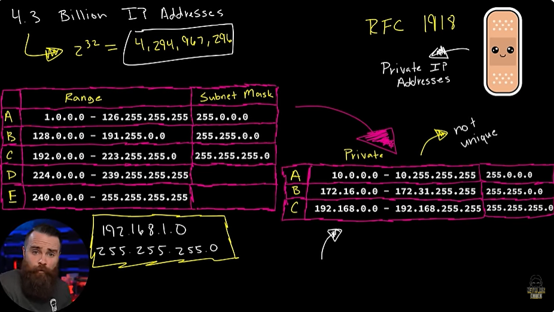
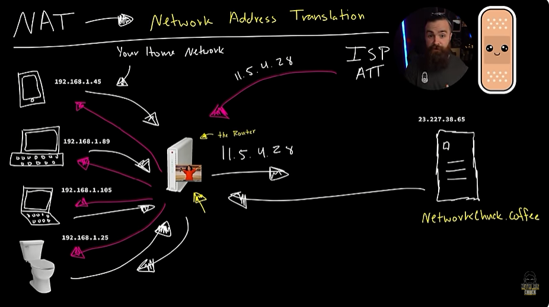
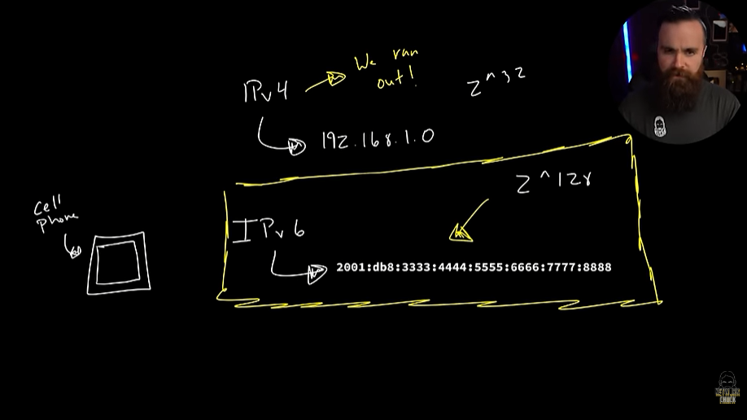

# 📝 Private IP & NAT

---

## 🎯 Judul & Tujuan

**Topik**: Private IP & NAT  
**Tahap**: TAHAP-1  
**Kategori**: Networking  
**Tujuan Pembelajaran**:

- [x] Memahami apa itu Private IP & NAT
- [x] Mengetahui komponen penyusun Private IP & NAT

---

## 💡 Konsep Utama

Private Ip Adress & NAT?

Karena kesalahan manajemen oleh IANA maka dunia hampir kehabisan 4.3 miliar ip address. tpi kita melakukan sesuatu, bernama RFC1918 adalah plester besar internet dan plesternya itu adalah private ip addresses.

Pada table sblumnya itu adalah public ip address, alamat yg bisa menjangkau internet, yg biasanya dipakai untuk eksplor internet sperti liat yt, buka tiktok dst. jdi smua yg perlu komunikasi ke internet harus punya ip address dan ip address itu harus unik, orang lain diujung dunia manapun tidak boleh ada yg sama.

tpi karena ip address habis karna dipakai terlalu banyak oleh device-device, misal di networkchuck punya 70-200 ip address di tiap devicenya.

jdi solusinya gmna?  
mereka ambil beberapa bagian(range) di public ip address, dan dikhususkan beberapa range ini untuk sebagai private ip address(beserta netmasknya). biasanya(common private ip) yg paling banyak dipakai adalah class C, artinya private ip address tidak unik, serta tidak bisa akses internet. coba cek di laptop,  terminal->ipconfig->muncul 192.168.56.1 (private ip).

tpi kok saat liat yt masih bisa akses internet?  
nah ini karena plester lain yg keren yg disebut NAT(Netwok Address Translation).

contoh kerja NAT  
misal ada device (HP, Laptop, PC) lalu semua connect ke router,
karena setiap device tdk bisa diberi public ip address(karena tidak cukup), maka router memberikan private ip address.  

misal mau jelajahi web networkchuck.coffe bagaimana?  
awalnya pada ISP(ATT/TelKomsel) memberi pinjaman satu public ip address(11.5.4.28), nah itu akan dipake router untuk mewakili jika ada device yg mau akses/komunikasi ke internet. nah jdi tiap device dikasi router private ip address lalu diwakili satu public ip yg tersambung ke router yg sama.

namun meski sudah ada dua plester(private ip dan NAT) kita masih kehabisan ruang IPv4 adresses.  
IPv4-> 193.168.1.0 (kehabisan ruang) total kombinasinya(2^32)  
lalu muncullah IPv6-> 2001:db8:3333:444:5555:6666:7777:8888  

yg total kombinasinya (2^128) BESAR BANGET! meskipun di masa depan menakutkan jika mengulang kesalahan yg sama lagi. bgtu besarnya sehingga setiap device dapat mempunyai Ipv6 public address.  

klo hp gmna? misal pake paket data(telkomsel) maka pake IPv6 public address untuk akses ke internet, karena perusahaan jaringan sperti ATT dan Telkomsel pakai IPv6 sebagai standart industri, tpi untuk kebanyakan website masih pakai IPv4.

| Class | Range (Private IP Address) | Subnet Mask |
|:-----:|-----------------------------|-------------|
| A | 10.0.0.0 - 10.255.255.255 | 255.0.0.0 |
| B | 172.16.0.0 - 172.31.255.255 | 255.255.0.0 |
| C | 192.168.0.0 - 192.168.255.255 | 255.255.255.0 |

**Definisi Singkat**:

>

---

**Visualisasi/Diagram**:

<table style="border: none; width: 100%; text-align: center;">
  <tr>
    <td style="border: none; vertical-align: top;">
      <figure>
        
        <figcaption>Private IP Address</figcaption>
      </figure>
    </td>
    <td style="border: none; vertical-align: top;">
      <figure>
        
        <figcaption>NAT (Network Address Translation)</figcaption>
      </figure>
    </td>
  </tr>
  <tr>
    <td style="border: none; vertical-align: top;">
      <figure>
        
        <figcaption>IPv6 Address</figcaption>
      </figure>
    </td>
  </tr>
</table>

---

## 📚 Sumber Belajar

| No | Sumber | Link | Format | Rating | Waktu |
|----|-----|------|--------|--------|-------|
| 1 | NetworkChuck - CCNA Course | <https://www.youtube.com/watch?v=8bhvn9tQk8o&list=PLIhvC56v63IJVXv0GJcl9vO5Z6znCVb1P&index=18> | Video | ⭐⭐⭐⭐⭐ | 15min |
| 2 | | | | | |
| 3 | | | | | |

**Sumber Rekomendasi**: NetworkChuck

---

## ⚡ Catatan Penting

### Poin Utama

1. **Terminologi**:  
    - **RFC1918**: standar yg menetapkan IP address private, alamat IP yg tdk bisa diakses langsung dari internet dan digunakan di jaringan lokal (LAN).
    - **NAT(Netwok Address Translation)**: teknik yang mengubah IP Private menjadi IP Public, atau sebaliknya, sehingga perangkat di jaringan lokal bisa mengakses Internet.
    - **ISP(Internet Service Provider)**: perusahaan penyedia layanan Internet yg menghubungkan pelanggan ke internet.

---
