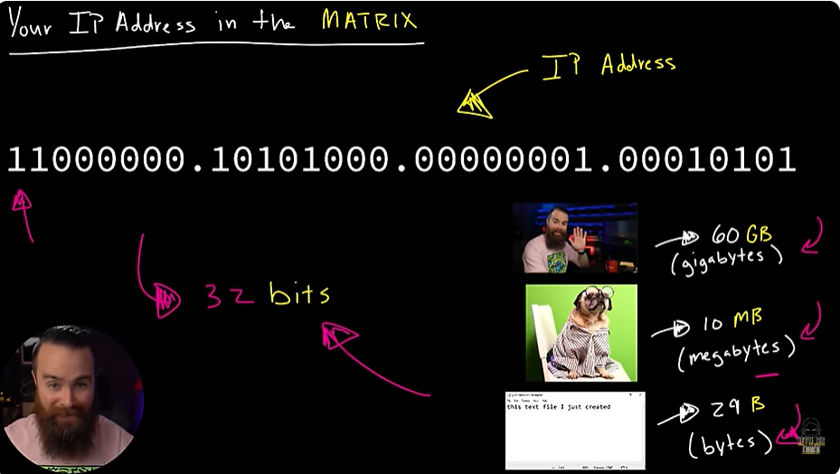
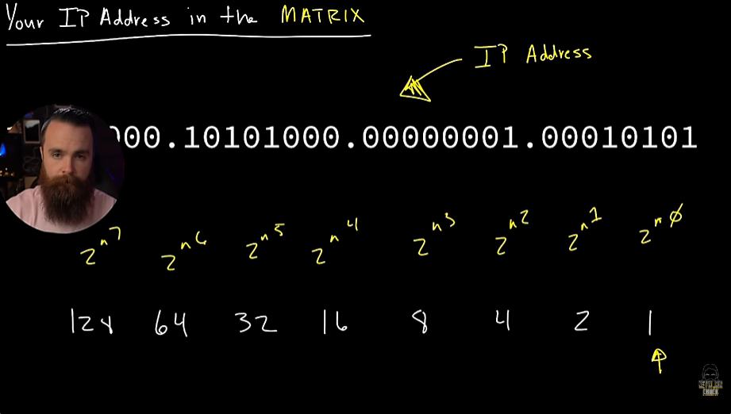
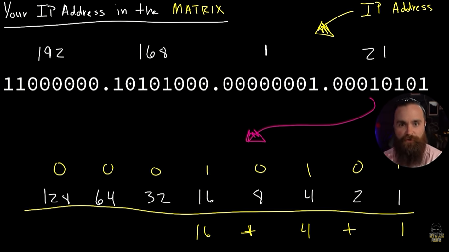
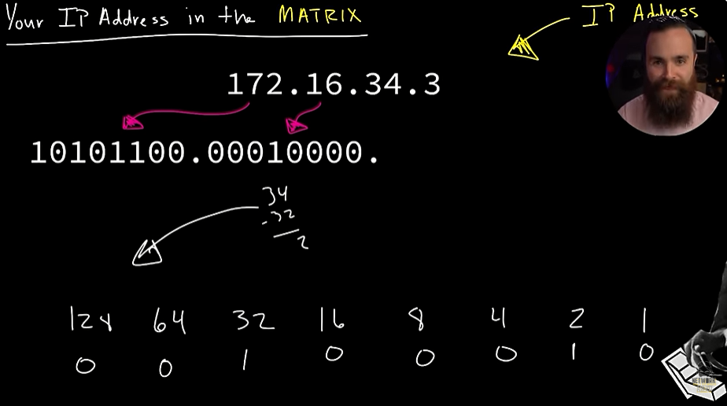

# 📝 Convert IP

---

## 🎯 Judul & Tujuan

**Topik**: Convert IP  
**Tahap**: TAHAP-1  
**Kategori**: Networking  
**Tujuan Pembelajaran**:

- [x] Memahami tujuan Convert IP
- [x] Mengetahui cara convert IP

---

## 💡 Konsep Utama

IP address dalam bentuk Biner  
11000000.10101000.00000001.00010101 ->1 octet = 8 bits x 4 octet = total 32 bits.

Apa itu bits?  
misal video 4k ukurannya 60 Gb(gigabytes).  
foto ukurannya 10 MB(megabytes).  
teks.txt ukurannya 29 B(Bytes).  
nah satuan data terkecil dari komputer disebut bit(0 atau 1).

1 octet(octo) = 8 bits,  
8 bits = 1 byte,  
1 = on, 0 = off, mirip saklar lampu dan spertinya Nosferatu tau bahasa ini(biner) :v

1. Dari Biner ke Desimal

    kekuatan dari pangkat 2:  

    | 2^7 | 2^6 | 2^5 | 2^4 | 2^3 | 2^2 | 2^1 | 2^0 |
    |:---:|:---:|:---:|:---:|:---:|:---:|:---:|:---:|
    | 128 | 64 | 32 | 16 | 8 | 4 | 2 | 1 |

    lalu coba ubah kode biner ini ke desimal,  
    11000000.10101000.00000001.00010101  
    nanti Nosferatu akan bantu tekan saklar menyala/mati, misal 128 dan 64 tekan on dan sisanya off.

    | 128 | 64 | 32 | 16 | 8 | 4 | 2 | 1 | Keterangan |
    |:---:|:---:|:---:|:---:|:---:|:---:|:---:|:---:|:---|
    | 1 | 1 | 0 | 0 | 0 | 0 | 0 | 0 | biner yg dihitung |
    | 128 | 64 | 0 | 0 | 0 | 0 | 0 | 0 | saklar yg on |

    lalu jumlahkan smua 128+64=192, setelah itu ulangi ke octet lain.

    | 128 | 64 | 32 | 16 | 8 | 4 | 2 | 1 | Keterangan |
    |:---:|:---:|:---:|:---:|:---:|:---:|:---:|:---:|:---|
    | 1 | 0 | 1 | 0 | 1 | 0 | 0 | 0 | biner yg dihitung |
    | 128 | 0 | 32 | 0 | 8 | 0 | 0 | 0 | saklar yg on |

    jadinya, 128+32+8=168.

    | 128 | 64 | 32 | 16 | 8 | 4 | 2 | 1 | Keterangan |
    |:---:|:---:|:---:|:---:|:---:|:---:|:---:|:---:|:---|
    | 0 | 0 | 0 | 0 | 0 | 0 | 0 | 1 | biner yg dihitung |
    | 0 | 0 | 0 | 0 | 0 | 0 | 0 | 1 | saklar yg on |

    jadinya, 1+0=1.

    | 128 | 64 | 32 | 16 | 8 | 4 | 2 | 1 | Keterangan |
    |:---:|:---:|:---:|:---:|:---:|:---:|:---:|:---:|:---|
    | 0 | 0 | 0 | 1 | 0 | 1 | 0 | 1 | biner yg dihitung |
    | 0 | 0 | 0 | 16 | 0 | 4 | 0 | 1 | saklar yg on |

    jadinya, 16+4+1=21.

    jdi hasil konversi ke desimal ialah:  
    11000000.10101000.00000001.00010101 = 192.168.1.21

2. Dari Desimal ke Biner  
    misal desimal ubahlah ke biner: 172.16.34.3

    caranya dari nomor awal kurangi dengan kekuatan pangkat 2 diatas,jika bisa dikurangi maka saklar on, jika tidak bisa dikurangi maka saklar off(diskip). ulangi terus sampai ke angka terkecil.

    | 128 | 64 | 32 | 16 | 8 | 4 | 2 | 1 | Keterangan |
    |:---:|:---:|:---:|:---:|:---:|:---:|:---:|:---:|:---|
    | 172 | 44 | 44 | 12 | 12 | 4 | 0 | 0 | angka yg dikurangi |
    | 1 | 0 | 1 | 0 | 1 | 1 | 0 | 0 | saklar yg on |

    | 128 | 64 | 32 | 16 | 8 | 4 | 2 | 1 | Keterangan |
    |:---:|:---:|:---:|:---:|:---:|:---:|:---:|:---:|:---|
    | 16 | 16 | 16 | 16 | 0 | 0 | 0 | 0 | angka yg dikurangi |
    | 0 | 0 | 0 | 1 | 0 | 0 | 0 | 0 | saklar yg on |

    | 128 | 64 | 32 | 16 | 8 | 4 | 2 | 1 | Keterangan |
    |:---:|:---:|:---:|:---:|:---:|:---:|:---:|:---:|:---|
    | 34 | 34 | 34 | 2 | 2 | 2 | 2 | 0 | angka yg dikurangi |
    | 0 | 0 | 1 | 0 | 0 | 0 | 1 | 0 | saklar yg on |

    | 128 | 64 | 32 | 16 | 8 | 4 | 2 | 1 | Keterangan |
    |:---:|:---:|:---:|:---:|:---:|:---:|:---:|:---:|:---|
    | 3 | 3 | 3 | 3 | 3 | 3 | 3 | 1 | angka yg dikurangi |
    | 0 | 0 | 0 | 0 | 0 | 0 | 1 | 1 | saklar yg on |

    172.16.34.3 jdi kode biner-> 10101100.00010000.00100010.00000011

**Definisi Singkat**:

>

---

**Visualisasi/Diagram**:

<table style="border: none; width: 100%; text-align: center;">
  <tr>
    <td style="border: none; vertical-align: top;">
      <figure>
        
        <figcaption>Satuan Data (GB - Bits)</figcaption>
      </figure>
    </td>
    <td style="border: none; vertical-align: top;">
      <figure>
        
        <figcaption>Kekuatan Pangkat 2</figcaption>
      </figure>
    </td>
  </tr>
  <tr>
    <td style="border: none; vertical-align: top;">
      <figure>
        
        <figcaption>Biner ke Desimal</figcaption>
      </figure>
    </td>
    <td style="border: none; vertical-align: top;">
      <figure>
        
        <figcaption>Desimal ke Biner</figcaption>
      </figure>
    </td>
  </tr>
</table>

---

## 📚 Sumber Belajar

| No | Sumber | Link | Format | Rating | Waktu |
|----|-----|------|--------|--------|-------|
| 1 | NetworkChuck - CCNA Course | <https://www.youtube.com/watch?v=2-i5x8KCfII&list=PLIhvC56v63IJVXv0GJcl9vO5Z6znCVb1P&index=19> | Video | ⭐⭐⭐⭐⭐ | 18min |
| 2 | | | | | |
| 3 | | | | | |

**Sumber Rekomendasi**: NetworkChuck

---

## ⚡ Catatan Penting

### Poin Utama

1. **Terminologi**:  
    - **Biner**: sistem bilangan berbasis 2, hanya pakai angka 0 dan 1. Dipakai komputer karena cocok dengan kondisi on/off (saklar). Contoh: 11000000 = 192.
    - **Desimal**: sistem bilangan berbasis 10, pakai angka 0-9 (yg kita pakai sehari-hari). Contoh: 192, 168, 1.

---
