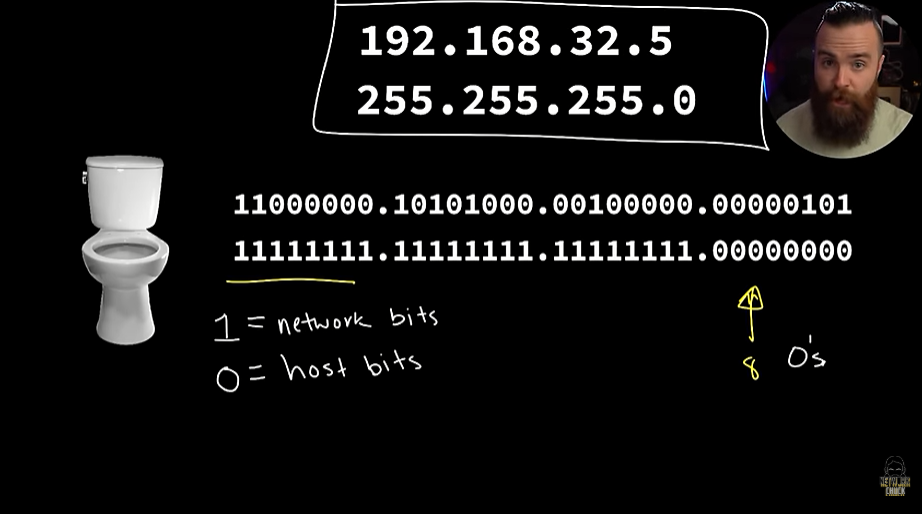
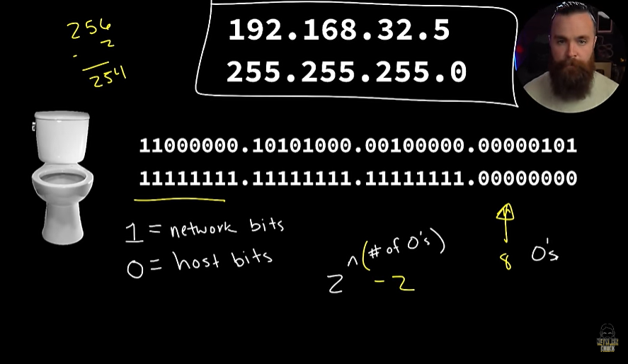

# 📝 Subnet Mask

---

## 🎯 Judul & Tujuan

**Topik**: Subnet Mask  
**Tahap**: TAHAP-1  
**Kategori**: Networking  
**Tujuan Pembelajaran**:

- [x] Memahami apa itu Subnet Mask
- [x] Mengetahui cara membuat Subnet Mask

---

## 💡 Konsep Utama

Subnet mask/netmask berfungsi untuk beri tahu rahasia terkait jaringan, sperti sberapa besar jaringan yg dipakai, brapa bnyak ip address yg tersedia dan lainnya.

192.168.32.5 -> ip address  
255.255.255.0 -> netmask  

Konversi subnet mask ke biner:  
192.168.32.5 -> 11000000.10101000.00100000.00000101  
255.255.255.0 -> 11111111.11111111.11111111.00000000  

| 128 | 64 | 32 | 16 | 8 | 4 | 2 | 1 | Keterangan |
|:---:|:---:|:---:|:---:|:---:|:---:|:---:|:---:|:---|
| 255 | 127 | 63 | 31 | 15 | 7 | 3 | 1 | angka yg dikurangi |
| 1 | 1 | 1 | 1 | 1 | 1 | 1 | 1 | saklar yg on |

128+64+32+16+8+4+2+1= jika dijumlah dari 1-128 hasilnya akan 255.

Identifikasi jenis jaringan:  

| 11111111 | 11111111 | 11111111 | 00000000 |
|:--------:|:--------:|:--------:|:--------:|
| Network Bits | Network Bits | Network Bits | Host Bits |

1 = network bit, 0 = host bit.  
jika diliat di subnet mask, smua angka 1 beri tau bahwa mana bagian dari ip address yg merupakan network bits. octet pertama sampai ketiga adalah network bits, lalu octet terakhir(smua angka 0) disebut host bit, 0 beri tau mana yg merupakan host.  

network bits(octet tidak akan berubah) beri tau sedang berada di jaringan yg mana. setiap bit bisa digunakan untuk buat ip address dan ditugaskan untuk host tersebut.

cara hitung 2 pangkat dari jumlah 0 yg ada. misal disini nolnya ada 8,maka 2^8 = 256, tpi dikurangi 256-2 = jdi 254.  
maka rumusnya 2^jumlah 0, lalu jumlah pangkat-2 = hasil.

misal mau nambah host jdi 50 bagaimana?  
maka perlu lebih banyak angka 0 (host), caranya perlu pinjam/curi dari network bits.

11111111.11111111.11111110.00000000  
(harusnya octet 1-3 full angka 1)  
jdi tinggal pake rumusnya aja, 2^9 = 512-2 = 510.

Coba convert subnet yg sudah diubah:  
11000000.10101000.00100000.00000101 -> ip address  
11111111.11111111.11111111.00000000 -> subnet mask  

| 128 | 64 | 32 | 16 | 8 | 4 | 2 | 1 | Keterangan |
|:---:|:---:|:---:|:---:|:---:|:---:|:---:|:---:|:---|
| 1 | 1 | 1 | 1 | 1 | 1 | 1 | 0 | saklar yg menyala |
| 128 | 64 | 32 | 16 | 8 | 4 | 2 | 0 | saklar yg on |

128+64+23+16+8+4+2= maka subnet mask jadinya 254.

192.168.32.5  -> ip address  
255.255.254.0 -> subnet mask  

**Definisi Singkat**:

>

---

**Visualisasi/Diagram**:

<table style="border: none; width: 100%; text-align: center;">
  <tr>
    <td style="border: none; vertical-align: top;">
      <figure>
        
        <figcaption>Network Bits &amp; Host Bits</figcaption>
      </figure>
    </td>
    <td style="border: none; vertical-align: top;">
      <figure>
        
        <figcaption>Total Host</figcaption>
      </figure>
    </td>
  </tr>
</table>

---

## 📚 Sumber Belajar

| No | Sumber | Link | Format | Rating | Waktu |
|----|-----|------|--------|--------|-------|
| 1 | NetworkChuck - CCNA Course | <https://www.youtube.com/watch?v=2-i5x8KCfII&list=PLIhvC56v63IJVXv0GJcl9vO5Z6znCVb1P&index=19> | Video | ⭐⭐⭐⭐⭐ | 18min |
| 2 | | | | | |
| 3 | | | | | |

**Sumber Rekomendasi**: NetworkChuck

---

## ⚡ Catatan Penting

### Poin Utama

1. **Terminologi**:  
    - **Netmask(subnet mask)**: menentukan ukuran/batas jaringan dan berapa host yang bisa dipakai.

---
