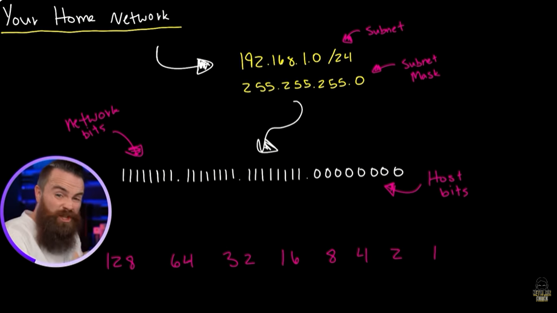
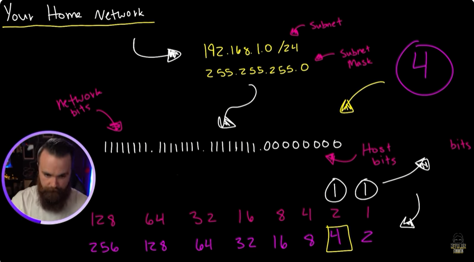
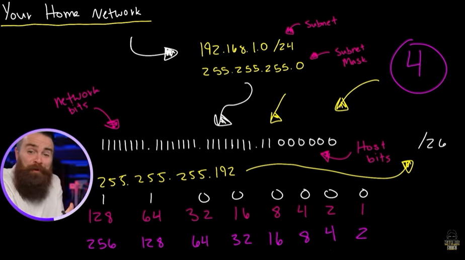
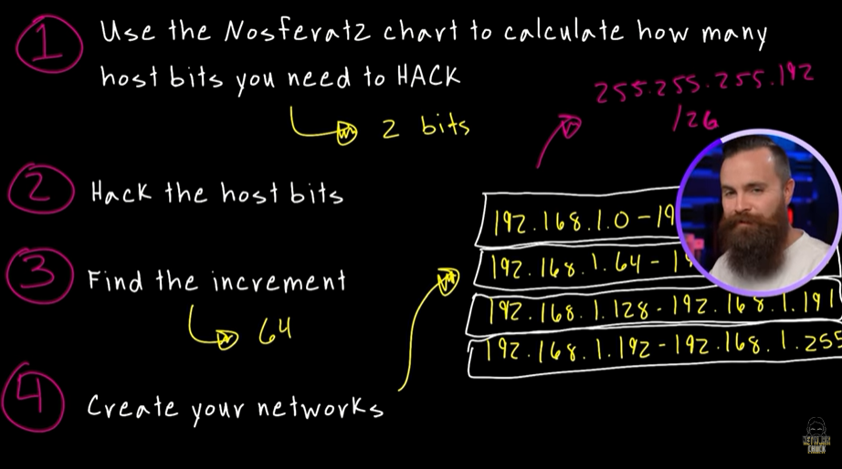
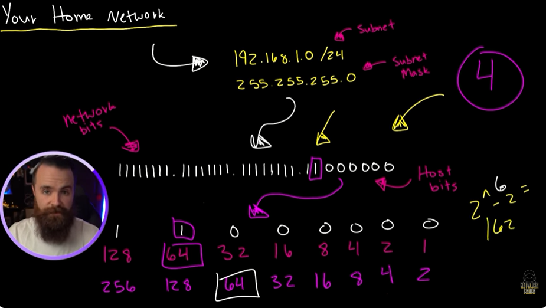

# 📝 Subnet Home Network

---

## 🎯 Judul & Tujuan

**Topik**: Subnet Home Network  
**Tahap**: TAHAP-1  
**Kategori**: Networking  
**Tujuan Pembelajaran**:

- [x] Memahami apa itu Subnet Home Network
- [x] Mengetahui cara membuat Subnet Home Network

---

## 💡 Konsep Utama

Subnet Jaringan

Punya subnet mask dan punya ip address untuk dipakai, tpi itu tidak aman dan harusnya tidak boleh kumpulkan semua device yg tersambung ke jaringan yg sama.

jdi mari ubah, tidak dengan cara normal biasanya sperti:  
192.168.1.0/24  
192.168.2.0/24  
192.168.3.0/24  

tpi dengan kekuatan subnetting untuk pecah jaringan saat ini jadi empat network kecil. yaitu wireless, IOT, DMZ, User.

tpi kenapa pake subnetting?  
192.168.1.0/24 -> subnet  
255.255.255.0 -> subnet mask  

| 11111111 | 11111111 | 11111111 | 00000000 |
|:--------:|:--------:|:--------:|:--------:|
| Network Bits | Network Bits | Network Bits | Host Bits |

1 = network bit, 0 = host bit

Subnet ini harus dirubah dan dipecah jdi 4 network, ketika ingin lebih banyak network bits maka perlu hack/curi dari host bit (diubah jdi angka 1).

caranya:  

1. pakai Nosferat2 chart untuk hitung berapa banyak host bits yg dibutuhkan untuk di hack.
2. hack host bitsnya.
3. temukan the increment.
4. buat network barunya.

(1) pakai Nosferat2 chart.  
128 64  34  16  8   4 2 1 -> nosferatu chart  
256 128 64  32  16  8 4 2 -> nosferat2 chart  
Nosferatu-> bantu ubah dari desimal ke biner.  
Nosferat2-> bantu ubah host bits ke network bits.  

Misal perlu dipecah jdi 4 jaringan gmna?  
cari angka 4(sesuai ingin dipecah jdi brapa) lalu tandai, lalu beri angka satu dan hitung ada brapa angka satu.
| 256 | 128 | 64 | 32 | 16 | 8 | 4 | 2 | Keterangan |
|:---:|:---:|:---:|:---:|:---:|:---:|:---:|:---:|:---|
| 0 | 0 | 0 | 0 | 0 | 0 | 1 | 1 | jumlah host bits yg di hack (2 bits) |
| 256 | 128 | 64 | 32 | 16 | 8 | **4** | 2 | |

contoh lain, klo mau pecah jdi 17 network?  
16 masih kurang jdi ambil lagi yg sblahnya.  
| 256 | 128 | 64 | 32 | 16 | 8 | 4 | 2 | Keterangan |
|:---:|:---:|:---:|:---:|:---:|:---:|:---:|:---:|:---|
| 0 | 0 | 0 | 1 | 1 | 1 | 1 | 1 | jumlah host bits yg di hack (5 bits) |
| 256 | 128 | 64 | **32** | 16 | 8 | 4 | 2 | |

(2) hack host bitsnya.  
maka subnet mask biner tdi yg host bit 0 diubah jdi 1 sbanyak 2 bits. lalu ubah dari biner ke desimal lagi.

11111111.11111111.11111111.11000000  
| 128 | 64 | 32 | 16 | 8 | 4 | 2 | 1 | Keterangan |
|:---:|:---:|:---:|:---:|:---:|:---:|:---:|:---:|:---|
| 1 | 1 | 0 | 0 | 0 | 0 | 0 | 0 | biner yg dihitung |
| 128 | 64 | 0 | 0 | 0 | 0 | 0 | 0 | saklar yg on |

hitung desimal yg atasnya ada angka 1, 128+64= jdinya [192].

255.255.255.192  
klo ditulis di cider notation yaitu hitung seluruh netwok bits di subnet mask(smua angka satu).  
| 11111111 | 11111111 | 11111111 | 11000000 | Keterangan |
|:--------:|:--------:|:--------:|:--------:|:---|
| 8 | 8 | 8 | 2 | total angka 1 (8+8+8+2) |

jadi 24+2 = [26].  
jdinya:  
192.169.1.0  
255.255.255.192/26  

(3) temukan the increment.  
tpi pertanyaannya berapa banyak host yg bisa pakai, berapa ip address broadcast, dan range networknya.  
caranya dengan menemukan inkremen-nya yaitu network bit trakhir(angka 1 trakhir).  

11111111.11111111.11111111.1[1]000000  

| 128 | 64 | 32 | 16 | 8 | 4 | 2 | 1 | Keterangan |
|:---:|:---:|:---:|:---:|:---:|:---:|:---:|:---:|:---|
| 1 | **1** | 0 | 0 | 0 | 0 | 0 | 0 | biner satu terakhir |
| 128 | **64** | 32 | 16 | 8 | 4 | 2 | 1 | desimal biner satu terakhir |

yaitu ini desimal dari biner satu terakhir(1), desimal 64.  

(4) buat network barunya.  
dari desimal 64 yg ditemukan tdi dikurangi 1, karena 192.168.1.  0 yg 0 masih dianggap host.  
lalu ulangi dari 64 ke 128-1, dst sampe 255.  
dan masing punya subnet mask 255.255.255.192/26  

192.168.1.0 - 192.168.1.63  
192.168.1.64 - 192.168.1.127  
192.168.1.28 - 192.168.1.191  
192.168.1.192 - 192.168.1.225  

lalu cara cari tau tersisa berapa host yg bisa dipakai, hitung sisa 0 nya dulu.  
| 11111111 | 11111111 | 11111111 | 11 | 000000 |
|:--------:|:--------:|:--------:|:--:|:------:|
| Network Bits | Network Bits | Network Bits | Network Bits | Host Bits (sisa 0 = 6) |

-> angka 0 yg sisa adalah 6.  
rumusnya 2^6 = 64-2 = 62.  

**Definisi Singkat**:

>

---

**Visualisasi/Diagram**:

<table style="border: none; width: 100%; text-align: center;">
  <tr>
    <td style="border: none; vertical-align: top;">
      <figure>
        
        <figcaption>Subnetting Jaringan</figcaption>
      </figure>
    </td>
    <td style="border: none; vertical-align: top;">
      <figure>
        
        <figcaption>Convert ke Biner</figcaption>
      </figure>
    </td>
  </tr>
  <tr>
    <td style="border: none; vertical-align: top;">
      <figure>
        
        <figcaption>Kebutuhan Host Bits</figcaption>
      </figure>
    </td>
    <td style="border: none; vertical-align: top;">
      <figure>
        
        <figcaption>Hack Host Bits</figcaption>
      </figure>
    </td>
  </tr>
  <tr>
    <td style="border: none; vertical-align: top;">
      <figure>
        
        <figcaption>Rumus</figcaption>
      </figure>
    </td>
    <td style="border: none; vertical-align: top;">
      <figure>
        
        <figcaption>Total Host</figcaption>
      </figure>
    </td>
  </tr>
</table>

---

## 📚 Sumber Belajar

| No | Sumber | Link | Format | Rating | Waktu |
|----|-----|------|--------|--------|-------|
| 1 | NetworkChuck - CCNA Course | <https://www.youtube.com/watch?v=2-i5x8KCfII&list=PLIhvC56v63IJVXv0GJcl9vO5Z6znCVb1P&index=19> | Video | ⭐⭐⭐⭐⭐ | 18min |
| 2 | | | | | |
| 3 | | | | | |

**Sumber Rekomendasi**: NetworkChuck

---
