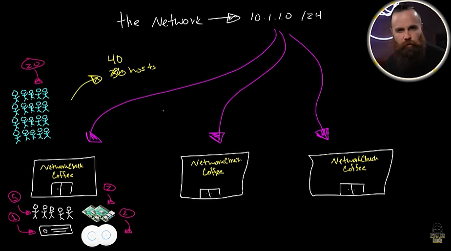
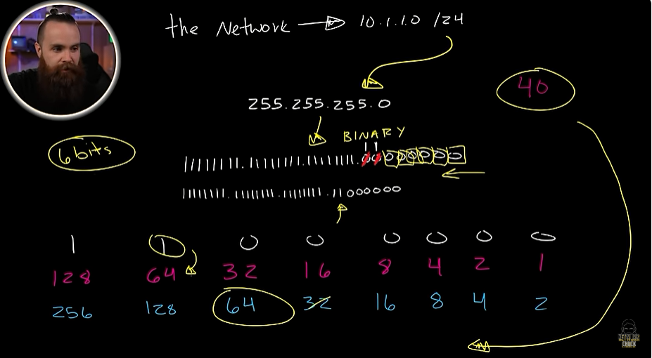
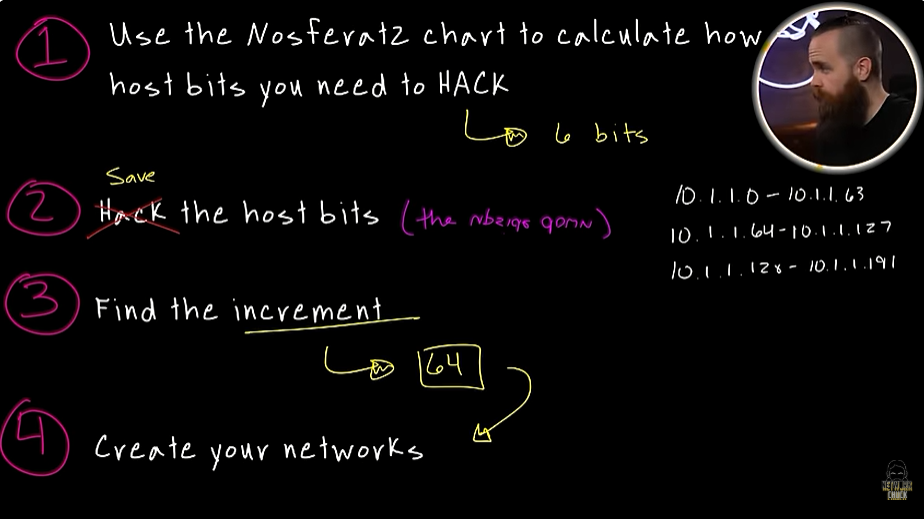
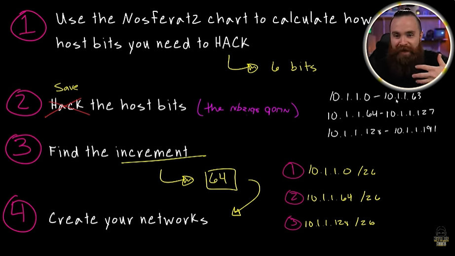

# 📝 Subnet Coffee Shop

---

## 🎯 Judul & Tujuan

**Topik**: Subnet Coffee Shop  
**Tahap**: TAHAP-1  
**Kategori**: Networking  
**Tujuan Pembelajaran**:

- [x] Mengetahui cara membuat Subnet Coffee Shop

---

## 💡 Konsep Utama

-------- LATIHAN 1 (Class C) --------  
latihan subnetting coffe shop  

the network 10.1.1.0/24  
bukan langsung berikan 3 jaringan baru, tpi berdasarkan banyak host yg diminta.

Ada 3 cabang networkchuck cofee dibagi ke 5 pekerja, 1 server, 2 rasberry pi, 2 WAP,dan 20 untuk pelanggan. totalnya 30 host(anggap aja jdi 40 host) untuk masing-masing cabang.

the network 10.1.1.0/24  
subnet mask -> 255.255.255.0  
binernya -> 11111111.11111111.11111111.00000000  

caranya:

1. pakai Nosferat2 chart untuk hitung berapa banyak host bits yg dibutuhkan untuk di hack.  
2. hack(malah jdi save) host bitsnya.(the upside down)  
3. temukan the increment.  
4. buat network barunya.  

(1) pakai Nosferat2 chart  
kan mau cari 40 host maka pilih yg sama atau diatasnya di nosferat2 chart, 40 berarti yg ditandai adalah angka 64. dan dapat 6 bits (dari 2 ke 64).

| 256 | 128 | 64 | 32 | 16 | 8 | 4 | 2 | Keterangan |
|:---:|:---:|:---:|:---:|:---:|:---:|:---:|:---:|:---|
| 0 | 0 | 1 | 1 | 1 | 1 | 1 | 1 | jumlah host bits yg di hack (6 bits) |
| 256 | 128 | **64** | 32 | 16 | 8 | 4 | 2 | |

(2) save host bits (karena cari host)  
yg biasanya dihitung dari kiri ke kanan skarang dari kanan ke kiri(ditandai 0-nya).  

11111111.11111111.11111111.11[0][0][0][0][0][0]  
jdinya...  
11111111.11111111.11111111.11000000

0 yg ditandai tetap, 0 sisanya diubah jdi angka 1.

(3) temukan the increment  
angka 1 terakhir berada di 64.

| 128 | 64 | 32 | 16 | 8 | 4 | 2 | 1 | Keterangan |
|:---:|:---:|:---:|:---:|:---:|:---:|:---:|:---:|:---|
| 1 | **1** | 0 | 0 | 0 | 0 | 0 | 0 | biner satu terakhir |
| 128 | **64** | 32 | 16 | 8 | 4 | 2 | 1 | desimal biner satu terakhir |

(4) buat network barunya  
10.1.1.0 - 10.1.1.63 (64 host, mulai dari 0)  
10.1.1.64 - 10.1.1.127  
10.1.1.128 - 10.1.1.191  

| 128 | 64 | 32 | 16 | 8 | 4 | 2 | 1 | Keterangan |
|:---:|:---:|:---:|:---:|:---:|:---:|:---:|:---:|:---|
| 1 | **1** | 0 | 0 | 0 | 0 | 0 | 0 | biner satu terakhir |
| 128 | **64** | 32 | 16 | 8 | 4 | 2 | 1 | desimal biner satu terakhir |

255.255.255.191  
11111111.11111111.11111111.00000000 = 1 ada sbanyak 26.

tinggal dijumlahin aja yg ada angka 1 nya(dari biner jdi desimal) 128+64=191, lalu hitung jumlah smua angka 1 nya dari subnet mask yaitu 26. maka hasilnya untuk 3 jaringan:

1) 10.1.1.0/26  
2) 10.1.1.64/26  
3) 10.1.1.128/26  

-------- LATIHAN 2 (Class B) --------  
netsim-> network simulator, simulator milik boson.

ISP punya 5 customer yg masing-masing harus ada minim 20 static ip public. networknya 142.2.0.0/16, butuh minim 20 host.

ubah subnet jdi subnet mask, lalu cari angka yg sama atau diatas host yg akan dipake. dari 20 jdi yg mendekati dari chart nosferat2 adalah [32], lalu ketemu 5 bits(dari angka 2 ke 32).

225.255.0.0  
11111111.11111111.00000000.00000000  

| 256 | 128 | 64 | 32 | 16 | 8 | 4 | 2 | Keterangan |
|:---:|:---:|:---:|:---:|:---:|:---:|:---:|:---:|:---|
| 0 | 0 | 0 | 1 | 1 | 1 | 1 | 1 | jumlah host bits yg di hack (5 bits) |
| 256 | 128 | 64 | **32** | 16 | 8 | 4 | 2 | |

(2) save host bits  
nah dari kanan ke kiri save angka 0 sbnyak 5 host bits, sisanya yg 0 dikiri smua berubah jdi angka 1.

11111111.11111111.11111111.111[0][0][0][0][0]  
jdinya....  
11111111.11111111.11111111.11100000  

(3)temukan the increment  
11111111.11111111.11111111.11[1]00000  
angka 1 yg ditandai ini yg increment  

(4) buat network barunya  
142.2.0.0 - 142.2.0.31  
142.2.0.32 - 142.2.0.63  
142.2.0.64 - 142.2.0.95  
142.2.0.96 - 142.2.0.127  
142.2.0.128 - 142.2.0.139  

lalu tambahkan nosferatu chart angka 1, 128+64+2 = 224, lalu hitung jumlah keseluruhan angka 1, jumlahnya .

| 256 | 128 | 64 | 32 | 16 | 8 | 4 | 2 | Keterangan |
|:---:|:---:|:---:|:---:|:---:|:---:|:---:|:---:|:---|
| 0 | 0 | 0 | 1 | 1 | 1 | 1 | 1 | jumlah host bits yg di hack (5 bits) |
| 256 | 128 | 64 | **32** | 16 | 8 | 4 | 2 | |

11111111.11111111.11111111.11100000 -> subnet mask biner, total angka 1 adalah 27. jdi hasilnya untuk masing customer ialah:

the network -> 142.2.0.0/16  
Dipecah menjdi:

1) 142.2.0.0/27  
2) 142.2.0.32/27  
3) 142.2.0.64/27  
4) 142.2.0.96/27  
5) 142.2.0.128/27  

yg tadinya butuh 20 ip, lalu dipasin jdi 30, dan yg tersedia 32 host.

**Definisi Singkat**:

>

---

**Visualisasi/Diagram**:

<table style="border: none; width: 100%; text-align: center;">
  <tr>
    <td style="border: none; vertical-align: top;">
      <figure>
        
        <figcaption>Soal Latihan</figcaption>
      </figure>
    </td>
    <td style="border: none; vertical-align: top;">
      <figure>
        
        <figcaption>Save Host Bits</figcaption>
      </figure>
    </td>
  </tr>
  <tr>
    <td style="border: none; vertical-align: top;">
      <figure>
        
        <figcaption>Network Baru</figcaption>
      </figure>
    </td>
    <td style="border: none; vertical-align: top;">
      <figure>
        
        <figcaption>Hasil</figcaption>
      </figure>
    </td>
  </tr>
</table>

---

## 📚 Sumber Belajar

| No | Sumber | Link | Format | Rating | Waktu |
|----|-----|------|--------|--------|-------|
| 1 | NetworkChuck - CCNA Course | <https://www.youtube.com/watch?v=B1vqKQIPxr0&list=PLIhvC56v63IJVXv0GJcl9vO5Z6znCVb1P&index=22> | Video | ⭐⭐⭐⭐⭐ | 14min |
| 2 | | | | | |
| 3 | | | | | |

**Sumber Rekomendasi**: NetworkChuck

---
