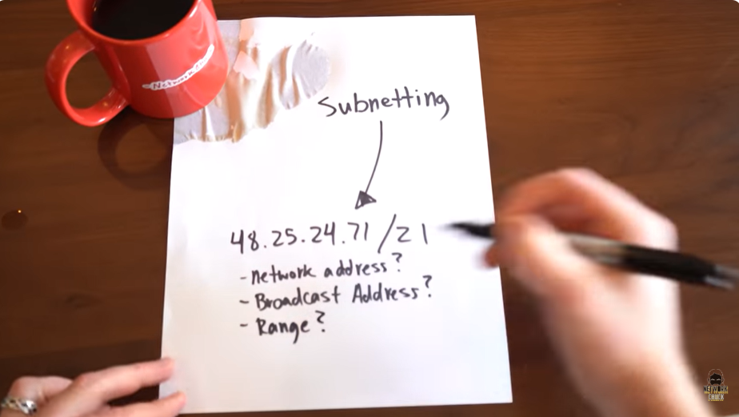
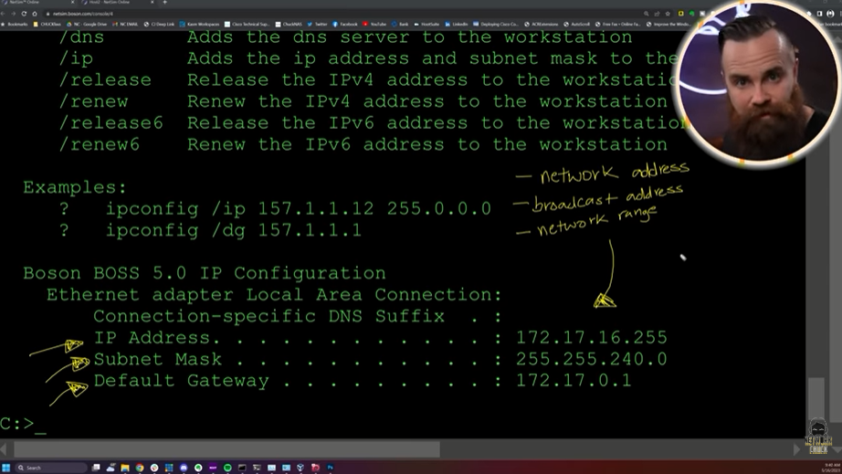
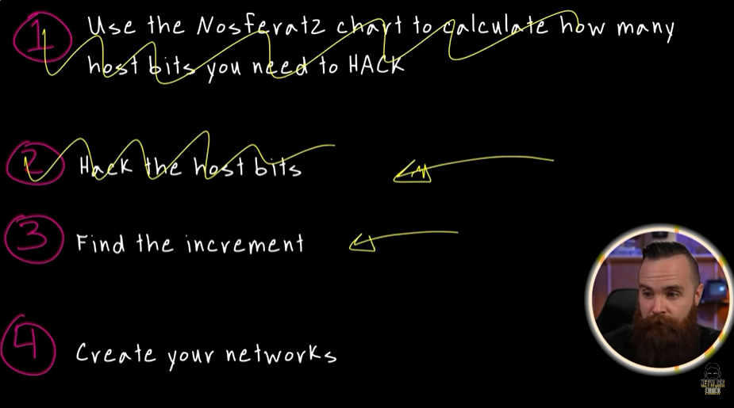
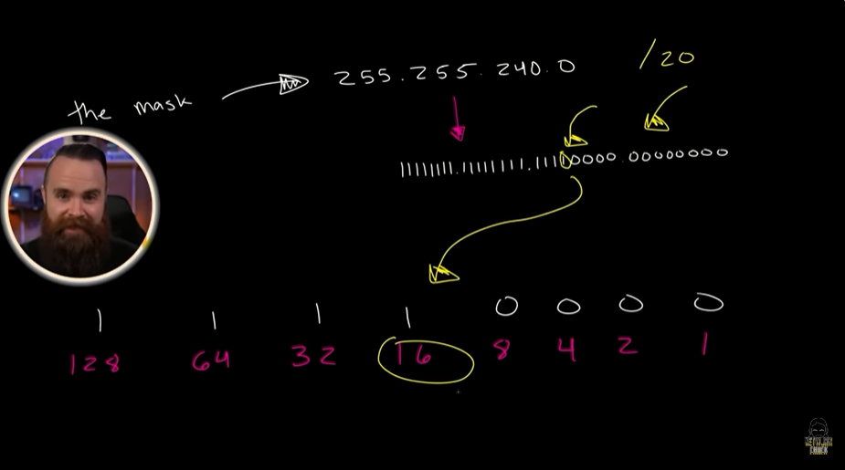
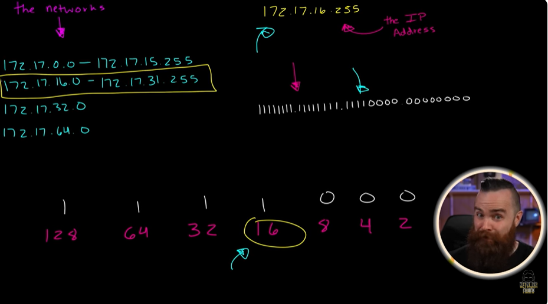
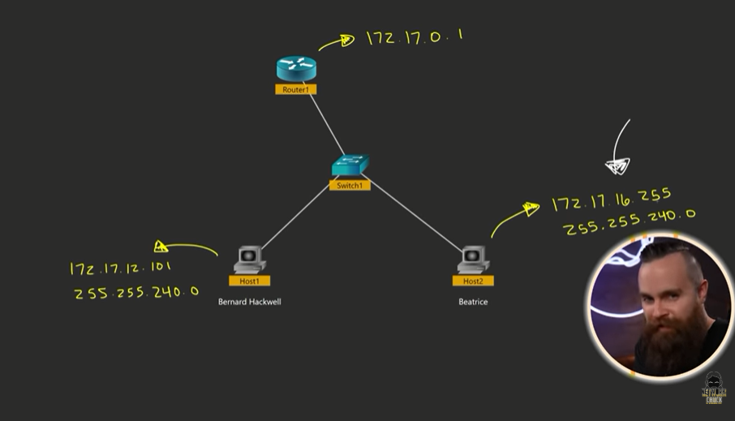
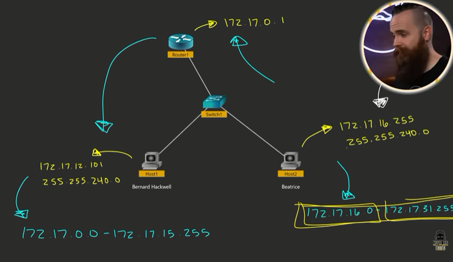

# 📝 Reverse Subnetting

---

## 🎯 Judul & Tujuan

**Topik**: Reverse Subnetting  
**Tahap**: TAHAP-1  
**Kategori**: Networking  
**Tujuan Pembelajaran**:

- [x] Memahami apa itu Reverse Subnetting
- [x] Mengetahui cara membuat Reverse Subnetting

---

## 💡 Konsep Utama

Reverse Subnetting adalah proses mencari subnet mask atau prefix (/xx) dari kebutuhan jaringan, misalnya berdasarkan jumlah host atau informasi IP yang diketahui.

the network-> 48.25.24.71/21  

- network address?  
- broadcast address?  
- range?  

caranya:  
cari tau dulu private  
terminal->ipconfig

ip address: 172.17.16.255  
subnet mask: 255.255.240.0  
default gateway: 172.17.0.1  

klo sudah tau ip address, subnet mask, dan default gateway, maka step 1-2 di skip aja,langsung step 3-4.

1. [x] ~~pakai Nosferat2 chart untuk hitung berapa banyak host bits yg dibutuhkan untuk di hack.~~
2. [x] ~~hack(malah jdi save) host bitsnya.(the upside down)~~
3. temukan the increment.
4. buat network barunya.

-------- LATIHAN SUBNETTING REVERSE --------

```text
router(172.17.0.1)
   ||
   ||
 router()
   |______ pc2(172.17.16.255, 255.255.240.0)
   |
  pc1(172.17.12.101, 255.255.240.0)
```

the mask-> 255.255.240.0  
11111111.11111111.11110000.00000000  

| 128 | 64 | 32 | 16 | 8 | 4 | 2 | 1 | Keterangan |
|:---:|:---:|:---:|:---:|:---:|:---:|:---:|:---:|:---|
| 1 | 1 | 1 | **1** | 0 | 0 | 0 | 0 | biner satu terakhir |
| 128 | 64 | 32 | **16** | 8 | 4 | 2 | 1 | desimal biner satu terakhir |

hitung jumlah keseluruhan angka 1 yaitu 20.

(3) temukan the increment  
lalu cari increment terakhir angka 1, berada di angka 16.

(4) buat network barunya  
the network berdasarkn subnet mask  
255.255.240.0  
11111111.11111111.11110000.00000000  

sblumnya increment ditaruh di octet ke 4, skarang di octet ke 3 pun bisa.

1) 172.17.0.0 - 172.17.15.255  
2) 172.17.16.0 - 172.17.31.255  
3) 172.17.32.0 - 172.17.47.255  
4) 172.17.48.0 - 172.17.63.255  

lalu manakah dari network yg dicari ini 172.17.16.255 termasuk ga satu jaringan? ya termasuk karena miripdengan no 2.

broadcast addressnya biasanya yg trakhir/paling awal di jaringan(0/255), dalam ini karena pake octet yg 3 maka 172.17.31.255 adalah broadcast address. tpi masalahnya dia tidak bisa ping atau komunikasi dengan yg lain, karena pc1 di octet ketiga yaitu 12 dan pc2 octet ketiga pake 16. artinya pc1 dan pc2 berada di networkyg beda.

pc1(172.17.12.101, 255.255.240.0) -> 172.17.0.0 - 172.17.15.255  
pc2(172.17.16.255, 255.255.240.0) -> 172.17.16.0 - 172.17.31.255  

contoh pada pc2:  
172.17.0.0 - 172.17.15.255 -> range address  
172.17.15.255 -> broadcast address  
172.17.0.0 -> subnet/network address  

**Definisi Singkat**:

>

---

**Visualisasi/Diagram**:

<table style="border: none; width: 100%; text-align: center;">
  <tr>
    <td style="border: none; vertical-align: top;">
      <figure>
        
        <figcaption>Soal Latihan</figcaption>
      </figure>
    </td>
    <td style="border: none; vertical-align: top;">
      <figure>
        
        <figcaption>IP Config</figcaption>
      </figure>
    </td>
  </tr>
  <tr>
    <td style="border: none; vertical-align: top;">
      <figure>
        
        <figcaption>Rumus</figcaption>
      </figure>
    </td>
    <td style="border: none; vertical-align: top;">
      <figure>
        
        <figcaption>Increment</figcaption>
      </figure>
    </td>
  </tr>
  <tr>
    <td style="border: none; vertical-align: top;">
      <figure>
        
        <figcaption>Network</figcaption>
      </figure>
    </td>
    <td style="border: none; vertical-align: top;">
      <figure>
        
        <figcaption>Exercise 3</figcaption>
      </figure>
    </td>
  </tr>
  <tr>
    <td style="border: none; vertical-align: top;">
      <figure>
        
        <figcaption>Hasil</figcaption>
      </figure>
    </td>
  </tr>
</table>

---

## 📚 Sumber Belajar

| No | Sumber | Link | Format | Rating | Waktu |
|----|-----|------|--------|--------|-------|
| 1 | NetworkChuck - CCNA Course | <https://www.youtube.com/watch?v=6zopTcQFhqM&list=PLIhvC56v63IJVXv0GJcl9vO5Z6znCVb1P&index=23> | Video | ⭐⭐⭐⭐⭐ | 8min |
| 2 | | | | | |
| 3 | | | | | |

**Sumber Rekomendasi**: NetworkChuck

---
