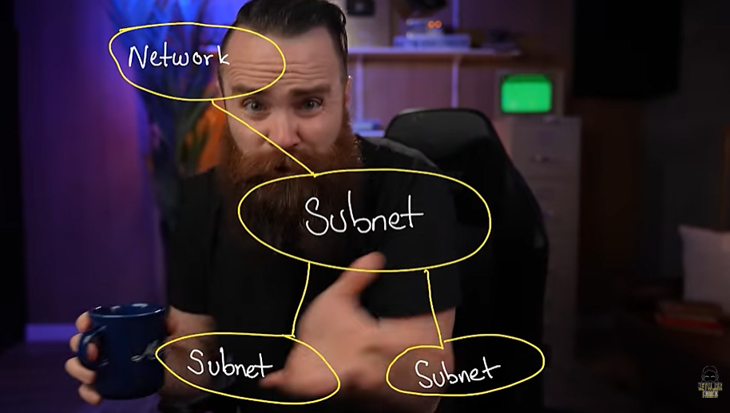
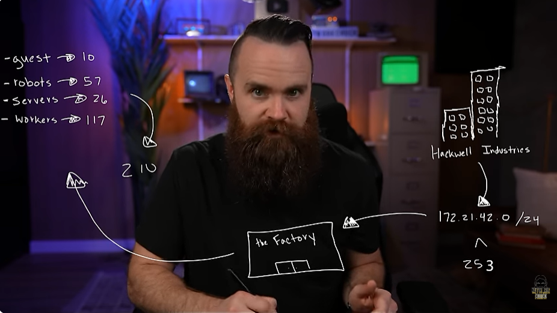
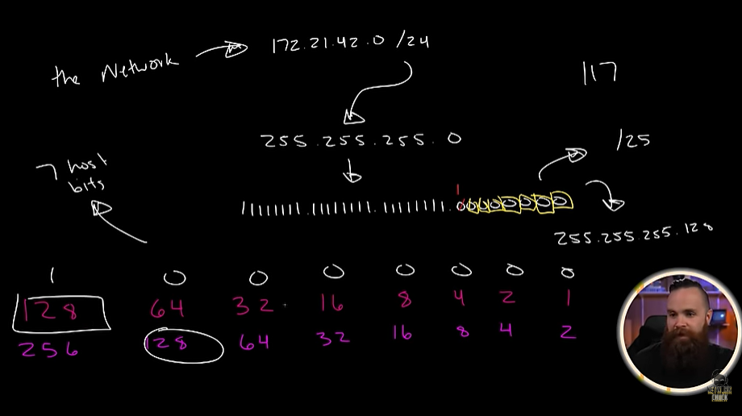
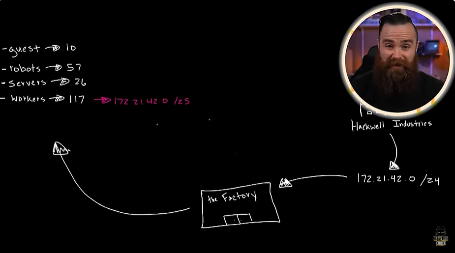
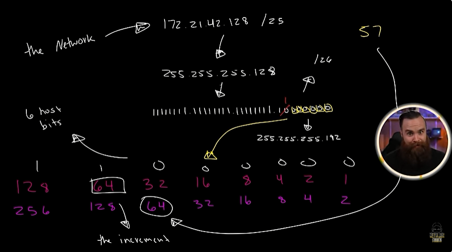
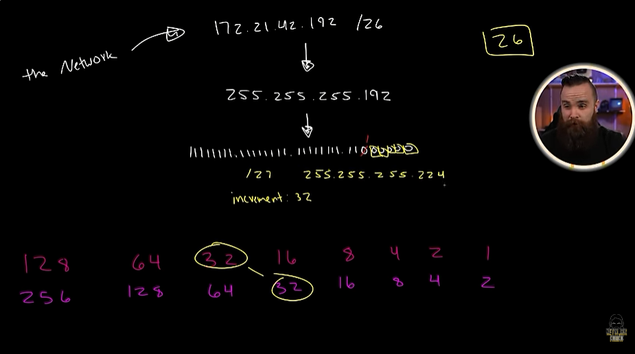
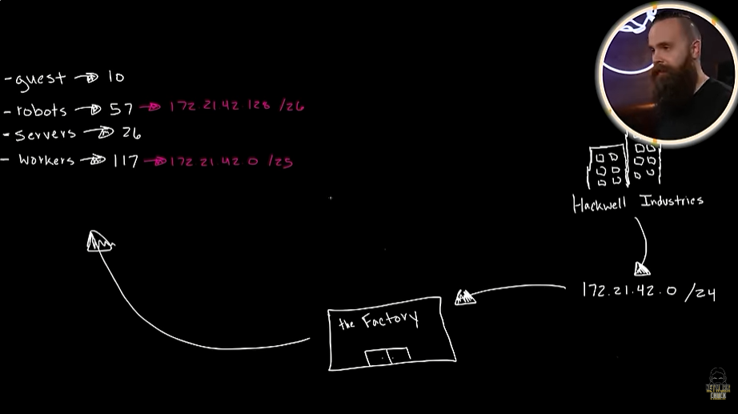
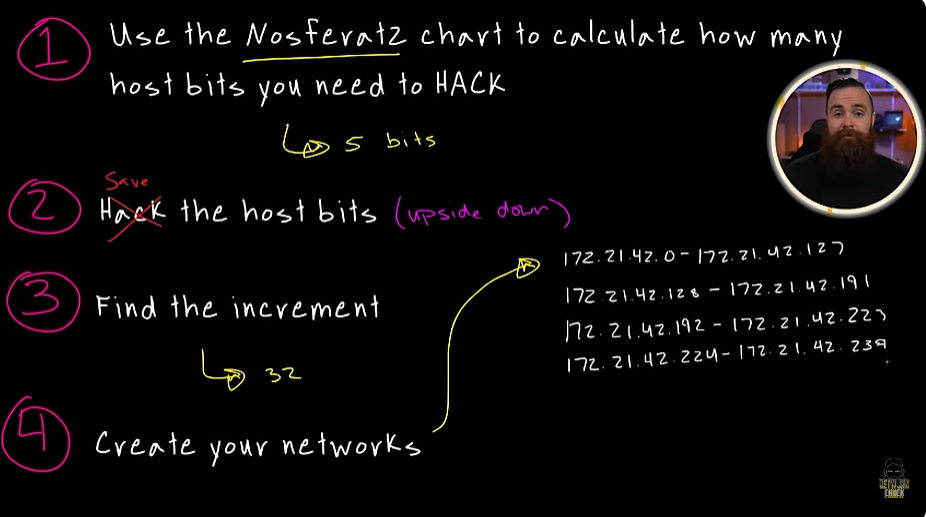
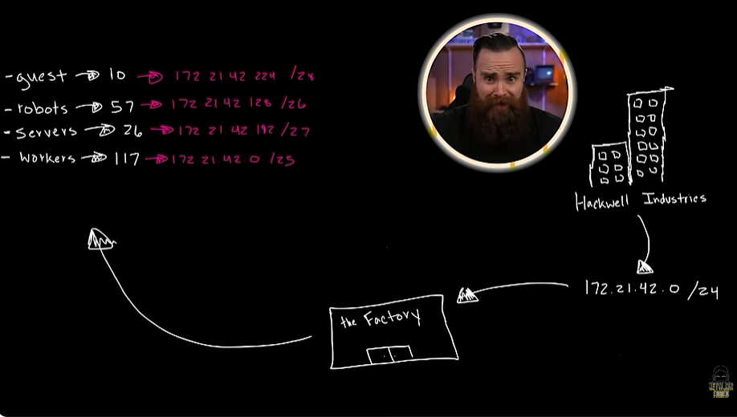

# 📝 Nested Subnetting

---

## 🎯 Judul & Tujuan

**Topik**: Nested Subnetting  
**Tahap**: TAHAP-1  
**Kategori**: Networking  
**Tujuan Pembelajaran**:

- [x] Memahami apa itu Nested Subnetting
- [x] Mengetahui cara membuat Nested Subnetting

---

## 💡 Konsep Utama

Apakah subnet bisa dipecah jdi subnet(sub network) lagi dan apakah bisa beda size/ukuran subnetnya? bisa dengan menggunakan VLSM teknik.

Hackwell industries, punya pabrik baru yg pake /24 dan ingin punya 4 subnet, yg masing2 ip dipake oleh:

- guests -> 10  
- robots -> 57  
- servers -> 26  
- workers -> 117  

the network -> 172.21.42.0/24  
pake VLSM(dari host terbesar ke host terkecil) maka akan bisa, lalu total host yg diperlukan adalah 10+57+26+117 = 210. lalu yg bisa dipake di /24 hanya 253 host. lalu pakai cara yg sblumnya sama, tpi dicari dulu host terbesar(workers->robots->servers->guest).

caranya:

1. pakai Nosferat2 chart untuk hitung berapa banyak host bits yg dibutuhkan untuk di hack.
2. hack(malah jdi save) host bitsnya.(the upside down)
3. temukan the increment.
4. buat network barunya.

Urutannya(dari host terbesar ke host terkecil):

1) cari dulu yg terbesar pertama(117 workers host).  
    172.21.42.0/24 -> 255.255.255.0 -> 11111111.11111111.11111111.00000000

    | 256 | 128 | 64 | 32 | 16 | 8 | 4 | 2 | Keterangan |
    |:---:|:---:|:---:|:---:|:---:|:---:|:---:|:---:|:---|
    | 0 | 1 | 1 | 1 | 1 | 1 | 1 | 1 | jumlah host bits yg di hack (7 bits) |
    | 256 | **128** | 64 | 32 | 16 | 8 | 4 | 2 | |

    11111111.11111111.11111111.1[0][0][0][0][0][0][0]  

    save 7 host bits, subnet /25 dan desimalnya 128+0 = 128  
    increment 128, network -> 172.21.42.0-172.21.42.127  
    jdinya untuk workers 117 -> 172.21.42.0/25

2) lalu cari dulu yg terbesar kedua(57 robots host).

    (ambil dari network terbesar sblumnya/workers)
    172.21.42.128/25 -> 255.255.255.128 -> 11111111.11111111.11111111.10000000

    | 256 | 128 | 64 | 32 | 16 | 8 | 4 | 2 | Keterangan |
    |:---:|:---:|:---:|:---:|:---:|:---:|:---:|:---:|:---|
    | 0 | 0 | 1 | 1 | 1 | 1 | 1 | 1 | jumlah host bits yg di hack (6 bits) |
    | 256 | 128 | **64** | 32 | 16 | 8 | 4 | 2 | |

    11111111.11111111.11111111.11[0][0][0][0][0][0]  

    save 6 host bits, subnet /26 dan desimalnya 128+64 = 192  
    increment-nya 64, network -> 172.21.42.128-172.21.42.191  
    jdinya untuk robots 57 -> 172.21.42.128/26  

3) lalu cari dulu yg terbesar ketiga(26 servers host).

    (ambil dari network terbesar sblumnya/robots)  
    172.21.42.192/26 -> 255.255.255.192 -> 11111111.11111111.11111111.11000000

    | 256 | 128 | 64 | 32 | 16 | 8 | 4 | 2 | Keterangan |
    |:---:|:---:|:---:|:---:|:---:|:---:|:---:|:---:|:---|
    | 0 | 0 | 0 | 1 | 1 | 1 | 1 | 1 | jumlah host bits yg di hack (5 bits) |
    | 256 | 128 | 64 | **32** | 16 | 8 | 4 | 2 | |

    11111111.11111111.11111111.111[0][0][0][0][0]  

    save 5 host bits, subnet /27 dan desimalnya 128+64+32 = 224  
    increment-nya 32, network -> 172.21.42.192-172.21.42.223  
    jdinya untuk robots 26 -> 172.21.42.192/27  

4) lalu cari dulu yg terkecil(10 guests host).

    (ambil dari network terbesar sblumnya/robots)  
    172.21.42.224/27 -> 255.255.255.224 -> 11111111.11111111.11111111.11100000

    | 256 | 128 | 64 | 32 | 16 | 8 | 4 | 2 | Keterangan |
    |:---:|:---:|:---:|:---:|:---:|:---:|:---:|:---:|:---|
    | 0 | 0 | 0 | 0 | 1 | 1 | 1 | 1 | jumlah host bits yg di hack (4 bits) |
    | 256 | 128 | 64 | 32 | **16** | 8 | 4 | 2 | |

    11111111.11111111.11111111.1111[0][0][0][0]  

    save 4 host bits, subnet /28 dan desimalnya 128+64+32+16 = 240  
    increment-nya 16, network -> 172.21.42.224-172.21.42.239  
    jdinya untuk guests 10 -> 172.21.42.224/28  

network akhir:

- 172.21.42.0-172.21.42.127
- 172.21.42.128-172.21.42.191
- 172.21.42.192-172.21.42.223
- 172.21.42.224-172.21.42.239

- guests -> 10 -> 172.21.42.224/28
- robots -> 57 -> 172.21.42.128/26
- servers -> 26 -> 172.21.42.192/27
- workers -> 117 -> 172.21.42.0/25

**Definisi Singkat**:

> VLSM(variable length subbnet mask) adalah teknik subnetting yg pakai subnet mask dengan panjang beda-beda dalam satu jaringan. yg memungkinkan subnet bisa dibagi jdi subnet lag dan bisa beda ukuran host.

---

**Visualisasi/Diagram**:

<table style="border: none; width: 100%; text-align: center;">
  <tr>
    <td style="border: none; vertical-align: top;">
      <figure>
        
        <figcaption>Soal Latihan</figcaption>
      </figure>
    </td>
    <td style="border: none; vertical-align: top;">
      <figure>
        
        <figcaption>Exercise 4</figcaption>
      </figure>
    </td>
  </tr>
  <tr>
    <td style="border: none; vertical-align: top;">
      <figure>
        
        <figcaption>Proses 1</figcaption>
      </figure>
    </td>
    <td style="border: none; vertical-align: top;">
      <figure>
        
        <figcaption>Hasil 1</figcaption>
      </figure>
    </td>
  </tr>
  <tr>
    <td style="border: none; vertical-align: top;">
      <figure>
        
        <figcaption>Proses 2</figcaption>
      </figure>
    </td>
    <td style="border: none; vertical-align: top;">
      <figure>
        
        <figcaption>Proses 3</figcaption>
      </figure>
    </td>
  </tr>
  <tr>
    <td style="border: none; vertical-align: top;">
      <figure>
        
        <figcaption>Hasil 2</figcaption>
      </figure>
    </td>
    <td style="border: none; vertical-align: top;">
      <figure>
        
        <figcaption>Rumus</figcaption>
      </figure>
    </td>
  </tr>
  <tr>
    <td style="border: none; vertical-align: top;">
      <figure>
        
        <figcaption>Hasil Akhir</figcaption>
      </figure>
    </td>
  </tr>
</table>

---

## 📚 Sumber Belajar

| No | Sumber | Link | Format | Rating | Waktu |
|----|-----|------|--------|--------|-------|
| 1 | NetworkChuck - CCNA Course | <https://www.youtube.com/watch?v=OD2vG5st4zI&list=PLIhvC56v63IJVXv0GJcl9vO5Z6znCVb1P&index=24> | Video | ⭐⭐⭐⭐⭐ | 7min |
| 2 | | | | | |
| 3 | | | | | |

**Sumber Rekomendasi**: NetworkChuck

---
